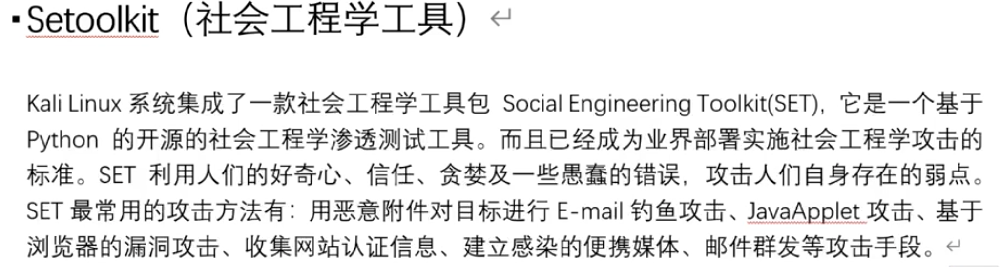
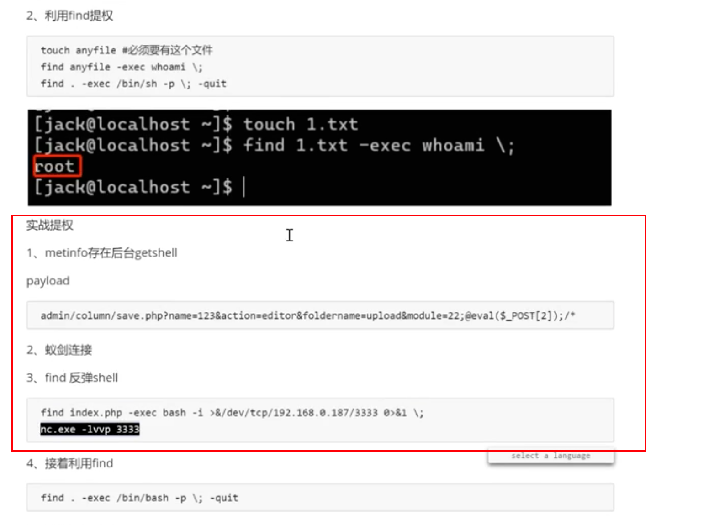

=========================
备忘
=========================

.. post:: 2023-06-11 18:06:14
  :tags: 
  :category: 安全
  :author: YanQue
  :location: CD
  :language: zh-cn

HTTrack
=========================

克隆网站工具, 静态网页

还有一个 setoolkit 工具也可以

setoolkit
=========================

社会工程学工具(social engineering toolkit), 开源, 基于Python.

  社会工程学工具

提权
=========================

.. note::

  # todo: 为什么需要降权
  为什么需要降权? 并不是最高权限就可以做一切... 有点不理解, 后面处理

杂乱无章
=========================

加密方式:

- 对称加密 加解密使用同一钥匙
  - DES
  - AES
- 非对称加密 加解密使用不同钥匙
  - RSA 比如SSH的密钥登陆. HTTPS的证书(公钥大家都有, 用来加密数据, 私钥只有所有者有, 保证只有自己可以看)

.. tip::

  仅靠非对称加密其实也不能真正保证安全, 数据包是在网络上流动的, 其他人可以直接在网络上获取加密后的包下次再直接用这个包.

  所以设置超时是有必要的, 比如: 登陆时, 对密码先公钥加密, 再对加密后的数据加时间戳后再次加密, 保证了每次发包数据是不一样的,
  后端再设置一个较小的过期验证时间, 超时拒绝登陆.

  不过也有一个问题, 再登陆有效期内, 还是可以被使用登陆. 只能尽量保证登陆有效期足够小等措施了.

MAC地址结构
=========================

如::

  AA:BB:CC:DD:EE:FF

前三位 `AA:BB:CC` 表示厂商

后三位 `DD:EE:FF` 表示厂商分配的设备标识

