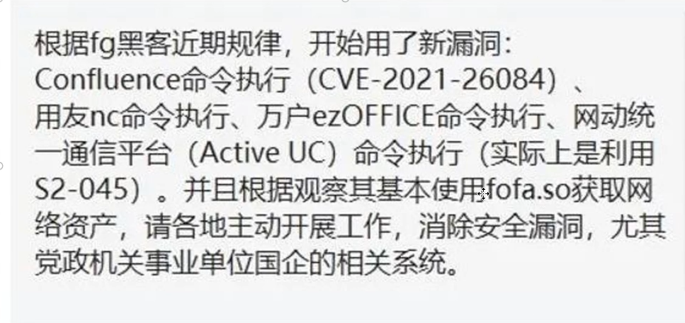
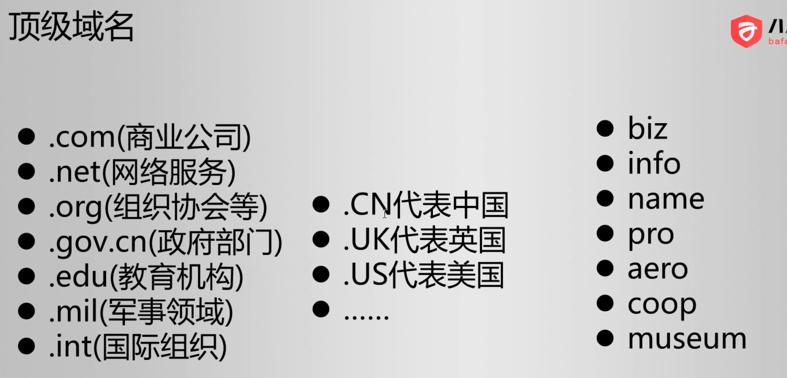
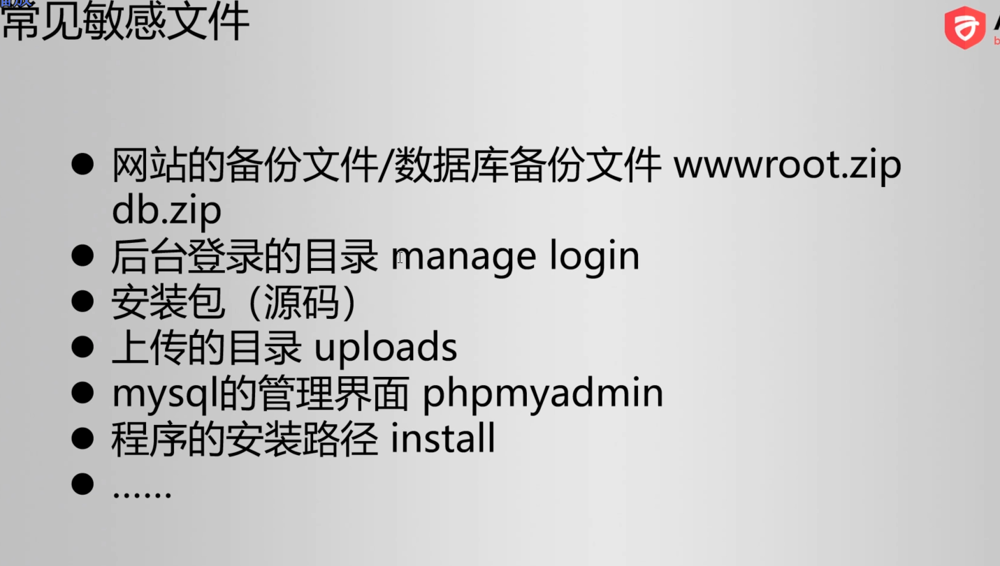
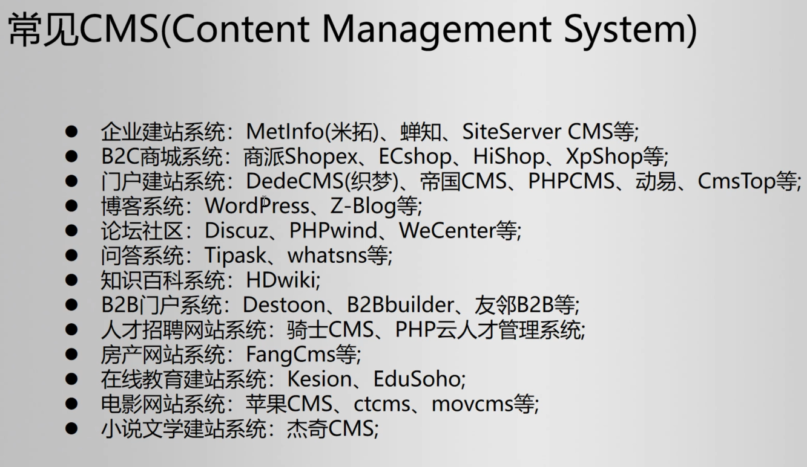

======================================
Kali信息收集
======================================

.. post:: 2023-02-25 22:13:17
  :tags: 学习记录
  :category: 安全
  :author: YanQue
  :location: CD
  :language: zh-cn

资产搜集综合工具
  - Maltego: 强大的跨平台信息搜集工具(可以自动搜集资产)
  - ARL灯塔: 搜集
  - yakit: 搜集出来还会尝试分析有没有漏洞 (单兵系统)
  - goby: 搜集
  - ...

流程
======================================

- 信息收集概述
- 网络空间测绘
- 端口扫描
- 子域名暴破
- 目录扫描
- CMS系统指纹识别

信息收集概述
======================================

不提前收集可能会遗漏一些方面

比如子域名没收集到

收集的内容
  - 域名
  - IP
  - 端口
  - CMS指纹
  - 通过搜索引擎收集信息(google dork)
  - 网络空间测绘
  - 目录扫描
  - ...

网络空间测绘
======================================

- 网络空间(Cyberspace)
- WiIIiam Gibson《Neuromancer》1984
- 网络空间搜索引擎（测绘）

.. note::

  不是指搜索引擎搜索到的HTML,
  而是指整个网络世界空间, 比如网关, 摄像头, Web框架, 基站 (一般叫做资产)

常见的搜集平台::

  # 世界上第一个网络空间搜索引擎
  https://www.shodan.io/

  # 钟馗之眼
  https://www.zoomeye.org/

  # 国内被封了, 因为很多人在这上搜集信息
  http://fofa.so/
  # fafo新地址
  https://fofa.info/

  # 360 夸克
  https://quake.360.net/quake/#/index

  # 奇安信 鹰图
  https://hunter.qianxin.com/

漏洞总结的地址(会给你最新漏洞以及在搜集平台搜索的语法)::

  # 佩奇 (被封)
  http://wiki.peiqi.tech/

  fofa被封

端口扫描
======================================

- 端口与服务的关系
- 常见端口号

端口范围::

  0 - 65535

大多数人对于常用开源的项目使用的端口都是默认的,
比如 mysql 默认是 3306, 一般不会改为其他的如 8888

端口扫描工具:

- :doc:`/docs/安全/kali/kali渗透专用指令/nmap` : 网络界的瑞士军刀

子域名暴破
======================================

域名

  顶级域名

子域名
  使用子域名更省钱

在线子域名爆破网站::

  https://dnsdumpster.com/

目录扫描
======================================

对于每一个服务器, 扫描上面开放的内容

为什么要扫描
  可能会存在敏感文件

  常见敏感文件

现在常用手段
  - 组织一个常用的词典
  - 对于每一个字典内的数据, 尝试拼接访问, 然后看返回码

常用工具
  - Burp Suite: :doc:`/docs/安全/brup/index`,
  - :doc:`/docs/安全/kali/kali渗透专用指令/dirb`
  - 御剑
  - dirbuster

CMS系统指纹识别
======================================

指纹扫描 CMS(Content Management System)

可以理解为系统用了哪些框架及其版本

因为一般写个什么都是先去看看有没有什么开源的，
所以可以尝试找找有没有使用这些开源项目， 然后根据项目找漏洞

常用工具
  - Google浏览器插件 "what runs" (只能分析前端)
  - :doc:`/docs/安全/kali/kali渗透专用指令/whatweb`
  - :doc:`/docs/安全/kali/kali渗透专用指令/cmseek`
  - Wappalyzer
  - 在线网站
  - 御剑指纹扫描器
  - Test404轻量CMS指纹识别
  - ...

