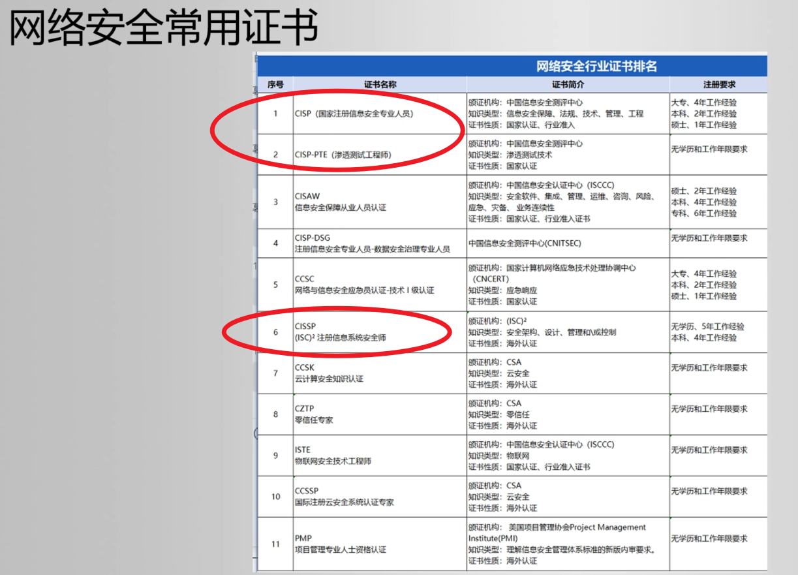

=======================================
学习记录
=======================================

.. toctree::

  渗透流程
  phpStudy搭建
  DVWA靶场搭建
  Kali信息收集
  Kali漏洞分析利用

为什么需要社工库?
  因为大多数人的密码, 跟自己的生日QQ手机号等自己的信息相关

  所以搜集后, 有利于进行构建爆破字典

如何增加经验
  - 护网
  - 挖漏洞; CNVD; SRC
  - 靶场实战, 如使用Kali官方的: `<https://www.vulnhub.com/>`_
  - 写博客; 公众号

可以试试去考的证书:

还有个软考信息安全工程师

可以平时逛逛的: `几乎所有国内的安全SRC <https://www.anquanke.com/src>`_

