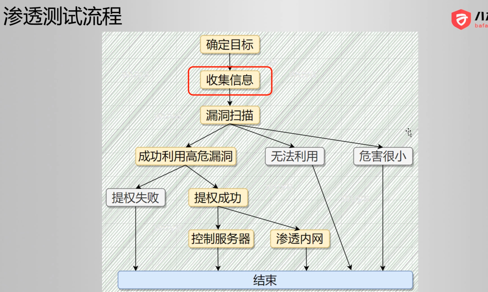

====================================
渗透流程
====================================

.. post:: 2023-02-25 22:13:17
  :tags: 学习记录
  :category: 安全
  :author: YanQue
  :location: CD
  :language: zh-cn

明确目标
====================================

信息收集
====================================

域名，子域名，端口，网站架构，网站目录结构，Apache, JDK, CMS

WAF

CDN

旁站

c段

漏洞分析/扫描
====================================

漏洞利用
====================================

证明漏洞存在

POC (proof of content)

形成渗透测试报告
====================================

怎么做的

存在哪些漏洞

修复建议

