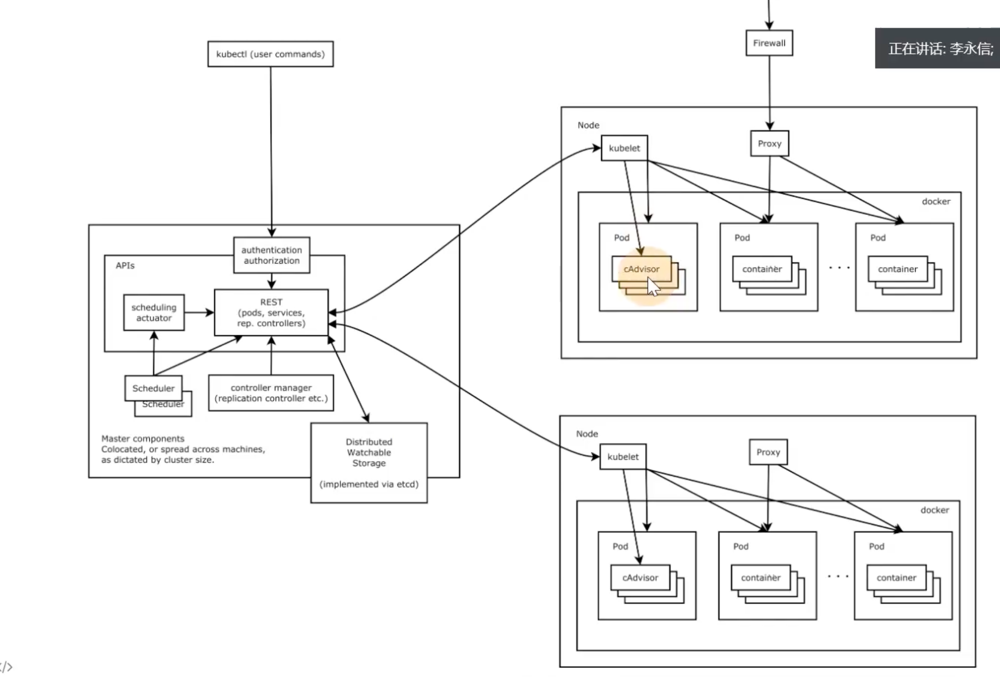
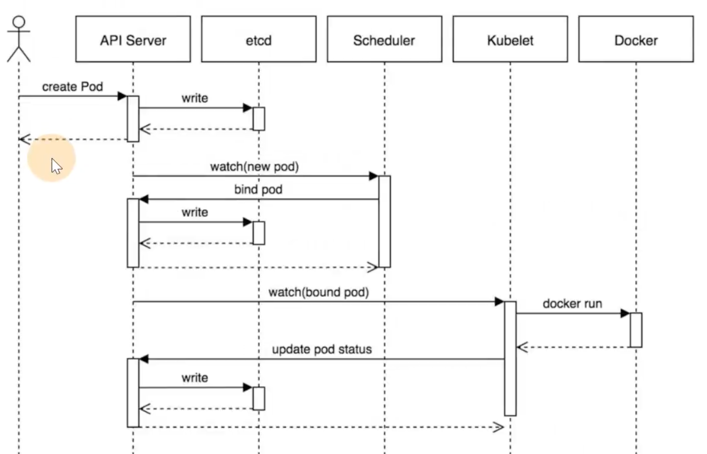

============================
Kubernetes
============================

.. post:: 2024-03-09 18:21:01
  :tags: k8s
  :category: 容器与集群
  :author: YanQue
  :location: CD
  :language: zh-cn

官网主页: `Kubernetes 文档 <https://kubernetes.io/zh-cn/docs/home/>`_

.. toctree::
  :maxdepth: 1

  集群安装

k8s集群演变::

  单体应用 --> 前后端分离 --> 微服务 --> 容器（貌似单体应用就有了） --> k8s容器集群

k8s大体架构::

  ingress （流量进入）
  ingress pod (一般是nginx分发)

  front-end service (前端) 		backend service （后端）
  pod1 pod2						pod5

纯容器集群的问题
============================

- 业务容器数量庞大，哪些容器部署在哪些节点，使用了哪些端口，如何记录、管理
- 跨主机通信，多个机器中的容器之间相互调用如何做，iptables规则手动维护？
- 跨主机容器间互相调用，配置如何写？写死固定IP+端口？
- 如何实现业务高可用？多个容器对外提供服务如何实现负载均衡？
- 容器的业务中断了，如何可以感知到，感知到以后，如何自动启动新的容器？
- 如何实现滚动升级保证业务的连续性？

集群管理
============================

因为 纯容器集群的问题_ , 所以有了集群管理工具

- Docker Swarm
- Mesos
- Google Kubernetes

2017年开始 Kubernetes 凭借强大的容器集群管理功能，逐步占据市场，目前在容器编排领域一枝独秀

k8s 架构
============================

分布式系统，两类角色

- 管理节点master
- 工作节点worker(或者slave)

  架构图

k8s 核心组件
============================

主要是针对管理结点

ApiServer
  APJ服务器，集群资源访问控制入口，提供reStAPJ及安全访问控制
ETCD
  分布式高性能键值数据库，存储整个集群的所有元数据
Scheduler
  调度器，负责把业务容器调度到最合适的Node节点
Controller Manager
  控制器管理，确保集群资源按照期望的方式运行

  - Replication Controller
  - Node controller
  - ResourceQuota Controller
  - Namespace Controller
  - ServiceAccount Controller
  - Token Controller
  - Service Controller
  - Endpoints Controller
kubelet
  运行在每个节点上的主要的"节点代理"，脏活累活(Docker主要是在这)

  pod 管理
    kubelet 定期从所监听的数据源获取节点上pod/container 的
    期望状态（运行什么容器、运行的副本数量、网络或者存储如何配置等等），
    并调用对应的容器平台接口达到这个状态。
  容器健康检查
    kubelet 创建了容器之后还要查看容器是否正常运行，
    如果容器运行出错，就要根据 pod 设置的重启策略进行处理.
  容器监控
    kubelet 会监控所在节点的资源使用情况，并定时向 master 报告，
    资源使用数据都是通过 GAdvisor 获取的。
    知道整个集群所有节点的资源情况，对于 pod 的调度和正常运行至关重要
kube-proxy
  维护节点中的iptables或者ipvs规则
Kubectl
  命令行接口，用于对 Kubernetes 集群运行命令 `<https://kubernetes.io/zh/docs/reference/kubect!/>`_

  工作流程

