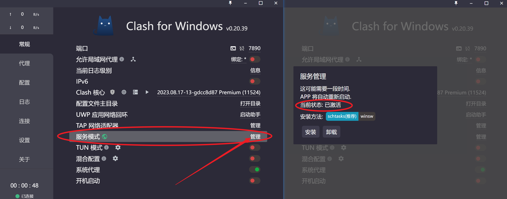
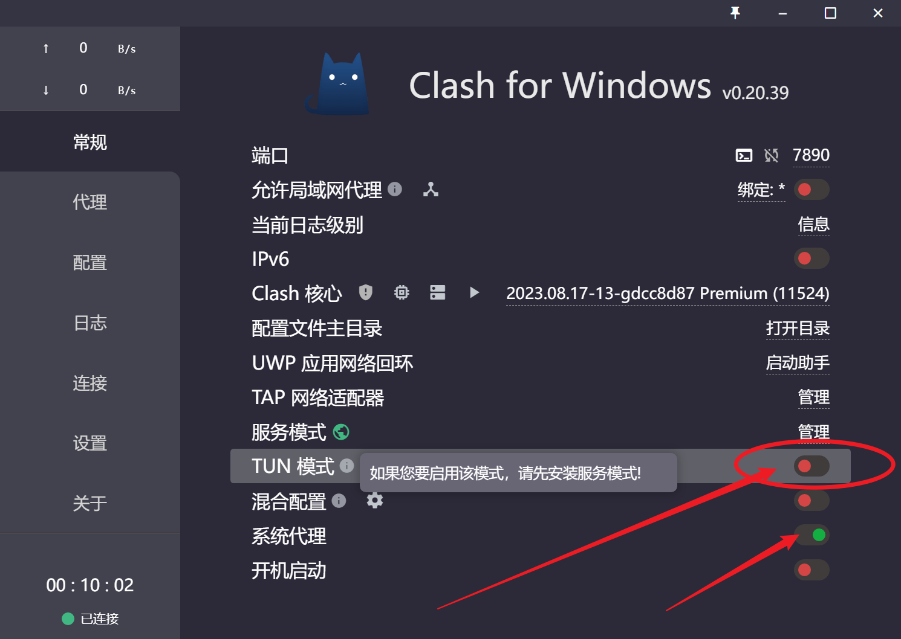
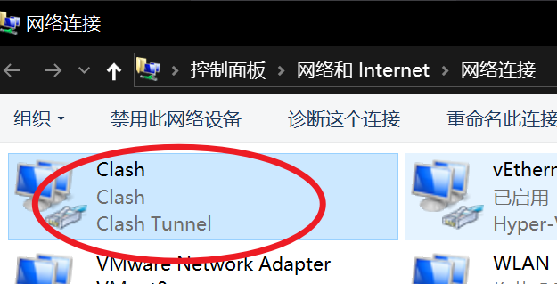

=============================================
设置应用全局
=============================================

我们通常所说的全局模式, 指的是 **使用浏览器访问某个地址时,
使用代理地址访问**.

而 规则模式 是, 仅对匹配名单的地址使用代理.

而系统的其他App能否正常访问代理, 得看应用自己有没有提供
自动识别代理的功能.

对于MacOS, 直接使用 ``ClashX Pro`` 即可, 打开 ``使用增强模式`` 功能
即可对全局App使用代理

下面主要介绍Windows.

安装虚拟网卡服务
=============================================

打开Clash主界面, 安装服务模式, 安装服务模块

安装好后图中圈出位置会显示::

  当前状态: 已激活

打开TUN模式
=============================================

在 `系统代理` 打开的情况下,
打开 `TUN模式`

成功后还可以看到有这个

