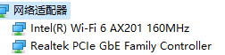
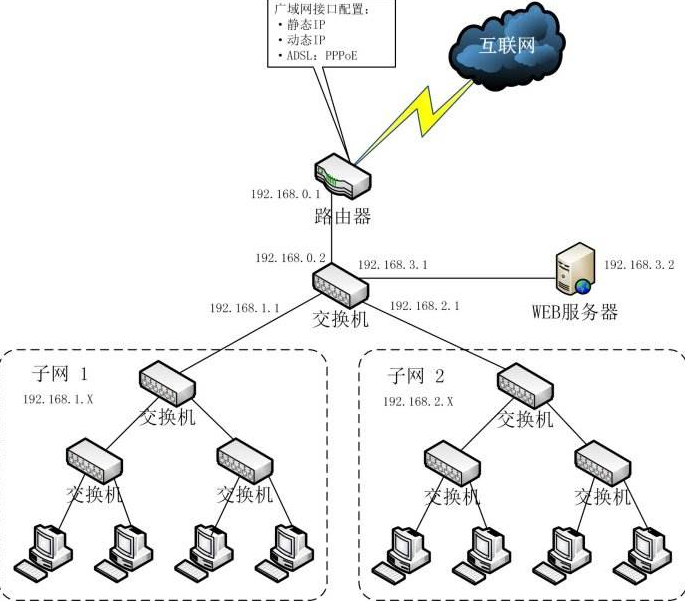
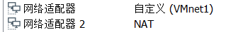
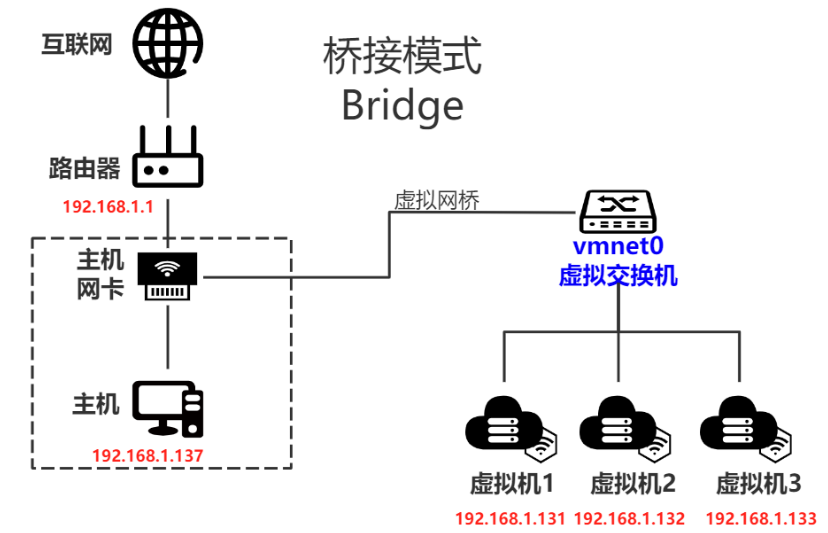
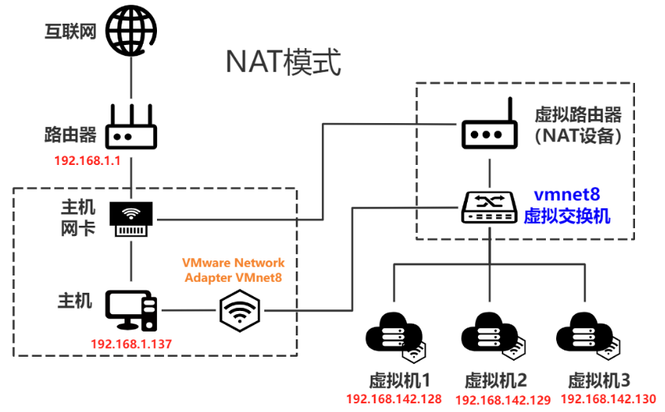
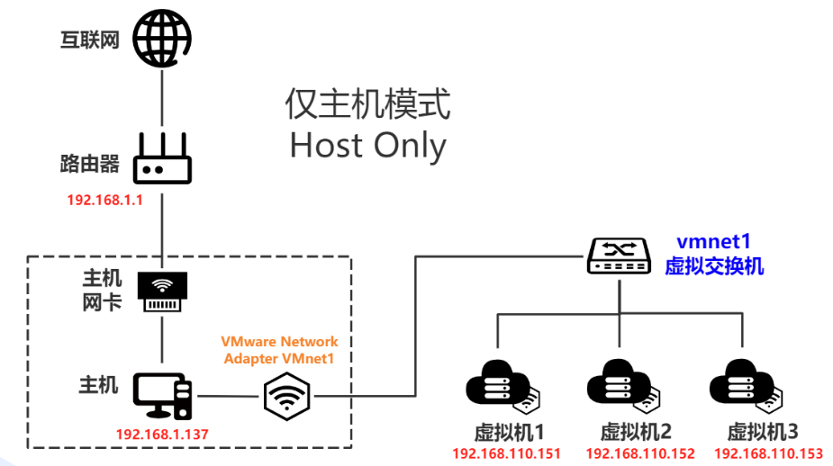

==========================
VMware 三种网络模式
==========================

参考:

- https://www.cnblogs.com/pipci/p/12271190.html

- https://wenku.baidu.com/view/7d6f1a3f084e767f5acfa1c7aa00b52acfc79c1d

网卡、路由器、交换机
==========================

**网卡** 是电脑内置的硬件，一般的笔记本会有两个网卡:

- 以太网网卡，有线上网用
- Wi-Fi网卡，无线上网使用。

	Windows 网络适配器

**路由器** 一般有几个功能，第一个是网关，控制下行网络。第二个是扩展有线网络端口，比如家里有四个房间，每个房间都要有一个网口。第三个是WiFi功能，可以接入无线设备。

**交换机** 一般只有扩展有线网络端口一个功能，也就是说可以把局域网的电脑组建成一个网络。

如果只有交换机没有路由器是不能上网的。

最后：我们看下总体的网络结构图：交换机是用来扩展接口，或者把局域网的电脑连接到一个网络环境用的。路由器帮我们连接到互联网。

	网络结构图

虚拟网络编辑器
==========================

首先，虚拟机有三个虚拟交换机，分别对应于三种模式。

三个虚拟机交换机
-------------------------

.. csv-table:: 虚拟交换机种类
	:header: 虚拟交换机, 用途
	:align: center

	VMnet0	, 桥接模式
	VMnet1	, 仅主机模式
	VMnet8	, NAT模式

注意，名字短的是虚拟机交换机。

因为我们前面讲过了，交换机的作用是扩展接口或者组网，所以这些虚拟机交换机的作用就是让相同网络模式的虚拟机能够相互连接。

另外，安装Vmware软件的时候，它还在我们的物理机里面安装了两个虚拟网卡。

虚拟网卡
-------------------------

.. csv-table:: 虚拟网卡
	:header: 虚拟网卡名称, 用途
	:align: center

	VMware Network Adapter VMnet1	, 仅主机模式
	VMware Network Adapter VMnet8	, NAT模式

名字长的是虚拟网卡。

虚拟网卡，是物理机使用的，用来连接到虚拟交换机，和虚拟机连接。

为什么没有vVMware Network Adapter VMnet0呢？这个我们我们后面来解答。

注意，一个机器可以同时使用多种网络模式，也就是使用多个虚拟网卡。

	使用多种网络模式

比如一台虚拟机，同时需要有内网IP和外网IP，就可以添加两个网络适配器。

对于这三种网络模式，我们最重要的是解决两个问题：

在不同的网络模式下：

1、主机怎么和虚拟机连接？
2、虚拟机怎么连接到互联网？

网络模式
==========================

桥接模式
--------------------------

	桥接模式

通信方式
++++++++++++++++++++++++++

#. 虚拟机通过连接到虚拟机交换机，利用虚拟网桥连接到主机的网卡。
#. 它不需要用到虚拟网卡，所以没有VMware Network Adapter VMnet0。

特点
++++++++++++++++++++++++++

#. 物理机和虚拟机地位平等
#. 虚拟机占用一个独立IP
#. 使用物理机的网卡访问互联网

配置
++++++++++++++++++++++++++

虚拟机IP网段和主机一致

连通情况
++++++++++++++++++++++++++

#. 主机和虚拟机可以访问
#. 虚拟机之间可以相互访问
#. 可以访问互联网

使用场景
++++++++++++++++++++++++++

创建一个虚拟服务器在内网提供网络服务

NAT
--------------------------

	NAT

通信方式
++++++++++++++++++++++++++

#. 虚拟NAT设备（虚拟路由）连接到VMnet8虚拟交换机——虚拟机联网用
#. 主机通过VMware Network Adapter VMnet8虚拟网卡连接到VMnet8虚拟交换机——主机和虚拟机连接用

.. note::

	虚拟DHCP服务器连接到VMnet8虚拟交换机

特点
++++++++++++++++++++++++++

#. 虚拟机在外部网络中没有自己的IP地址
#. 虚拟NAT设备会把专用网络中的 IP 地址转换为主机系统的 IP 地址——网络地址转换
#. 主机可以联网，虚拟机就可以联网

配置
++++++++++++++++++++++++++

无

连通情况
++++++++++++++++++++++++++

#. 主机和虚拟机可以访问
#. 虚拟机之间可以相互访问
#. 可以访问互联网
#. 本机虚拟机可以访问其他主机
#. 其他主机不能访问本机虚拟机。解决办法：共享网络、端口映射

使用场景
++++++++++++++++++++++++++

大部分情况

仅主机
--------------------------

	仅主机

通信方式
++++++++++++++++++++++++++

主机使用VMware Network Adapter VMnet1虚拟网卡连接到VMnet1虚拟交换机

特点
++++++++++++++++++++++++++

没有了虚拟NAT设备，所以不能上网

连通情况
++++++++++++++++++++++++++

#. 主机和虚拟机可以访问
#. 虚拟机之间可以相互访问
#. 不能访问互联网，解决办法：主机网卡共享给VMware Network Adapter VMnet1网卡
#. 不能访问其他主机
#. 其他主机不能访问本机虚拟机

使用场景
++++++++++++++++++++++++++

创建一个与其他机器隔离的网络

总结
--------------------------

在网络模式的区别里面，只需要记住1、特点2、使用场景就可以了。不需要记住上网到底是怎么实现的。

.. topic:: 结论

	#. 桥接需要一个额外的IP
	#. NAT模式是最简单的
	#. 仅主机用于封闭网络

.. note::

	原文地址: `https://cloud.fynote.com/share/d/12926`

	访问码: 6379
