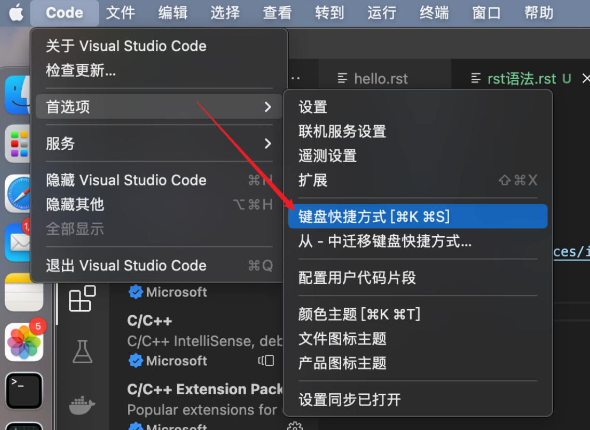

================================
快捷键
================================

快捷键 idea/pycharm

- command option v

  new一个对象的时候, 自动命名, 或者定义变量时快速命名

- command option <-
  返回上一个位置

- command option ->
  去下一个位置

- command shift f
  全局搜索字符串

- command shift r
  全局替换

- command f
  文件内搜索字符串

- command r
  文件内替换

- shift shift
  全局搜索文件名

Win下:
  - ctrl + alt + shift + l : 快速格式化

其他

  vscode快捷键位置

