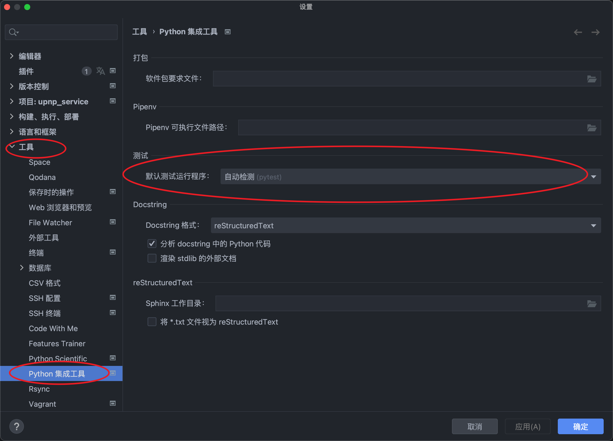

==========================
配置pytest环境
==========================

有时候点测试左边的三角形, 发现使用的是unittest, 于是就找了一下pytest相关的配置.

前提说明, 安装pytest及相应pytest插件, 必须安装的包::

  pip install pytest pytest-runner pytest.ini

这三个包貌似直接加*就行::

  pip install pytest*

然后看具体的测试用例使用了哪些插件, 然后去自己装.

比如定义了async异步测试函数, 需要使用asyncio标记::

  @pytest.mark.asyncio

这个时候就需要用到相应的插件::

  pip install pytest-asyncio

在Pycharm配置默认测试执行程序
====================================================

默认是自动识别, 可以在以下位置查看/修改::

  设置 =》 工具 =》 Python 继承工具 =》 测试 默认测试运行程序

