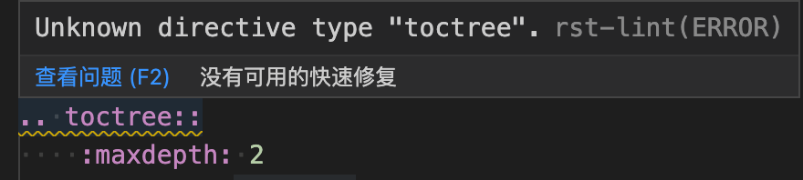

=================================
记录vscode与rst协作遇到的一些坑
=================================

语法检查
=================================

| 主要就是语法检查的坑

用到的拓展含 restructuredtext , 内置了 lint 语法检查, 包含三种类型

  - rst-check
  - rst-lint
  - doc8

.. sidebar:: 提示
  :subtitle: ...

  插件商店有提示lint使用的是另一个插件, 我没细看, 有兴趣的自行了解吧

其中, 数 rst-lint 问题最大, vscode 在另外的地方已经有配置使用 sphinx 检查,
这里拓展使用的 rst-lint 检查默认貌似是使用的 docutils , 导致没问题的地方, 老给你标波浪线, 严重影响体验.

例如:

  toctree标记语法错误, 其实没问题

最后配置以下设置解决

.. code-block:: javascript
  :name: 禁用 rst-lint ,使用 sphinx 预览

  // 禁用 rst-lint
  "restructuredtext.linter.disabledLinters": [
    "rst-lint",
  ],

  // 使用 sphinx 预览
  "restructuredtext.preview.name": "sphinx",

.. topic:: 参考文档

  `restructuredtext配置 <https://docs.restructuredtext.net/articles/configuration>`_

  `restructuredtext-linter介绍 <https://docs.restructuredtext.net/articles/linter>`_

  `restructuredtext-issues#386 <https://github.com/vscode-restructuredtext/vscode-restructuredtext/issues/386>`_

.. note::

  当时还在 restructuredtext-issues#386 询问了作者, 后面才看到邮件被告知确实似乎 linter 的问题, 但不是他们开发的. 然后顺手关闭了此问题...

  最开始的理解是 restructuredtext 里集成了 linter , 设想 linter 可以被 restructuredtext 自动设置, 是我错了, 还是禁用吧.
