======================================
VMware安裝OpenWrt
======================================

.. post:: 2024-03-09 18:21:01
  :tags: linux, OpenWrt
  :category: 操作系统
  :author: YanQue
  :location: CD
  :language: zh-cn

官网下载地址
  因为我是虚拟机安装, 系统是64位, 所以就只看这个页面的:
  `<https://downloads.openwrt.org/releases/23.05.2/targets/x86/64/>`_
  或者通用版也行:
  `<https://downloads.openwrt.org/releases/23.05.2/targets/x86/generic/>`_,

  二选一即可

  直接选组合包吧:

  .. figure:: ../../../../resources/images/2024-03-03-17-22-37.png
    :width: 480px

  区别::

    ext4      rootfs可以扩展磁盘空间大小，而squashfs不能。
    squashfs  rootfs可以使用重置功能（恢复出厂设置），而ext4不能。

虚拟机创建环境

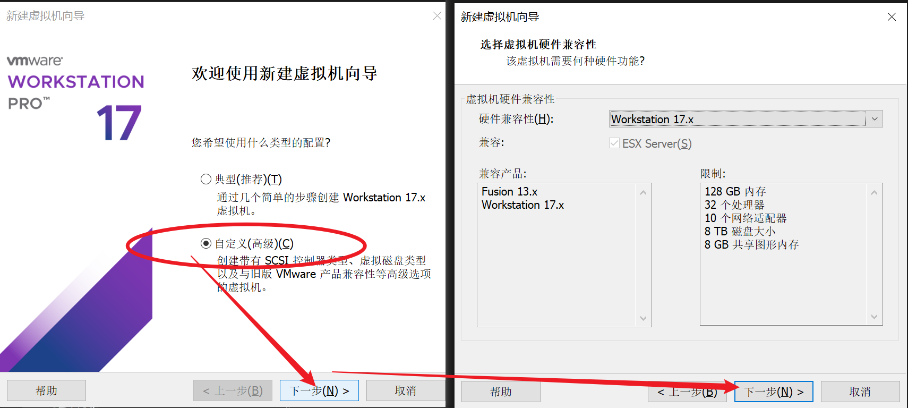

先不安装操作系统, 选择linux

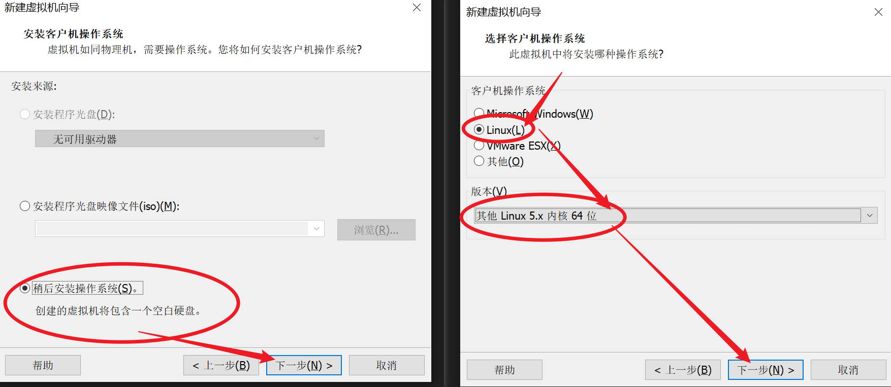

自由选择名称, 位置:

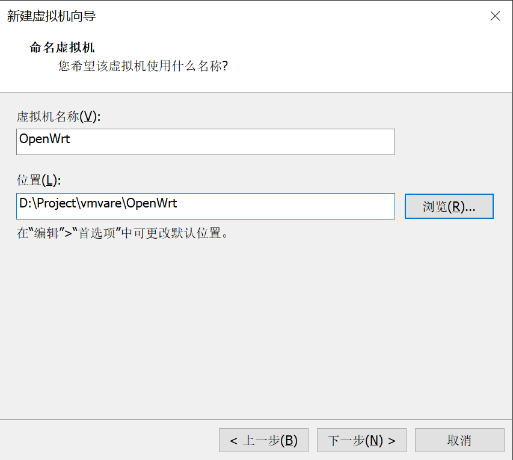

处理器给一个就行

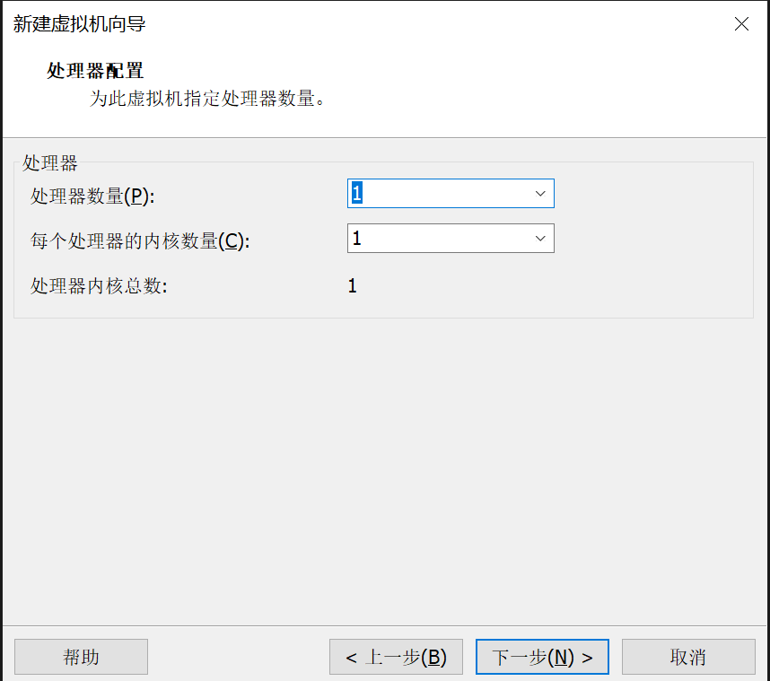

内存默认即可(要多给也行)

网络选择桥接(这里就是使用VM的好处, 如果用docker配置地址比较麻烦)

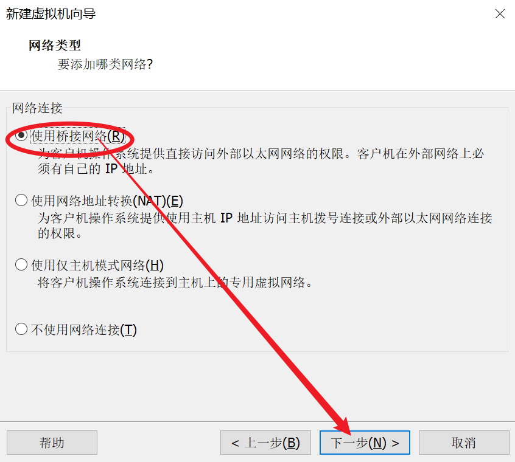

.. note::

  桥接模式
    VMware桥接模式，也就是将虚拟机的虚拟网络适配器与主机的物理网络适配器进行交接，
    虚拟机中的虚拟网络适配器可通过主机中的物理网络适配器直接访问到外部网络。
    简而言之，这就好像局域网中添加了一台新的、独立的计算机一样。
    因此，虚拟机也会占用局域网中的一个IP地址，并且可以和其他终端进行相互访问。
  NAT模式
    NAT，是Network Address Translation的缩写，意即网络地址转换。
    NAT模式也是VMware创建虚拟机的默认网络连接模式。
    使用NAT模式网络连接时，VMware会在主机上建立单独的专用网络，用以在主机和虚拟机之间相互通信。
  仅主机模式
    仅主机模式，是一种比NAT模式更加封闭的的网络连接模式，它将创建完全包含在主机中的专用网络。
    仅主机模式的虚拟网络适配器仅对主机可见，并在虚拟机和主机系统之间提供网络连接。
    相对于NAT模式而言，仅主机模式不具备NAT功能，因此在默认情况下，
    使用仅主机模式网络连接的虚拟机无法连接到Internet
    (在主机上安装合适的路由或代理软件，或者在Windows系统的主机上使用Internet连接共享功能，
    仍然可以让虚拟机连接到Internet或其他网络)。

控制器默认即可,
磁盘选择使用 :doc:`/docs/杂乱无章/常用工具使用/StarWindConverter` 转换的虚拟机文件(需要保持现有格式):

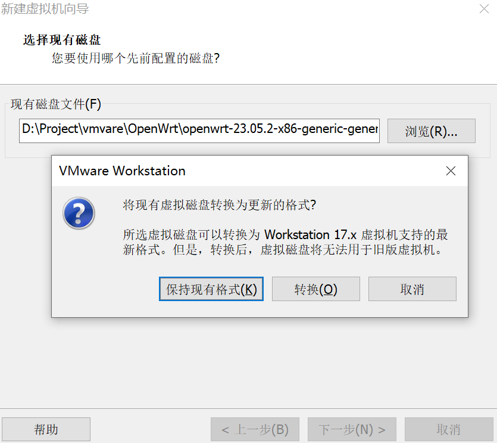

后续看需求了, 直到 选择自定义硬件

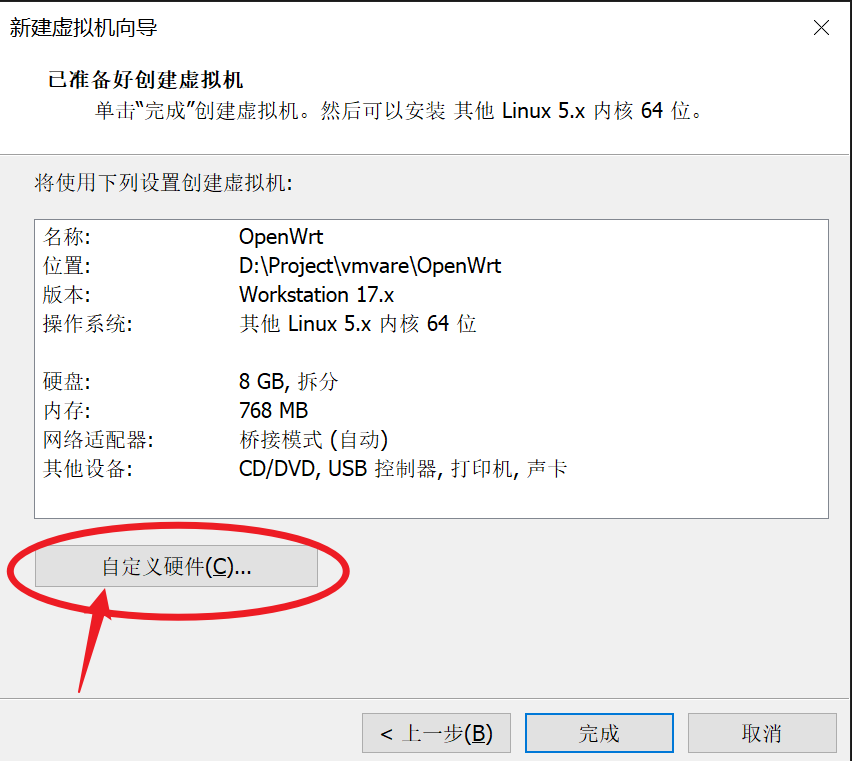

没用的都可以去掉

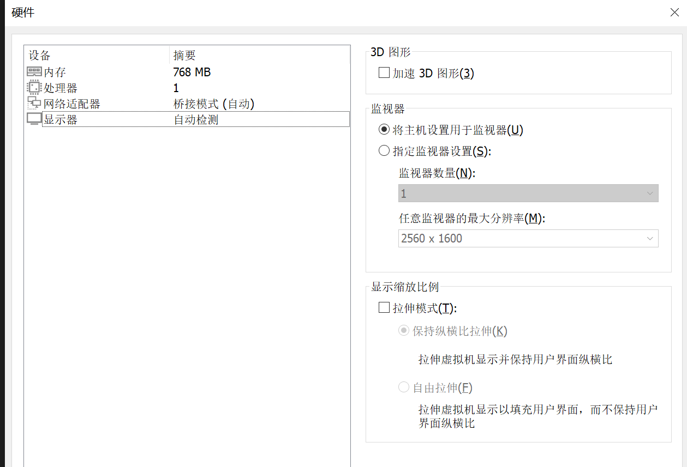

.. note::

  这里补充一下, 下载的 img 的压缩包, 需要先转换为ISO文件

  我这里使用的是WSL, 直接在cmd输入debian即可,
  然后配置源, 可参考 :doc:`/docs/操作系统/linux/debian/配置debian容器`

  最后使用 :doc:`/docs/操作系统/linux/linux指令/genisoimage` 指令::

    # 进入解压目录
    cd /mnt/e/xxxxxxxxxxx/openwrt-23.05.2-x86-generic-generic-ext4-combined.img
    geteltorito -o output_file.iso input_file.img

  不行, 缺少库, 还是直接用我虚拟机弄吧... ::

    genisoimage -o openwrt.iso openwrt-23.05.2-x86-generic-generic-ext4-combined.img

  实测直接转换的iso是不能用的, 还是老老实实使用工具 :doc:`/docs/杂乱无章/常用工具使用/StarWindConverter` 吧

然后打开虚拟机, 会安装一会儿, 出现 ready 后回车即可:

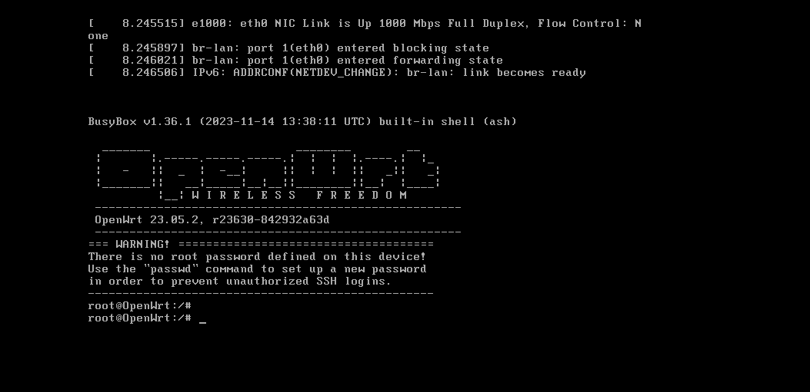

物理机 :doc:`/docs/操作系统/windows/windows_shell/ipconfig` 查看网络信息

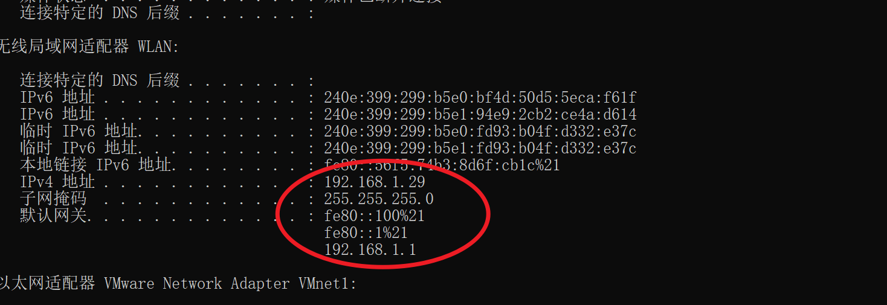

虚拟机配置网络::

  vi /etc/config/network

这是默认配置

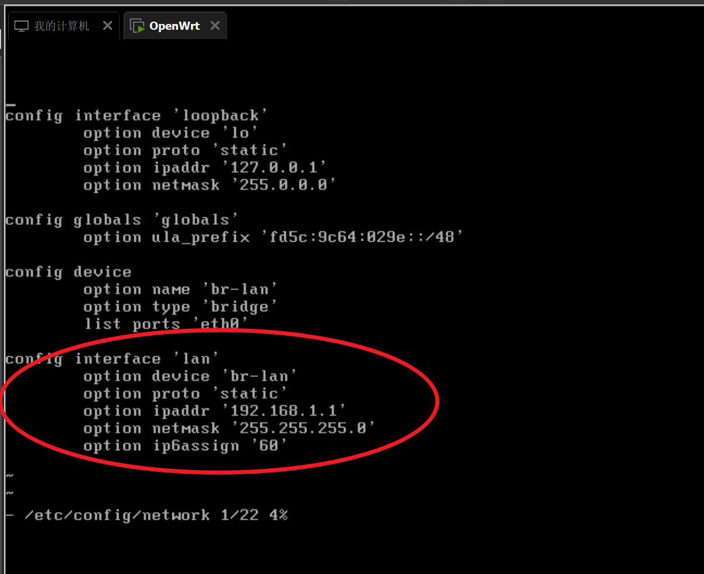

按照物理机修改, 需要跟物理机同网段

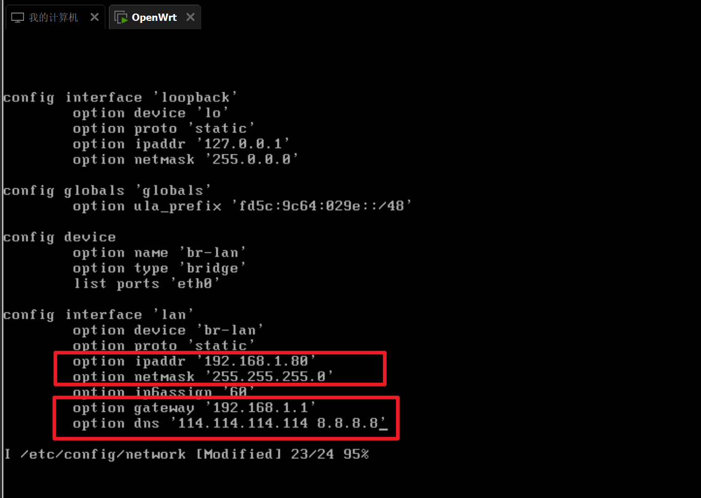

重启虚拟机::

  reboot

然后宿主机(物理机) 看看通不::

  ping

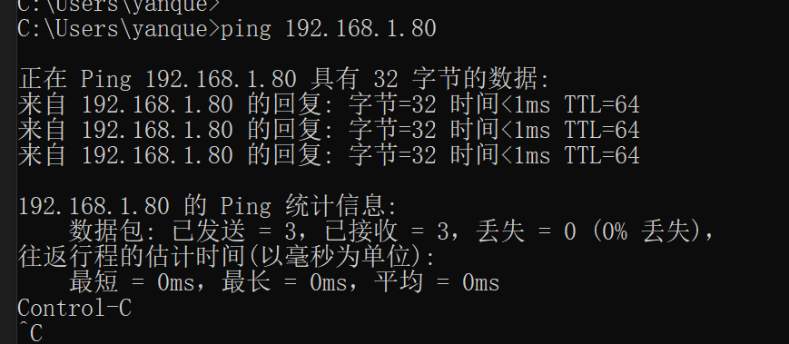

登录虚拟机的系统, 地址::

  192.168.1.80

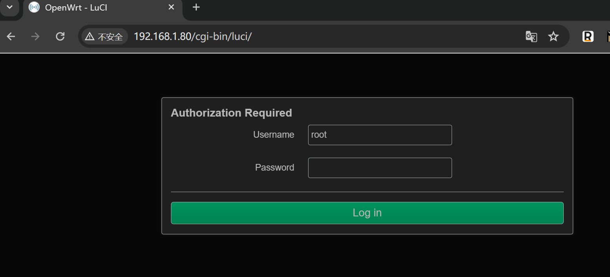

默认账密::

  root
  netflixcn.com

设置旁路由
======================================

随后打开「网络」->「接口」配置页面，选择 LAN 接口

- LAN 接口的桥接选项取消勾选
- DHCP 服务器勾选「忽略此接口」

打开「网络」-> 「设备」页面

- eth0网卡配置取消勾选「启用 IPv6」
- br-lan接口同样取消启用「启用IPv6」

安装 openclash
---------------------------------------

两种方式可以选择

- 直接在 openwrt 的「系统」-「软件包」中搜索下载
- 在openclash的官方仓库下载 ipk 安装包，手动上传安装

插件设置
---------------------------------------

个人习惯，倾向于使用 Fake-IP 模式。 步骤：

- 模式使用 Fake-IP（增强）模式，打开旁路由兼容
- 本地 DNS劫持，使用 dnsmasq 转发 PS.模式也推荐使用 TUN ，
  该模式下的UDP 处理性能更好，同时新增了 tun 虚拟接口，可以监管三层网络流量。

使用
---------------------------------------

至此，旁路由已经具备网络代理的功能。
家里的设备需要使用的话，需要将网络设置的ip 的网关和 DNS都指向旁路由的地址即可。
DNS的域名解析工作交给旁路由来处理，避免 DNS污染的问题。

参考:

- `VMware安装openWRT软路由系统的步骤(图文教程) <https://zhuanlan.zhihu.com/p/676168607>`_
- `通过Docker部署OpenWrt做家用旁路由 <https://blog.simpdog.me/posts/using-docker-to-deploy-openwrt-as-a-home-router/>`_

