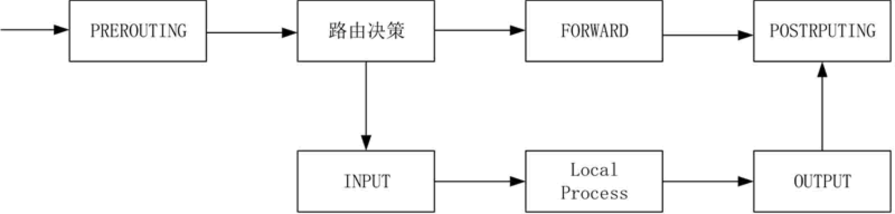

==============================
iptables
==============================

iptables其实不是真正的防火墙，可以理解为一个客户端代理，
用户通过iptables这个代理，将用户的安全设定到对应的安全框架，
而这个安全框架才是真正的防火墙，这个框架是 netfilter

netfilter 才是防火墙真正的安全框架，位于内核空间.
netfilter 是linux操作系统核心层内部的一个数据包处理模块，具有如下功能：

- 网络地址转换（network address translate）
- 数据包内容修改
- 以及数据包过滤的防火墙功能

netfilter/iptables 组成linux平台下的包过滤防火墙。
免费，可以替代昂贵的商业防火墙解决方案，完成封包过滤、封包重定向、网络地址转换（NAT）等功能。

虽然使用 service iptables restart 来启动服务，更准确的说，
iptables并没有一个守护进程，所以并不算是真正意义上的服务，而应该是内核提供的服务。

语法-选项
==============================

语法::

  iptables -t 表名 <-A/I/D/R> 规则链名 [规则号] <-i/o 网卡名> -p 协议名 <-s 源IP/源子网> --sport 源端口 <-d 目标IP/目标子网> --dport 目标端口 -j 动作

  #-A 指定链的末尾新增一个指定的规则
  #-I 链的指定位置插入一条或多条规则
  #-D 指定链的chain中删除一条或者多条规则
  #-R num 替换/修改第几条规则

  #-P 设置默认规则

选项

-P                设置默认策略:iptables -P INPUT (DROP
-F                清空规则链
-L                查看规则链
-A                在规则链的末尾加入新规则
-I                num 在规则链的头部加入新规则
-D                num 删除某一条规则
-s                匹配来源地址IP/MASK，加叹号"!"表示除这个IP外。
-d                匹配目标地址
-i                网卡名称 匹配从这块网卡流入的数据
-o                网卡名称 匹配从这块网卡流出的数据
-p                匹配协议,如tcp,udp,icmp
--dport num       匹配目标端口号
--sport num       匹配来源端口号
-n                表示不对 IP 地址进行反查，加上这个参数显示速度将会加快。
-v                表示输出详细信息，包含通过该规则的数据包数量、总字节数以及相应的网络接口。
-m                表示使用模块

参考: `<https://www.zsythink.net/archives/1199>`_

如::

  iptables -t nat -A PERROUTING -p tcp -s 10.10.10.10 --sport 67 -d 10.10.10.11 --dport 67 -j ACCEPT

  # 这里如果是多端口可能会出现不能识别sport的情况 需搭配multiport
  # multiport多端口，“，”表示或，“：”表示区间
  iptables -t nat -A PERROUTING -p tcp -s 10.10.10.10 -m multiport --sport 67，68 -d 10.10.10.11 --dport 67 -j ACCEPT

-j 的几种动作
------------------------------

ACCEPT        #接收数据包
DROP        #丢弃数据包
REDIRECT    #重定向，映射,透明代理
SNAT        #源地址转换
DNAT        #目标地址转换
MASQUERADE    #IP伪装（NAT），用于ADSL
LOG            #日志记录

iptables默认链
==============================

INPUT
  处理输入数据包
OUTPUT
  处理输出数据包
FORWARD
  处理转发数据包
PERROUTING
  用于目标地址转换（DNAT）
POSTROUTING
  用于源地址转换（SNAT）

过滤框架
==============================

- 如果是外部主机发送数据包给防火墙本机，数据将会经过 PREROUTING 链与 INPUT 链；
- 如果是防火墙本机发送数据包到外部主机，数据将会经过 OUTPUT 链与 POSTROUTING 链；
- 如果防火墙作为路由负责转发数据，则数据将经过 PREROUTING 链、FORWARD 链以及 POSTROUTING 链。

四种表
==============================

filter
  过滤功能，只能作用在三个链上面：INPUT,FORWARD,OUTPUT
nat
  地址转换，只能作用在：PREROUTING,OUTPUT,POSTROUTING(centos 7中还有INPUT)
mangle
  修改报文原数据，五个链都可以
raw
  关闭nat启用的追踪机制，PREROUTING,OUTPUT

换种方式::

  # 链                表
  prerouting        raw --> mangle --> nat
  input            mangle --> filter (centos7 has nat, 6 not)
  forward            mangle --> filter
  output            raw --> mangle --> nat --> filter
  postrouting        mangle --> nat

常用的一些命令
==============================

常用的一些命令::

  iptables -F        # 清空所有的防火墙规则
  iptables -nvL      # 查看三个链

  iptables -X INPUT  # 删除指定的链，这个链必须没有被其它任何规则引用，而且这条上必须没有任何规则。
                     # 如果没有指定链名，则会删除该表中所有非内置的链。
  iptables -Z INPUT  # 把指定链，或者表中的所有链上的所有计数器清零。

  iptables -L [-t 表名] [链名]    # 列出已设置的规则

-m的一些模块
==============================

multiport
  多端口匹配

  可用于匹配非连续或连续端口；最多指定15个端口；

  实例::

    iptables -A INPUT -p tcp -m multiport --dport 22,80 -j ACCEPT
    iptables -A OUTPUT -p tcp -m multiport --sport 22,80 -j ACCEPT
iprange
  匹配指定范围内的地址

  匹配一段连续的地址而非整个网络时有用

  实例::

    iptables -A INPUT -p tcp -m iprange --src-range 192.168.118.0-192.168.118.60 --dport 22 -j ACCEPT
    iptables -A OUTPUT -p tcp -m iprange --dst-range 192.168.118.0-192.168.118.60 --sport 22 -j ACCEPT
string
  字符串匹配，能够检测报文应用层中的字符串

  字符匹配检查高效算法：kmp, bm,
  能够屏蔽非法字符

  实例::

    #注意该条规则需要添加到OUTPUT链，当服务端返回数据报文检查到有关键字"sex"时，则丢弃该报文，可用于web敏感词过滤
    iptables -A OUTPUT -p tcp --dport 80 -m string --algo kmp --string "sex" -j DROP
connlimit
  连接数限制，对每IP所能够发起并发连接数做限制；

  默认INPUT 为 DROP. 每个ip对ssh服务的访问最大为3个并发连接，超过则丢弃::

    iptables -A INPUT -p tcp  --dport 22 -m connlimit ! --connlimit-above 3 -j ACCEPT
limit
  速率限制
limit-burst
  设置默认阀值

  默认放行10个，当到达limit-burst阀值后，平均6秒放行1个::

    iptables -A INPUT -p icmp -m limit --limit 10/minute --limit-burst 10 -j ACCEPT
state
  状态检查

  连接追踪中的状态：

  - NEW: 新建立一个会话
  - ESTABLISHED：已建立的连接
  - RELATED: 有关联关系的连接
  - INVALID: 无法识别的连接

  放行ssh的首次连接状态::

    iptables -A INPUT -p tcp --dport 22 -m state --state NEW -j ACCEPT

  详细点

  - INVALID：无效的封包，例如数据破损的封包状态
  - ESTABLISHED：已经联机成功的联机状态；
  - NEW：想要新建立联机的封包状态；
  - RELATED：这个最常用！表示这个封包是与我们主机发送出去的封包有关， 可能是响应封包或者是联机成功之后的传送封包！这个状态很常被设定，因为设定了他之后，只要未来由本机发送出去的封包，即使我们没有设定封包的 INPUT 规则，该有关的封包还是可以进入我们主机， 可以简化相当多的设定规则。

相关指令
==============================

:doc:`/docs/操作系统/linux/linux指令/iptables-save`
:doc:`/docs/操作系统/linux/linux指令/iptables-restore`

问题--sport不能识别
==============================

--sport一直不能识别，百度也没查到原因

询问才知道。需要配合指定协议与multiport来匹配多端口才可以

端口如果使用 冒号 表示连续端口

