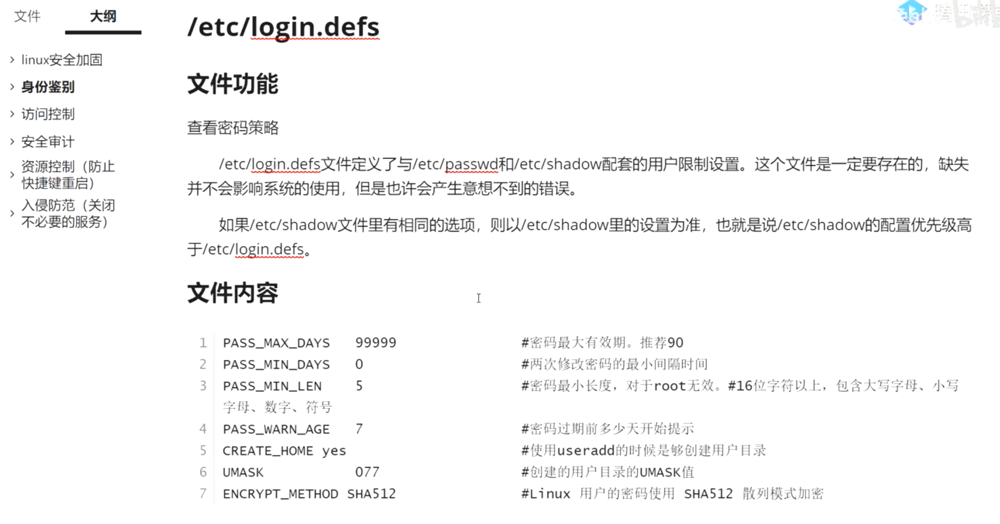
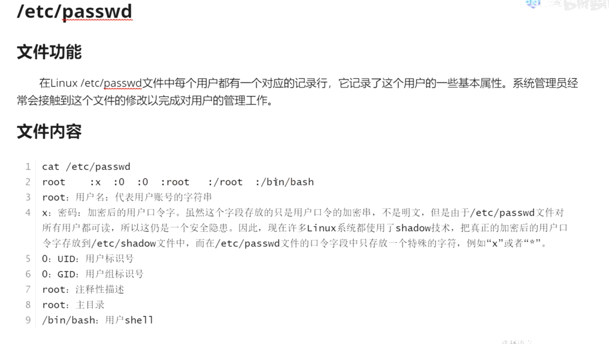
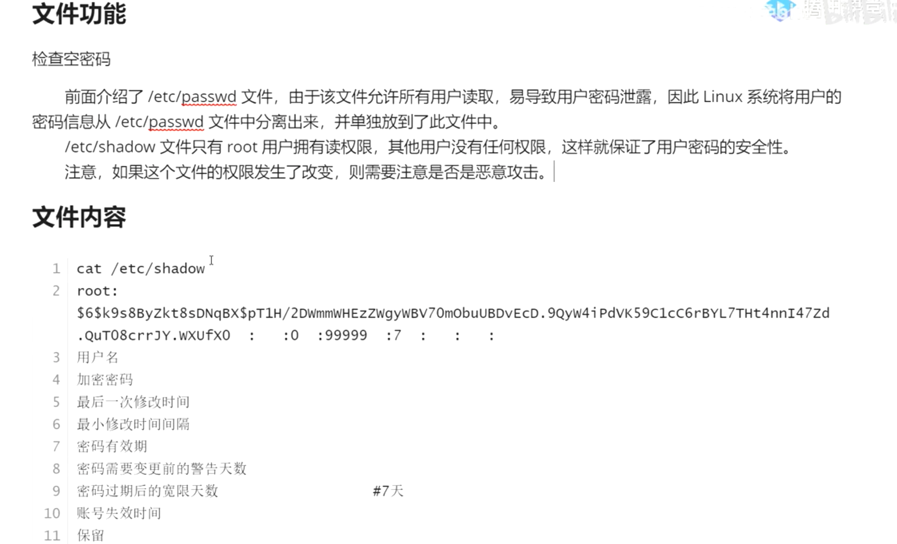
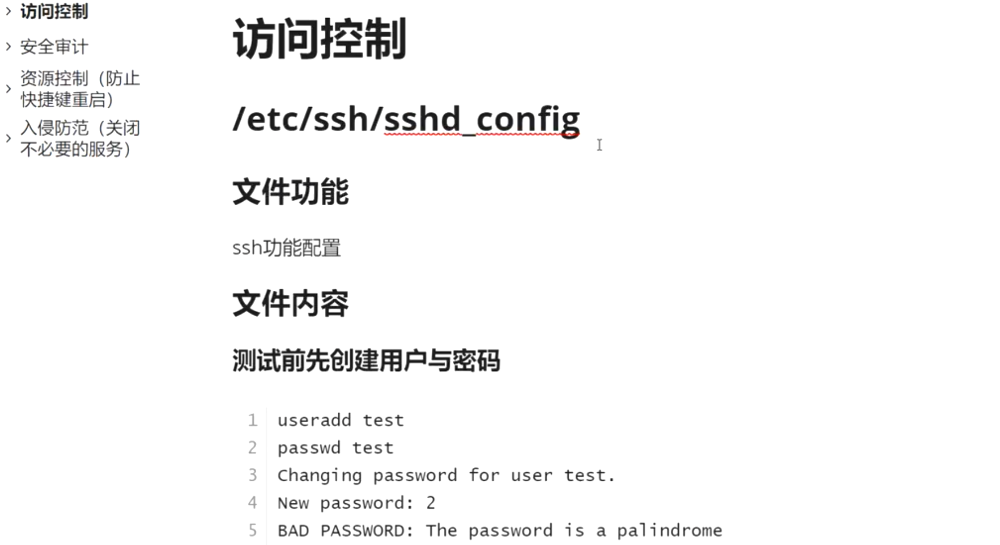
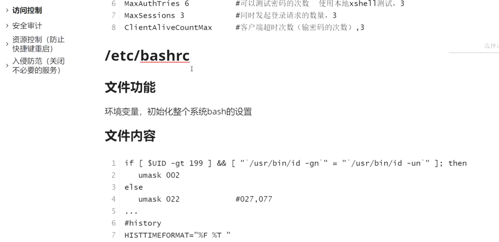
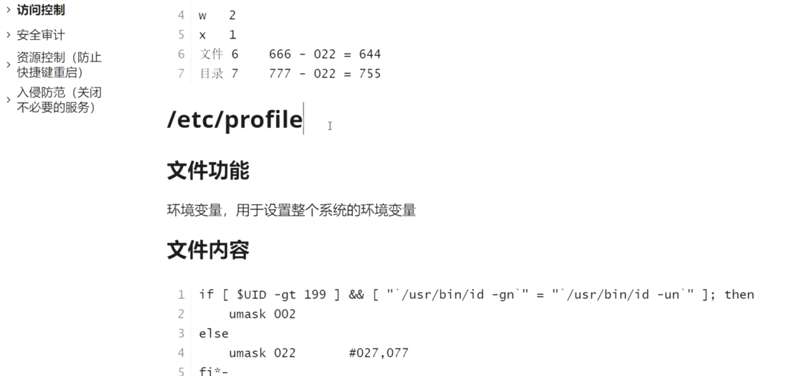
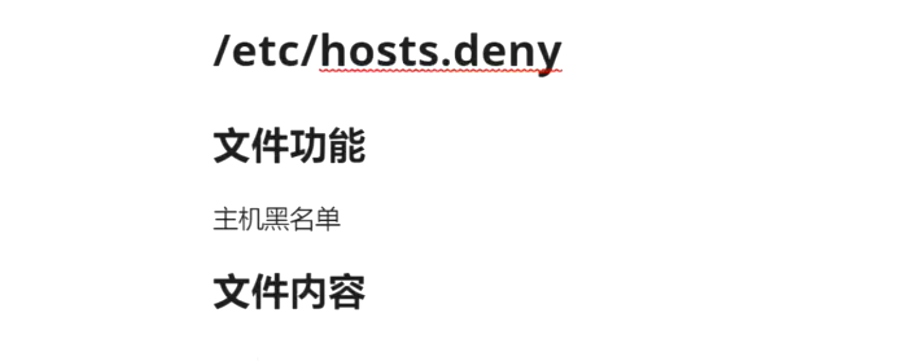
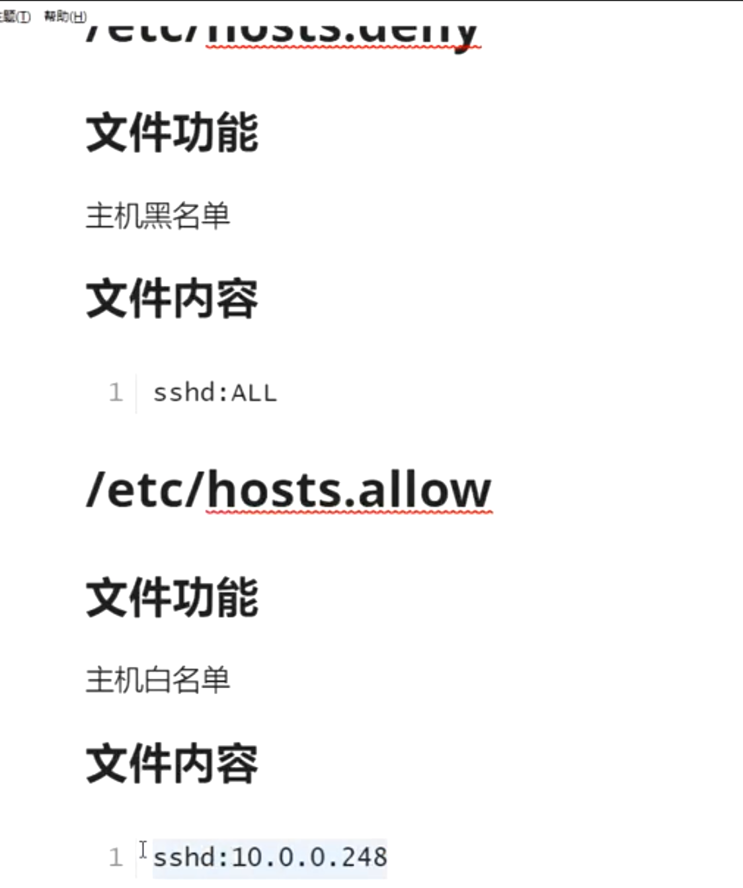
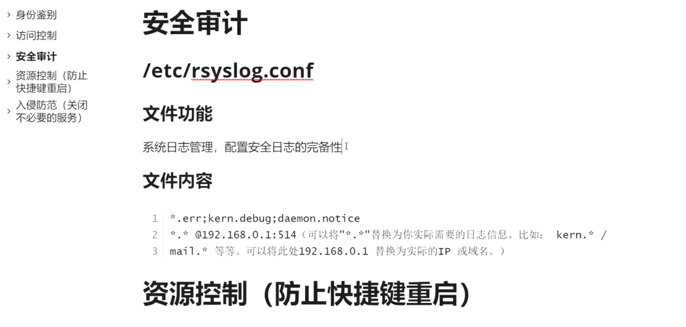

=============================
一些安全相关文件
=============================

.. post:: 2023-02-20 22:06:49
  :tags: linux
  :category: 操作系统
  :author: YanQue
  :location: CD
  :language: zh-cn

# todo:

	/etc/login.defs

umask 命令, 创建文件权限减去umask设置的值

- /etc/login.defs 定义与 /etc/passwd , /etc/shadow 配套的用户限制设置

- /etc/knockd.conf ssh相关敲门

	使用 nmap -p 端口号 IP地址

	按照文件所给的端口依次敲门可以恢复访问