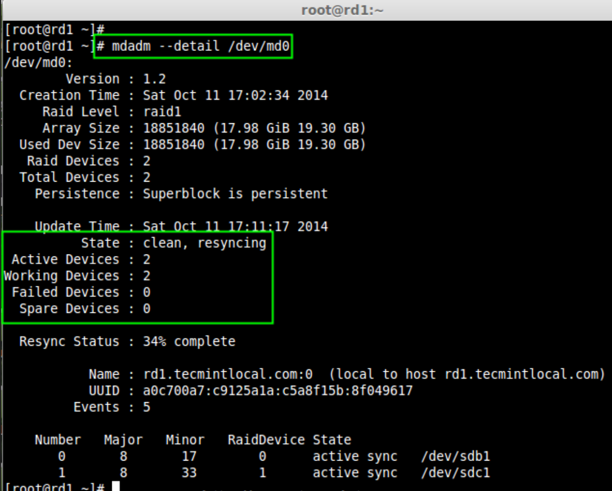
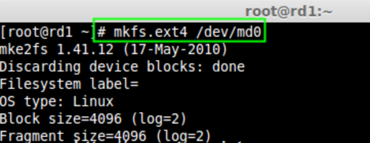
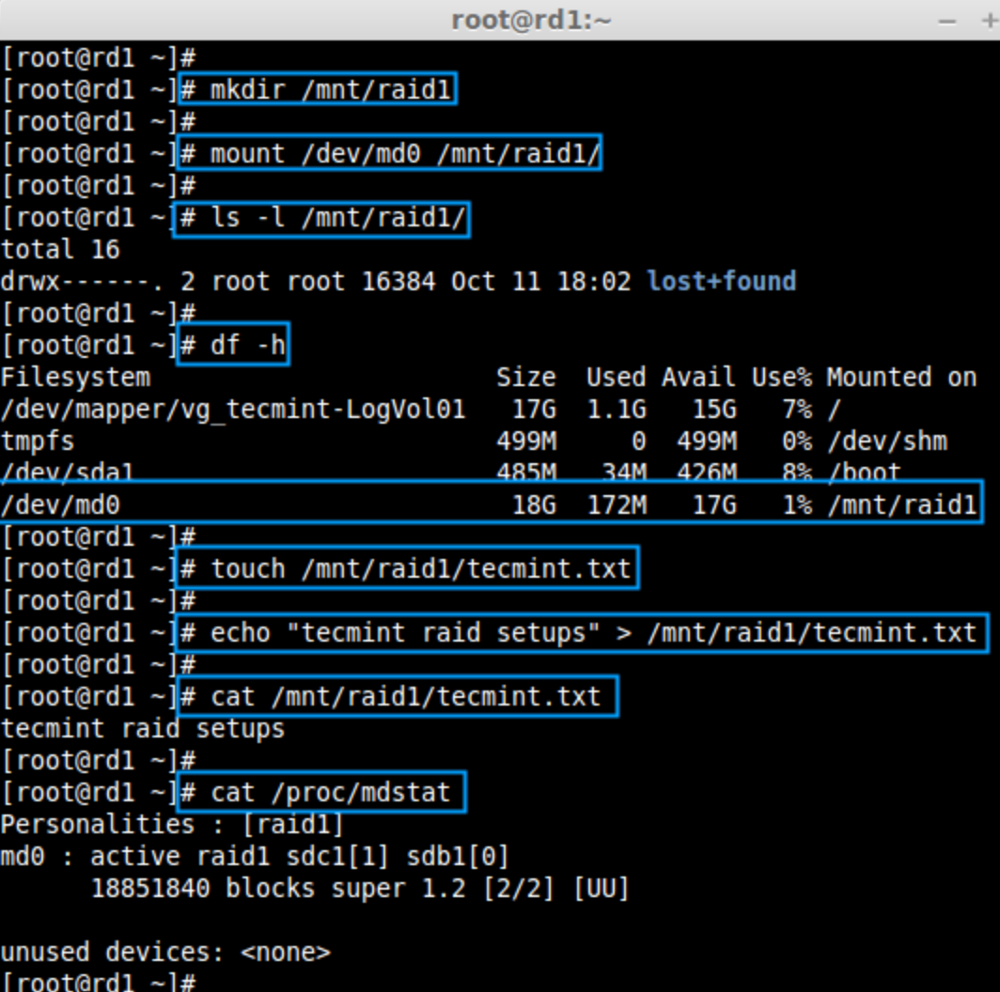
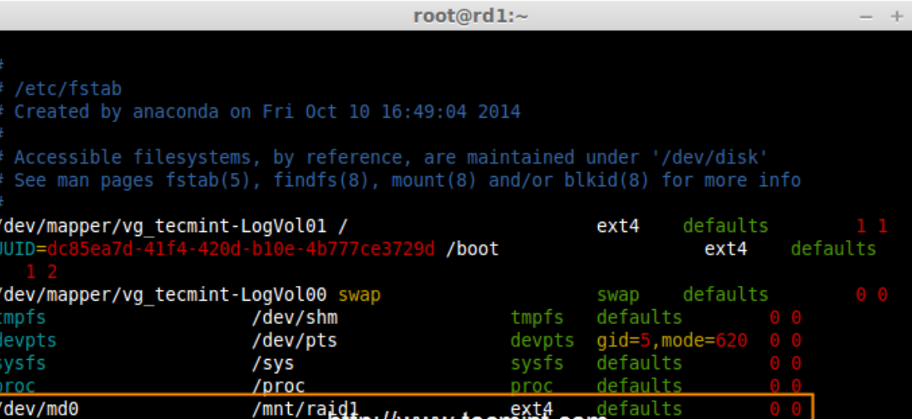
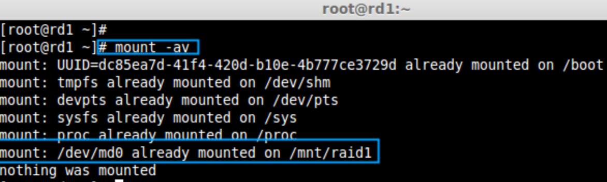
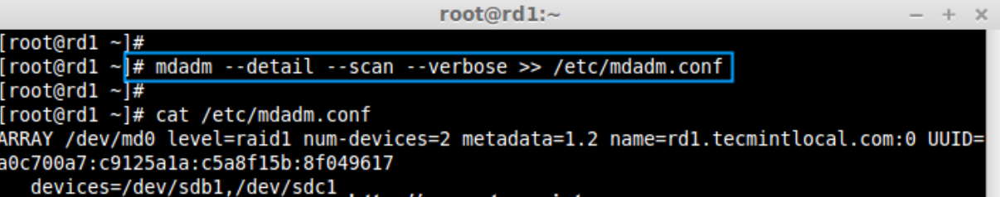
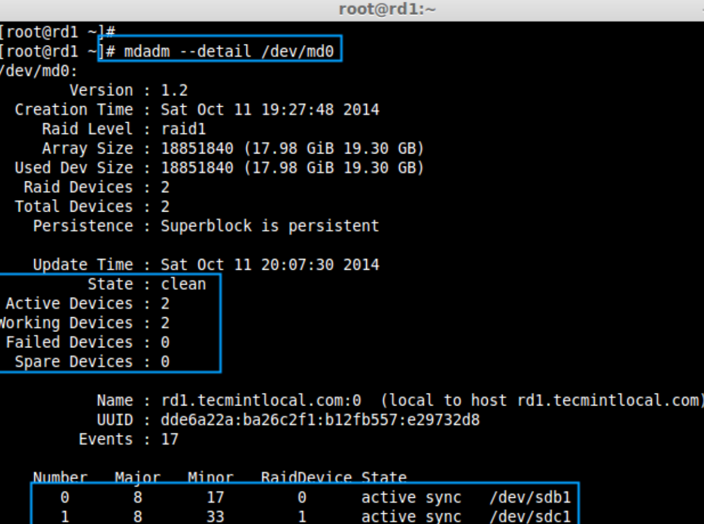
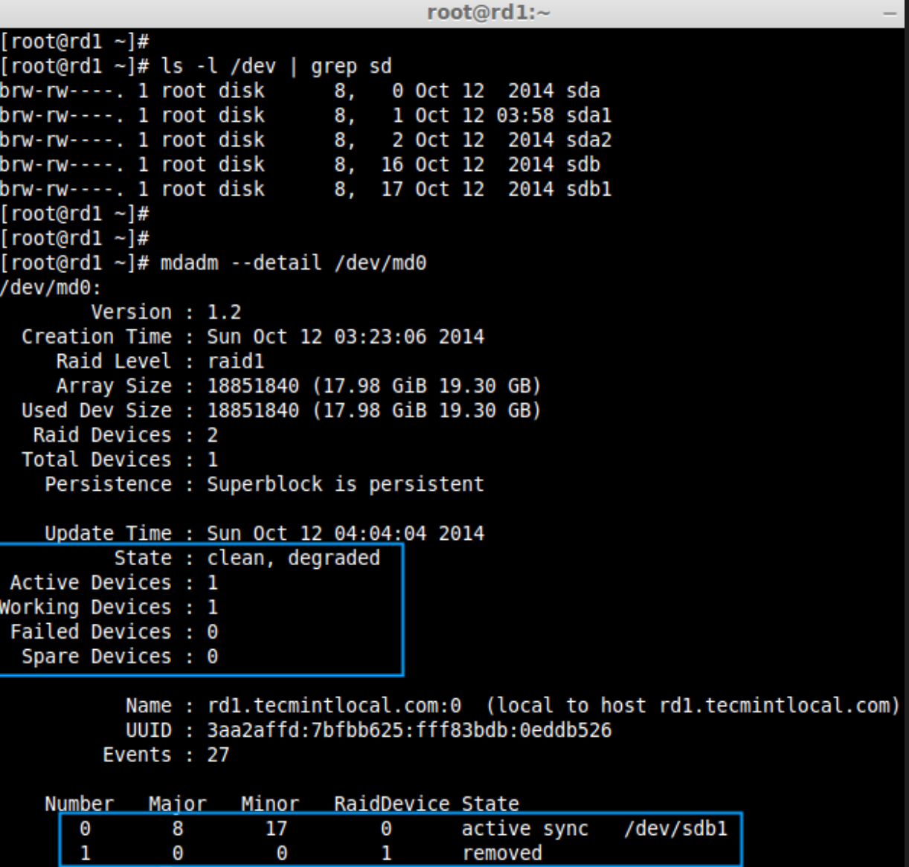
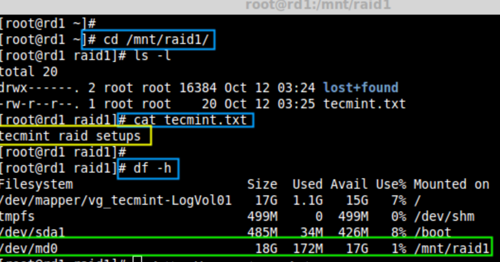

===============================================
用两块磁盘创建 RAID 1 (镜像)
===============================================

:参考::
  - 作者: `Babin Lonston <http://www.tecmint.com/create-raid1-in-linux/>`_
  - 译者: `LCTT <https://linux.cn/lctt/>`_
  - 译者: `struggling <https://linux.cn/lctt/strugglingyouth>`_
  - 评论: `<https://linux.cn/portal.php?mod=comment&id=6093&idtype=aid>`_

**RAID 镜像** 意味着相同数据的完整克隆（或镜像），分别写入到两个磁盘中。
创建 RAID 1 至少需要两个磁盘，而且仅用于读取性能或者可靠性要比数据存储容量更重要的场合。

创建镜像是为了防止因硬盘故障导致数据丢失。
镜像中的每个磁盘包含数据的完整副本。
当一个磁盘发生故障时，相同的数据可以从其它正常磁盘中读取。
而后，可以从正在运行的计算机中直接更换发生故障的磁盘，无需任何中断。

RAID 1 的特点
===============================================

- 镜像具有良好的性能。
- 磁盘利用率为50％。也就是说，如果我们有两个磁盘每个500GB，总共是1TB，但在镜像中它只会显示500GB。
- 在镜像如果一个磁盘发生故障不会有数据丢失，因为两个磁盘中的内容相同。
- 读取性能会比写入性能更好。

要求
===============================================

创建 RAID 1 至少要有两个磁盘，你也可以添加更多的磁盘，磁盘数需为2，4，6，8等偶数。
要添加更多的磁盘，你的系统必须有 RAID 物理适配器（硬件卡）。

这里，我们使用软件 RAID 不是硬件 RAID，如果你的系统有一个内置的物理硬件 RAID 卡，
你可以从它的功能界面或使用 Ctrl + I 键来访问它。

RAID 的级别和概念
  - 原文: <https://linux.cn/article-6085-1.html>`_
  - 本地: :doc:`RAID 的级别和概念`

服务器配置::

  - 操作系统  :  CentOS 6.5 FinalIP
  - 地址      :  192.168.0.226
  - 主机名    :  rd1.tecmintlocal.com
  - 磁盘 1 [20GB]  :  /dev/sdb
  - 磁盘 2 [20GB]  :  /dev/sdc

本文将指导你在 Linux 平台上使用 mdadm （用于创建和管理 RAID ）一步步的建立一个软件 RAID 1 （镜像）。
同样的做法也适用于如 RedHat，CentOS，Fedora 等 Linux 发行版。

第1步：安装所需软件并且检查磁盘
===============================================

正如我前面所说，在 Linux 中我们需要使用 mdadm 软件来创建和管理 RAID。
所以，让我们用 yum 或 apt-get 的软件包管理工具在 Linux 上安装 mdadm 软件包::

  yum install mdadm     [在 RedHat 系统]### apt-get install mdadm     [在 Debain 系统]

一旦安装好 `mdadm` 包，我们需要使用下面的命令来检查磁盘是否已经配置好::

  mdadm -E /dev/sd[b-c]

.. 没有检测到任何超级块，这意味着还没有创建RAID。

第2步：为 RAID 创建分区
===============================================

正如我提到的，我们使用最少的两个分区 /dev/sdb 和 /dev/sdc 来创建 RAID 1。
我们首先使用 `fdisk` 命令来创建这两个分区并更改其类型为 raid::

  fdisk /dev/sdb

按照下面的说明

- 按 `n` 创建新的分区。
- 然后按 `P` 选择主分区。
- 接下来选择分区号为1。
- 按两次回车键默认将整个容量分配给它。
- 然后，按 `P` 来打印创建好的分区。
- 按 `L`，列出所有可用的类型。
- 按 `t` 修改分区类型。
- 键入 `fd` 设置为 Linux 的 RAID 类型，然后按 Enter 确认。
- 然后再次使用 `p` 查看我们所做的更改。
- 使用 `w` 保存更改。

在创建“/dev/sdb”分区后，接下来按照同样的方法创建分区 /dev/sdc::

  fdisk /dev/sdc

一旦这两个分区创建成功后，使用相同的命令来检查 sdb 和 sdc 分区并确认 RAID 分区的类型如上图所示::

  mdadm -E /dev/sd[b-c]

.. note::

  正如你在上图所看到的，在 sdb1 和 sdc1 中没有任何对 RAID 的定义，这就是我们没有检测到超级块的原因。

第3步：创建 RAID 1 设备
===============================================

接下来使用以下命令来创建一个名为 /dev/md0 的“RAID 1”设备并验证它::

  mdadm --create /dev/md0 --level=mirror --raid-devices=2 /dev/sd[b-c]1### cat /proc/mdstat

接下来使用如下命令来检查 RAID 设备类型和 RAID 阵列::

  mdadm -E /dev/sd[b-c]1### mdadm --detail /dev/md0

  检查 RAID 设备阵列

从上图中，人们很容易理解，RAID 1 已经创建好了，
使用了 /dev/sdb1 和 /dev/sdc1 分区，你也可以看到状态为 resyncing（重新同步中）。

第4步：在 RAID 设备上创建文件系统
===============================================

给 md0 上创建 ext4 文件系统::

  mkfs.ext4 /dev/md0

  创建 RAID 设备文件系统

接下来，挂载新创建的文件系统到“/mnt/raid1”，并创建一些文件，验证在挂载点的数据::

  mkdir /mnt/raid1
  mount /dev/md0 /mnt/raid1/
  touch /mnt/raid1/tecmint.txt
  echo "tecmint raid setups" > /mnt/raid1/tecmint.txt

  挂载 RAID 设备

为了在系统重新启动自动挂载 RAID 1，需要在 fstab 文件中添加条目。
打开 `/etc/fstab` 文件并添加以下行::

  /dev/md0                /mnt/raid1              ext4    defaults        0 0

  自动挂载 Raid 设备

运行 `mount -av`，检查 fstab 中的条目是否有错误::

  mount -av

  检查 fstab 中的错误

接下来，使用下面的命令保存 RAID 的配置到文件“mdadm.conf”中::

  mdadm --detail --scan --verbose >> /etc/mdadm.conf

  保存 Raid 的配置

上述配置文件在系统重启时会读取并加载 RAID 设备。

第5步：在磁盘故障后检查数据
===============================================

我们的主要目的是，即使在任何磁盘故障或死机时必须保证数据是可用的。
让我们来看看，当任何一个磁盘不可用时会发生什么::

  mdadm --detail /dev/md0

  验证 RAID 设备

在上面的图片中，我们可以看到在 RAID 中有2个设备是可用的，
并且 Active Devices 是2。
现在让我们看看，当一个磁盘拔出（移除 sdc 磁盘）或损坏后会发生什么::

  ls -l /dev | grep sd### mdadm --detail /dev/md0

  测试 RAID 设备

现在，在上面的图片中你可以看到，一个磁盘不见了。
我从虚拟机上删除了一个磁盘。此时让我们来检查我们宝贵的数据::

  cd /mnt/raid1/### cat tecmint.txt

  验证 RAID 数据

你可以看到我们的数据仍然可用。
由此，我们可以了解 RAID 1（镜像）的优势。
在接下来的文章中，我们将看到如何设置一个 RAID 5 条带化分布式奇偶校验。
希望这可以帮助你了解 RAID 1（镜像）是如何工作的。

