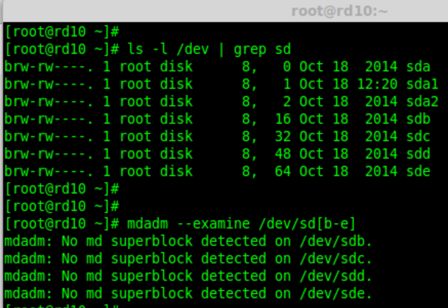
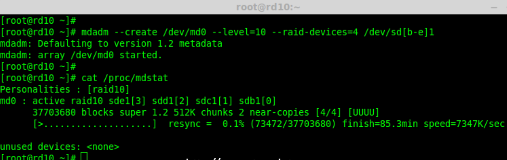
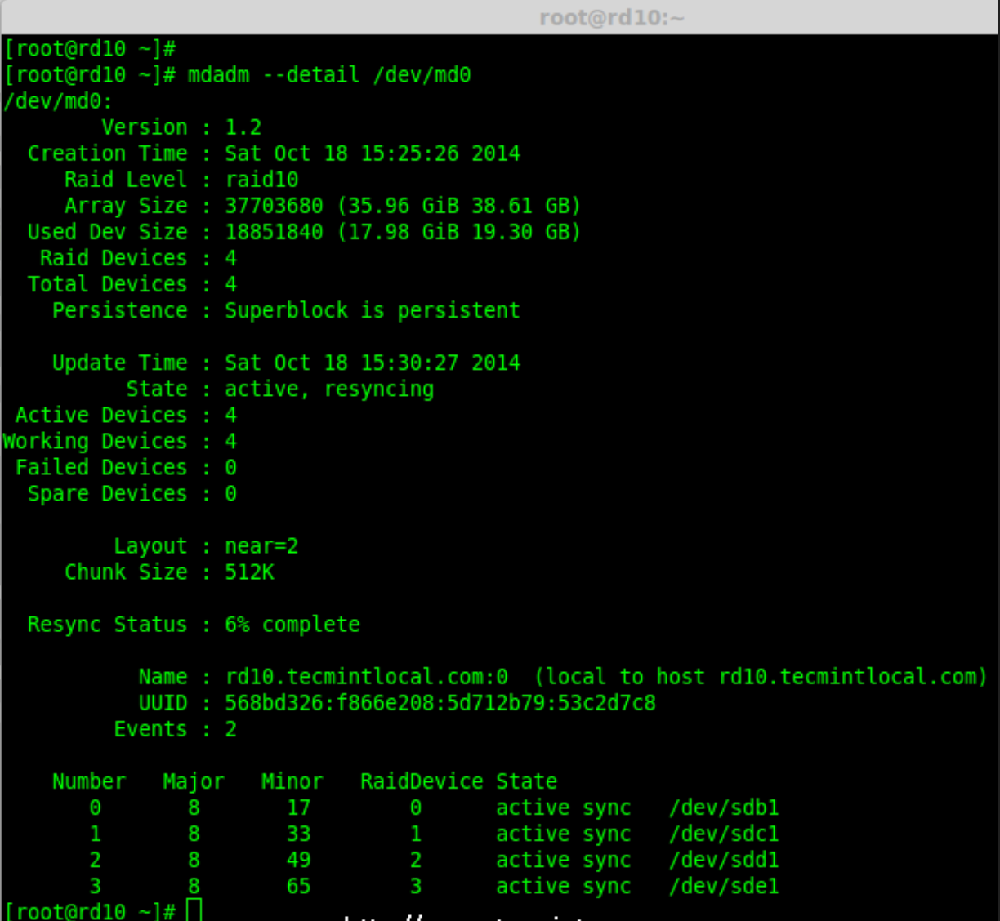
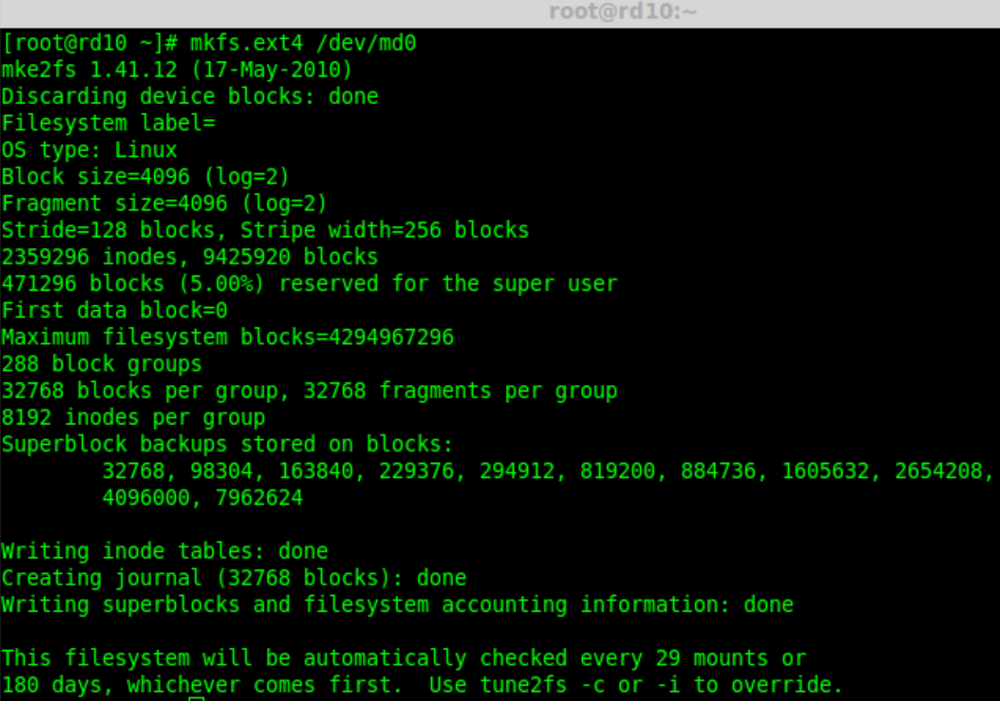
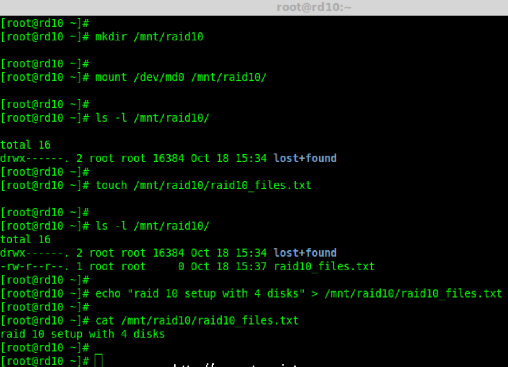
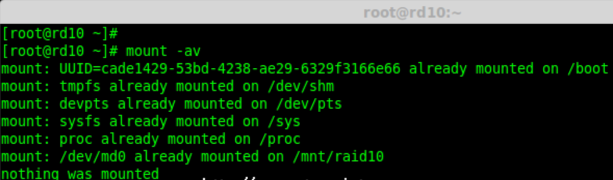
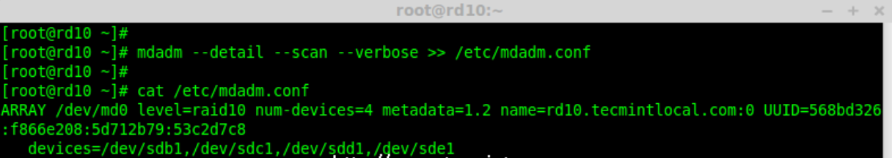
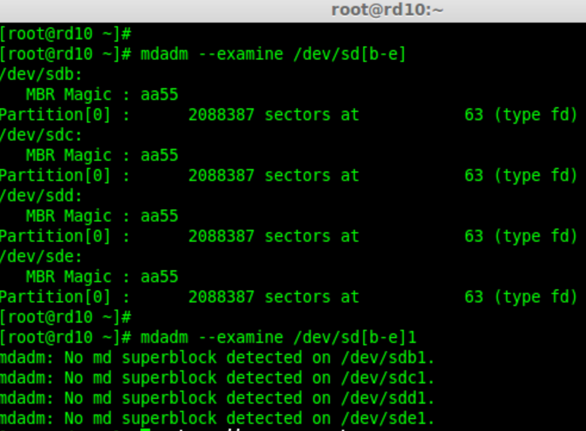
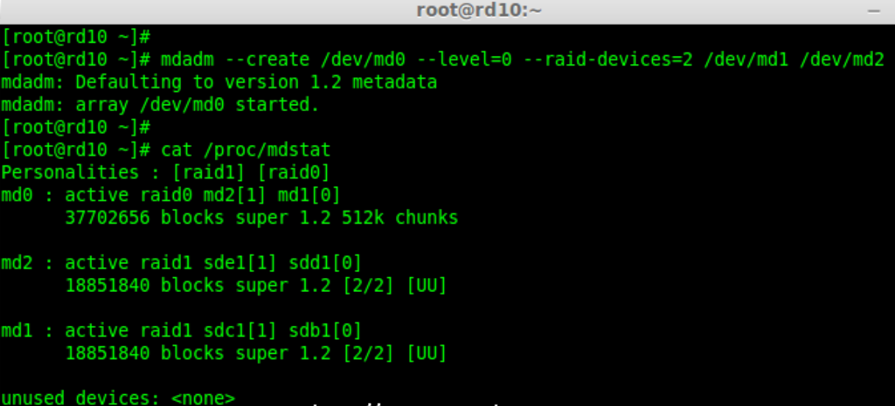

========================================================
设置 RAID 10 或 1 + 0 (嵌套)
========================================================

:参考::
  - 作者: `Babin Lonston <http://www.tecmint.com/create-raid-10-in-linux/>`_
  - 译者: `LCTT <https://linux.cn/lctt/>`_
  - 译者: `struggling <https://linux.cn/lctt/strugglingyouth>`_
  - <https://linux.cn/portal.php?mod=comment&id=6122&idtype=aid>`_

RAID 10 是组合 RAID 1 和 RAID 0 形成的。
要设置 RAID 10，我们至少需要4个磁盘。
在之前的文章中，我们已经看到了如何使用最少两个磁盘设置 RAID 1 和 RAID 0。

在这里，我们将使用最少4个磁盘组合 RAID 1 和 RAID 0 来设置 RAID 10。
假设我们已经在用 RAID 10 创建的逻辑卷保存了一些数据。
比如我们要保存数据 “TECMINT”，它将使用以下方法将其保存在4个磁盘中。

.. figure:: ../../../../../resources/images/2024-02-22-17-06-38.png
  :width: 480px

  在 Linux 中创建 Raid 10（LCTT 译注：原图有误，已修正）

RAID 10 是先做镜像，再做条带。
因此，在 RAID 1 中，相同的数据将被写入到两个磁盘中，“T”将同时被写入到第一和第二个磁盘中。
接着的数据被条带化到另外两个磁盘，“E”将被同时写入到第三和第四个磁盘中。
它将继续循环此过程，“C”将同时被写入到第一和第二个磁盘，以此类推。

.. note::

  （LCTT 译注：原文中此处描述混淆有误，已经根据实际情况进行修改。）

现在你已经了解 RAID 10 怎样组合 RAID 1 和 RAID 0 来工作的了。
如果我们有4个20 GB 的磁盘，总共为 80 GB，但我们将只能得到40 GB 的容量，另一半的容量在构建 RAID 10 中丢失。

RAID 10 的优点和缺点
========================================================

- 提供更好的性能。
- 在 RAID 10 中我们将失去一半的磁盘容量。
- 读与写的性能都很好，因为它会同时进行写入和读取。
- 它能解决数据库的高 I/O 磁盘写操作。

要求
========================================================

在 RAID 10 中，我们至少需要4个磁盘，前2个磁盘为 RAID 1，其他2个磁盘为 RAID 0，
就像我之前说的，RAID 10 仅仅是组合了 RAID 0和1。
如果我们需要扩展 RAID 组，最少需要添加4个磁盘。

服务器设置::

  操作系统      :  CentOS 6.5 FinalIP
  地址          :   192.168.0.229
  主机名        :   rd10.tecmintlocal.com
  磁盘 1 [20GB]     :   /dev/sdd
  磁盘 2 [20GB]     :   /dev/sdc
  磁盘 3 [20GB]     :   /dev/sdd
  磁盘 4 [20GB]     :   /dev/sde

有两种方法来设置 RAID 10，在这里两种方法我都会演示，但我更喜欢第一种方法，使用它来设置 RAID 10 更简单。

方法1：设置 RAID 10
========================================================

首先，使用以下命令确认所添加的4块磁盘没有被使用::

  ls -l /dev | grep sd

四个磁盘被检测后，然后来检查磁盘是否存在 RAID 分区::

  mdadm -E /dev/sd[b-e]### mdadm --examine /dev/sdb /dev/sdc /dev/sdd /dev/sde ### 或

  验证添加的4块磁盘

.. note::

  在上面的输出中，如果没有检测到 super-block 意味着在4块磁盘中没有定义过 RAID。

第1步：为 RAID 分区,
--------------------------------------------------------

现在，使用 `fdisk` ，命令为4个磁盘(/dev/sdb, /dev/sdc, /dev/sdd 和 /dev/sde)创建新分区::

  fdisk /dev/sdb
  fdisk /dev/sdc
  fdisk /dev/sdd
  fdisk /dev/sde

为 /dev/sdb 创建分区,
我来告诉你如何使用 fdisk 为磁盘(/dev/sdb)进行分区，此步也适用于其他磁盘::

  fdisk /dev/sdb

请使用以下步骤为 /dev/sdb 创建一个新的分区。

- 按 `n` 创建新的分区。
- 然后按 `P` 选择主分区。
- 接下来选择分区号为1。
- 只需按两次回车键选择默认值即可。
- 然后，按 `P` 来打印创建好的分区。
- 按 `L`，列出所有可用的类型。
- 按 `t` 去修改分区。
- 键入 `fd` 设置为 Linux 的 RAID 类型，然后按 Enter 确认。
- 然后再次使用 `p` 查看我们所做的更改。
- 使用 `w` 保存更改。

.. figure:: ../../../../../resources/images/2024-02-22-17-10-55.png
  :width: 480px

  为磁盘 sdb 分区

.. note::

  请使用上面相同的指令对其他磁盘(sdc, sdd sdd sde)进行分区。

创建好4个分区后，需要使用下面的命令来检查磁盘是否存在 raid::

  mdadm -E /dev/sd[b-e]     # mdadm --examine /dev/sdb /dev/sdc /dev/sdd /dev/sde ### 或
  mdadm -E /dev/sd[b-e]1    # mdadm --examine /dev/sdb1 /dev/sdc1 /dev/sdd1 /dev/sde1 ### 或

.. figure:: ../../../../../resources/images/2024-02-22-17-12-03.png
  :width: 480px

  检查磁盘

.. note::

  以上输出显示，新创建的四个分区中没有检测到 super-block，
  这意味着我们可以继续在这些磁盘上创建 RAID 10。

第2步: 创建 RAID 设备 `md`
--------------------------------------------------------

现在该创建一个`md`（即 /dev/md0）设备了，使用“mdadm” raid 管理工具。
在创建设备之前，必须确保系统已经安装了`mdadm`工具，如果没有请使用下面的命令来安装::

  yum install mdadm     [在 RedHat 系统]### apt-get install mdadm     [在 Debain 系统]

`mdadm`工具安装完成后，可以使用下面的命令创建一个 `md` raid 设备::

  mdadm --create /dev/md0 --level=10 --raid-devices=4 /dev/sd[b-e]1

接下来使用 `cat` 命令验证新创建的 raid 设备::

  cat /proc/mdstat

  创建 md RAID 设备

接下来，使用下面的命令来检查4个磁盘。下面命令的输出会很长，因为它会显示4个磁盘的所有信息::

  mdadm --examine /dev/sd[b-e]1

接下来，使用以下命令来查看 RAID 阵列的详细信息::

  mdadm --detail /dev/md0

  查看 RAID 阵列详细信息

.. note::

  你在上面看到的结果，该 RAID 的状态是 active 和re-syncing。

第3步：创建文件系统
--------------------------------------------------------

使用 ext4 作为 `md0` 的文件系统，并将它挂载到 `/mnt/raid10` 下。
在这里，我用的是 ext4，你可以使用你想要的文件系统类型::

  mkfs.ext4 /dev/md0

  创建 md 文件系统

在创建文件系统后，挂载文件系统到 `/mnt/raid10` 下，并使用 `ls -l` 命令列出挂载点下的内容::

  mkdir /mnt/raid10
  mount /dev/md0 /mnt/raid10/
  ls -l /mnt/raid10/

接下来，在挂载点下创建一些文件，并在文件中添加些内容，然后检查内容::

  touch /mnt/raid10/raid10_files.txt
  ls -l /mnt/raid10/
  echo "raid 10 setup with 4 disks" > /mnt/raid10/raid10_files.txt
  cat /mnt/raid10/raid10_files.txt

  挂载 md 设备

要想自动挂载，打开`/etc/fstab`文件并添加下面的条目，挂载点根据你环境的不同来添加。使用 wq! 保存并退出::

  vim /etc/fstab/dev/md0
  /mnt/raid10              ext4    defaults        0 0

.. figure:: ../../../../../resources/images/2024-02-22-17-17-51.png
  :width: 480px

  挂载 md 设备

接下来，在重新启动系统前使用`mount -a`来确认`/etc/fstab`文件是否有错误::

  mount -av

  检查 Fstab 中的错误

第四步：保存 RAID 配置
--------------------------------------------------------

默认情况下 RAID 没有配置文件，所以我们需要在上述步骤完成后手动保存它::

  mdadm --detail --scan --verbose >> /etc/mdadm.conf

  保存 RAID10 的配置

就这样，我们使用方法1创建完了 RAID 10，这种方法是比较容易的。现在，让我们使用方法2来设置 RAID 10。

方法2：创建 RAID 10
========================================================

在方法2中，我们必须定义2组 RAID 1，然后我们需要使用这些创建好的 RAID 1 的集合来定义一个 RAID 0。
在这里，我们将要做的是先创建2个镜像（RAID1），然后创建 RAID0 （条带化）。

首先，列出所有的可用于创建 RAID 10 的磁盘::

  ls -l /dev | grep sd

.. figure:: ../../../../../resources/images/2024-02-22-17-21-32.png
  :width: 480px

  列出了 4 个设备

将4个磁盘使用 `fdisk` 命令进行分区。对于如何分区，您可以按照上面的第1步::

  fdisk /dev/sdb### fdisk /dev/sdc### fdisk /dev/sdd### fdisk /dev/sde

在完成4个磁盘的分区后，现在检查磁盘是否存在 RAID块::

  mdadm --examine /dev/sd[b-e]
  mdadm --examine /dev/sd[b-e]1

  检查 4 个磁盘

第1步：创建 RAID 1
--------------------------------------------------------

首先，使用4块磁盘创建2组 RAID 1，一组为 `sdb1` 和 `sdc1` ，另一组是 `sdd1` 和 `sde1` ::

  mdadm --create /dev/md1 --metadata=1.2 --level=1 --raid-devices=2 /dev/sd[b-c]1
  mdadm --create /dev/md2 --metadata=1.2 --level=1 --raid-devices=2 /dev/sd[d-e]1
  cat /proc/mdstat

.. figure:: ../../../../../resources/images/2024-02-22-17-23-39.png
  :width: 480px

  创建 RAID 1

.. figure:: ../../../../../resources/images/2024-02-22-17-24-08.png
  :width: 480px

  查看 RAID 1 的详细信息

第2步：创建 RAID 0
--------------------------------------------------------

接下来，使用 md1 和 md2 来创建 RAID 0::

  mdadm --create /dev/md0 --level=0 --raid-devices=2 /dev/md1 /dev/md2
  cat /proc/mdstat

  创建 RAID 0

第3步：保存 RAID 配置
--------------------------------------------------------

我们需要将配置文件保存在 `/etc/mdadm.conf` 文件中，使其每次重新启动后都能加载所有的 RAID 设备::

  mdadm --detail --scan --verbose >> /etc/mdadm.conf

在此之后，我们需要按照方法1中的第3步来创建文件系统。

就是这样！我们采用的方法2创建完了 RAID 1+0。我们将会失去一半的磁盘空间，但相比其他 RAID ，它的性能将是非常好的。

