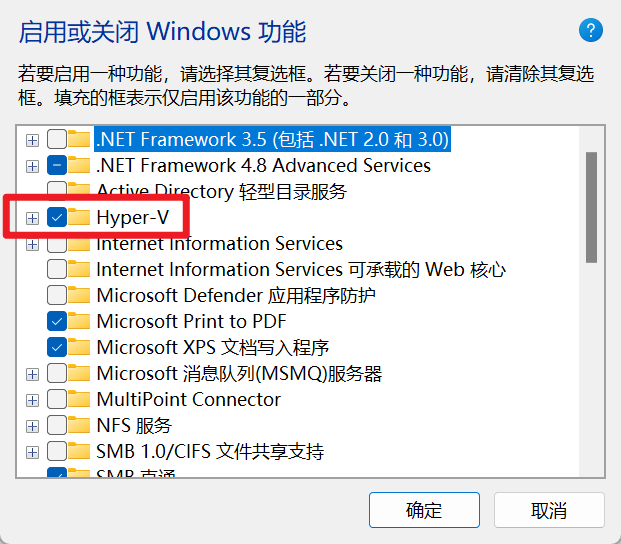

============================================
Windows打开Debian问题（虚拟机无法打开问题）
============================================

.. post:: 2023-02-20 22:06:49
  :tags: windows
  :category: 操作系统
  :author: YanQue
  :location: CD
  :language: zh-cn

参考的对象类型不支持尝试的操作。
===================================

报错
___________________________________

*参考的对象类型不支持尝试的操作。*

*Press any key to continue...*

原因
___________________________________

使用代理软件, 或游戏加速服务, winsock出现问题。

.. note::

	我这里是开启内存完整性引起的

单次解决
___________________________________

`netsh winsock reset`

.. note::

	后面发现是因为我开启了内存完整性,  会影响虚拟机启动,  还有docker容器启动, 关闭即可

	.. figure:: ../../../resources/images/2022-12-16-11-54-40.png
		:align: center
		:width: 480px

		Win11 内存完整性关闭状态

后面补充， 发现还可能有个原因是没有开启Hyper-V

在windows功能里安装打开即可

	打开功能Hyper-V

