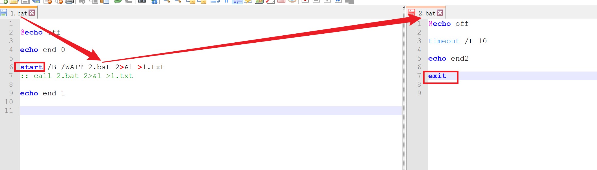
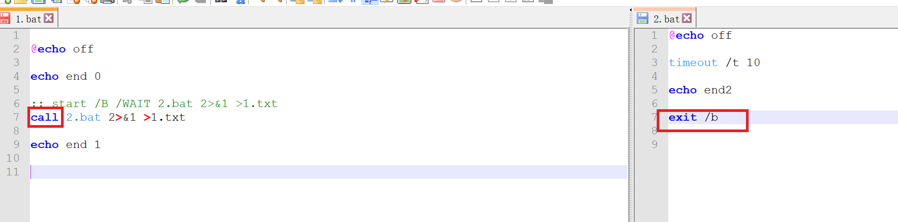

==================
call
==================

从批处理程序调用另一个批处理程序::

  CALL [drive:][path]filename [batch-parameters]

    batch-parameters   指定批处理程序所需的命令行信息。

如果命令扩展被启用，CALL 会如下改变:

CALL 命令现在将卷标当作 CALL 的目标接受。语法是::

  CALL:label arguments

一个新的批文件上下文由指定的参数所创建，控制在卷标被指定后传递到语句。
你必须通过达到批脚本文件末两次来 "exit" 两次。
第一次读到文件末时，控制会回到 CALL 语句的紧后面。
第二次会退出批脚本。
键入 GOTO /?，参看 GOTO :EOF 扩展的描述，此描述允许你从一个批脚本返回。

另外，批脚本文本参数参照(%0、%1、等等)已如下改变::

  批脚本里的 %* 指出所有的参数(如 %1 %2 %3 %4 %5 ...)

  批参数(%n)的替代已被增强。你可以使用以下语法:

      %~1         - 删除引号(")，扩展 %1
      %~f1        - 将 %1 扩展到一个完全合格的路径名
      %~d1        - 仅将 %1 扩展到一个驱动器号
      %~p1        - 仅将 %1 扩展到一个路径
      %~n1        - 仅将 %1 扩展到一个文件名
      %~x1        - 仅将 %1 扩展到一个文件扩展名
      %~s1        - 扩展的路径只含有短名
      %~a1        - 将 %1 扩展到文件属性
      %~t1        - 将 %1 扩展到文件的日期/时间
      %~z1        - 将 %1 扩展到文件的大小
      %~$PATH:1   - 查找列在 PATH 环境变量的目录，并将 %1
                    扩展到找到的第一个完全合格的名称。如果
                    环境变量名未被定义，或者没有找到文件，
                    此修改符会扩展到空字符串

可以组合修改符来取得多重结果::

  %~dp1       - 只将 %1 扩展到驱动器号和路径
  %~nx1       - 只将 %1 扩展到文件名和扩展名
  %~dp$PATH:1 - 在列在 PATH 环境变量中的目录里查找 %1，
                并扩展到找到的第一个文件的驱动器号和路径。
  %~ftza1     - 将 %1 扩展到类似 DIR 的输出行。

在上面的例子中，%1 和 PATH 可以被其他有效数值替换。
%~ 语法被一个有效参数号码终止。%~ 修定符不能跟 %*
使用

此处提一下与 :doc:`/docs/操作系统/windows/windows_shell/start` 的区别:

- start的调用需要在调用的bat脚本内写入 ``exit`` 才能正常返回当前bat指令
- call 的退出有没有 ``exit /b`` 即可, 默认就是这个

如, 1.bat 调用 2.bat , 使用 start:

使用 call:

输出都是::

  C:\Users\烟雀\Desktop\some\t\_>1.bat
  end 0
  end 1
  C:\Users\烟雀\Desktop\some\t\_>

使用call时, 在 2.bat 使用 :doc:`/docs/操作系统/windows/windows_shell/exit` 会退出整个程序,
因为, call 是在一个批处理中直接调用另一个批处理, 不会打开新的窗口.

而 start 是新开一个窗口, 所以需要在新开的窗口手动 exit 退出.

要处理call执行子脚本退出父脚本可以使用::

  goto :eof

来替代, 表示转到文件末尾

