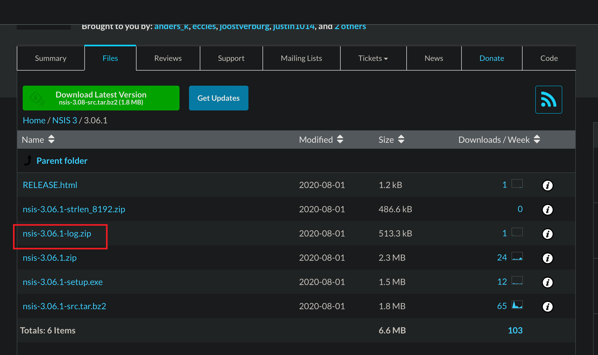

======================
一些使用问题/技巧
======================

.. post:: 2023-02-20 22:06:49
  :tags: windows, windows执行文件打包, nsis
  :category: 操作系统
  :author: YanQue
  :location: CD
  :language: zh-cn

执行 bat 不打开 dos窗口
============================================

.. sidebar::

  这个玩意儿就是一个坑, 找了几乎一天的解决方案. 什么 start 启动等

这里补充一个小技巧吧, 当在nsis脚本中执行 bat 指令时, 总是会打开 dos 黑窗口,

不想要它显示, 可以使用::

  ExecShell 'open' '$INSTDIR\t.bat' "1 1 >$INSTDIR/log.txt 2>&1" SW_HIDE

找了很久的解决方案, 网上什么start啥的都无法执行, 最后终于实验出了这个, 一开始不知道 open 也支持打开 bat, 踏了很久的坑.

``SW_HIDE`` 表示隐藏dos窗口.

详情见: :ref:`NSIS_ExecShell`

安装日志设置
======================

如下::

  !include "LogicLib.nsh"

  ; 本区段必须放置在所有区段之前
  ; 运行后会在安装目录生成一个install.log文件
  Section "-LogSetOn"
        LogSet on
  SectionEnd

code::

  !include "LogicLib.nsh"

  Section "-LogSetOn"
        LogSet on
  SectionEnd

注意可能会有报错: ``Error: LogSet specified, NSIS_CONFIG_LOG not defined.``

这是因为当前安装版本的一些内置的东西有问题, 需要去官网下载对应版本的内容进行覆盖,

下载地址: `<http://sourceforge.net/projects/nsis/files/>`_

比如安装版本是 3.06.1 , 且是log相关的部分, 就下载这个包:

下载后, 找到安装目录, 进行文件替换.

:github解决地址::
  `chore(deploy): Release #6730 <https://github.com/electron-userland/electron-builder/pull/6730>`_
  `NSIS_CONFIG_LOG not defined <https://github.com/electron-userland/electron-builder/issues/6715>`_

调试
======================

调试只有依赖 安装日志设置_ 或者 消息框(MessageBox)_ 了.

使用 MessageBox::

  MessageBox MB_OK "变量\$0的值: $0"

判断电脑位数
======================

使用 x64.nsh ::

  !include "x64.nsh"

  ${If} ${RunningX64}
    ; 是64位的
  ${EndIf}

检查旧版本是否已安装
======================

需要先下载好 nsProcess.dll, 然后使用::

  nsProcess::_FindProcess "xxx.exe"

默认是没有这个dll的, 需要手动下载, 参考: `【NSIS】安装或卸载时使用nsProcess检查程序是否正在运行 <https://www.cnblogs.com/yzhyingcool/p/16025864.html>`_

下载地址: `NsProcess plugin <https://nsis.sourceforge.io/NsProcess_plugin>`_

获取当前用户名
======================

使用 GetUserName 函数。该函数接受一个指向缓冲区的指针和缓冲区的大小，并将当前用户的用户名写入缓冲区中。

下面是示例代码::

  !include LogicLib.nsh ;导入LogicLib插件

  Section
      InitPluginsDir ;初始化插件目录

      ;定义变量存储用户名
      Var username

      ;分配缓冲区的大小为256字节
      StrCpy $0 256

      ;调用 GetUserName 函数将用户名写入缓冲区中
      System::Call 'advapi32::GetUserName(t r1, *i ${NSIS_MAX_STRLEN}) i.r0'

      ;如果函数返回值不为0，表示成功获取到用户名
      ${If} $0 != 0
          ;将缓冲区中的用户名赋值给变量
          StrCpy $username $1
      ${EndIf}

      ;打印用户名
      DetailPrint "Username: $username"

  SectionEnd

NSIS打包安装程序时获取管理员权限
============================================

NSIS脚本添加以下代码::

  RequestExecutionLevel admin

NSIS安装后的脚本自动使用管理员权限
============================================

写注册表的方式::

  WriteRegStr HKCU \"SOFTWARE\\Microsoft\\Windows NT\\CurrentVersion\\AppCompatFlags\\Layers\" \"$INSTDIR\\program.exe\" \"RUNASADMIN\"

其中program.exe为要执行的主程序的名称

将文件(夹)加入到安装包
============================================

使用 :ref:`File <NSIS_File>` 指令, 如果是文件, 直接跟文件全名(包括后缀),
如果是文件夹, 加 ``/r`` 选项即可. 如下例的 other 文件夹::

  Section Do
    SetOutPath $INSTDIR
    File /r other
  SectionEnd

释放对安装目录的占用
============================================

有时候在执行bat脚本时, 需要操作安装目录, 这时需要释放对安装目录的文件句柄占用,
在执行前使用 ``SetOutPath "$TEMP"`` 切换一下输出目录即可::

  Section
    SetOutPath "$INSTDIR"

    ; do ...

    SetOutPath "$TEMP"
    ;执行批处理文件
    ExecWait '"$INSTDIR\your_batch_file.bat"'
  SectionEnd

.. note::

  这里有一个点我一直没想明白, 暂且记下来吧:

  在 NSIS 脚本中调用 bat 指令时, 看任务管理器,
  实际是一个 cmd.exe 下启动的类似进程组(Windows貌似只有任务, 没有进程组的概念, 此处不做讨论).
  即使调用 bat 指令时, 使用的是 :ref:`ExecShell <NSIS_ExecShell>` 来后台执行, 且 NSIS 脚本已经执行完成退出.

  且此时的情况:

  - NSIS 脚本退出
  - NSIS 调用的后台执行的 bat 脚本仍在执行

  这时候会发现 bat 脚本还是拥有 ``$INSTDIR`` 安装目录的占用, 其实是 **SetOutPath** 的占用.

  目前猜测有以下几种可能:

  - NSIS 启动的子进程的句柄占用会传递给 bat 脚本
  - NSIS 脚本的句柄占用会被 cmd.exe 给拿到

  具体是什么情况, 暂时没看出来...

写卸载脚本
======================

有时候可能像自己写一个卸载脚本::

  WriteUninstaller "$INSTDIR\uninstall.exe"

注意这个时候必须存在 Uninstall 小节, 如::

  Section Uninstall
    ; 在这里添加卸载时要执行的操作

    ;Delete other/xxx

    ; SetOutPath "$INSTDIR"
    ; RMDir /r "$INSTDIR\other"
    RMDir /r "$INSTDIR\other"
  SectionEnd

Uninstall 小节是预定义名称的小节, 卸载时调用. 注意这时候不能直接设置输出路径, 然后使用相对路径删除.

若有需要卸载时调用的函数, 函数名需以 ``un.`` 开头. 卸载预定义函数见: :ref:`回调函数`

申请管理员权限
======================

在nsis脚本开头写入::

  RequestExecutionLevel admin

即可在执行安装程序时弹出申请管理员权限窗口.

若没有, 看看后面是不是重复写了其他权限如::

  RequestExecutionLevel user

再不行就是低版本nsis或操作系统版本低不支持.

安装与卸载时变量共享
======================

能共享的变量只有预定义的一些内置变量, 目前自己测试过可行的只有::

  $INSTDIR

且只能是一开始定义的安装目录, 若后续在安装时有修改, 卸载时此修改不生效.

故, 要想共享, 最简单的就是使用注册表了, 注意要申请管理员权限提权才能写注册表, 例::

  RequestExecutionLevel user

  Var HomeDir

  Section Do1
    WriteUninstaller "$INSTDIR\uninstall.exe"
    StrCpy $HomeDir "D:\Program Files\test\Example2"

    ; 将变量的值写入卸载程序
    WriteRegStr HKLM "Software\TNsis" "AppHomeDir" "$HomeDir"
  SectionEnd

  Section Uninstall
    ; 读取变量的值
    ReadRegStr $HomeDir HKLM "Software\TNsis" "AppHomeDir"
    MessageBox MB_OK "The value of HomeDir is $HomeDir"

    ; 删除注册表键
    DeleteRegKey HKLM "Software\TNsis"

    RMDir /r "$HomeDir"
  SectionEnd

注册表相关操作可参考: :ref:`NSIS_注册表操作`

其他方式可以通过写文件的方式, 有点麻烦, 暂不表述

GUI界面选择安装路径
======================

需要先导入 ``MUI.nsh`` , 然后插入页面::

  !include "MUI.nsh"

  !insertmacro MUI_PAGE_DIRECTORY     ; 选择安装路径页面
  !insertmacro MUI_PAGE_INSTFILES     ; 选择安装文件页面

  InstallDir "$PROGRAMFILES\MyApp"    ; 指定默认安装路径

  !insertmacro MUI_PAGE_FINISH        ; 安装完成页面

注意, 选择安装位置的执行时间在 init 之后, 所以要在 init 之后的 section 获取安装位置才是可靠的.

此头文件详情可见: :doc:`/docs/操作系统/windows/windows执行文件打包/nsis/常用头文件`

NSIS 卸载程序参数
======================

/q 表示静默安装

_? 表示是否打开GUI确认卸载框

- _?=0：不需要用户确认，直接执行卸载操作;
- _?=1：需要用户确认，打开卸载确认对话框;
- _?=2：需要用户确认，但不需要显示卸载确认对话框.

默认情况下，NSIS脚本会自动向卸载程序传递一个 ``_?=1`` 的命令行参数.

卸载时的返回值
======================

**暂时无解, 至少我目前没找到**

SetUninstallReturnValue

eg::

  Function un.onUninstSuccess
    ; 在这里执行卸载成功后的清理操作

    SetUninstallReturnValue 1234 ; 手动抛出返回值

    MessageBox MB_OK "卸载程序返回值：$0"
  FunctionEnd

这个貌似 **只有旧版本的NSIS有指令** ,
新版本暂时没找到支持的方法, 暂时通过 **判断安装目录是否存在确定是否卸载成功** :

卸载程序名称确定::

  StrCpy $1 "$INSTDIR\uninstall.exe"

获取目录字符串的长度, 然后获取目录::

  StrLen $9 $1
  IntOp $8 $9 - 14
  StrCpy $7 $1 $8
  MessageBox MB_OK "dir: $7"

确定目录是否存在::

  IfFileExists "$7" +1 +2
  MessageBox MB_OK "dir exists: $7 "
  MessageBox MB_OK "dir not exists: $7 "

卸载成功的话文件是会被全部删除的. 除非特意留下某些残留, 那就需要自行兼容处理了.

获取安装窗体句柄
======================

使用变量 **$HWNDPARENT**

将窗体前台显示
======================

使用 BringToFront 指令.

不过存在一个问题, 有时候前台显示效果是:
在任务栏闪烁, 点击闪烁图标后后才会前台显示

