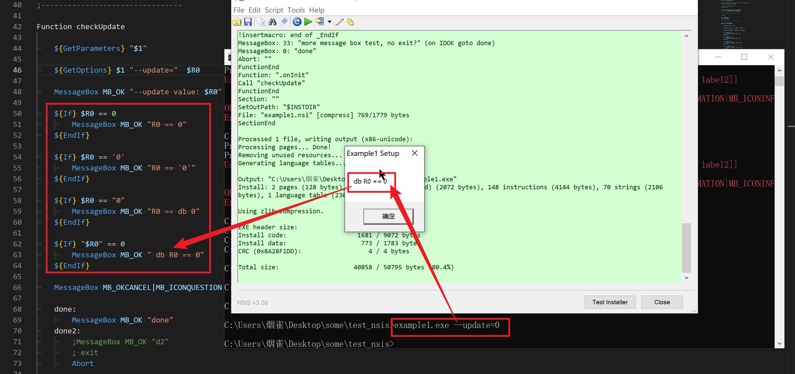

=====================
语法规范
=====================

注释
=====================

注释, 使用 ``#`` 或者 ``;``

.. _NSIS_导入其他脚本:

导入其他脚本
=====================

引入自定义脚本文件, 使用 ``!include`` ::

    !include xxx.nsh

使用dll模块
=====================

使用dll提供的函数::

    plugin::command [parameters]

不止dll, 其他自定义模块也行. 不过都需要先 导入其他脚本_ , 使用::

    nsExec::Exec "myfile"

.. _NSIS_变量:

变量
=====================

自定义
----------------------

语法(貌似大小写皆可)::

  Var [/GLOBAL] var_name

变量定义, 使用 ``Var``::

  Var xxx

注意定义的变量全部都是全局变量, 若定义在函数内部, 必须使用 ``/GLOBAL`` 修饰::

  Var /GLOBAL xxx

还可以使用define ::

  !define var_name "var_str"

使用define定义的变量只读, 可在当前脚本全局使用.

预定义
----------------------

寄存器变量(用于参数传递)::

  $0, $1, $2, $3, $4, $5, $6, $7, $8, $9

  $R0, $R1, $R2, $R3, $R4, $R5, $R6, $R7, $R8, $R9

  # 一开始以为是命令行参数, 看了一下仅是预定义的一些变量, 只是不用显示声明而已

可变预定义变量::

  $INSTDIR        程序安装路径, 可以使用 StrCpy, ReadRegStr, ReadINIStr, etc 修改
  $OUTDIR         当前输出目录
  $CMDLINE        安装时候的命令行参数, 为整个命令行,
                    如: xxx.exe parameter1 parameter2 ...
                    若需要获取其中的参数, 使用 GetParameters (针对普通参数) , GetOptions (针对选项参数) .
                    见 获取命令行参数_

                    当命令行存在 ``/D`` 选项参数时, ``$CMDLINE`` 为空.
  $LANGUAGE       当前使用的语言

系统变量
----------------------

系统变量::

  $PROGRAMFILES   程序文件目录(通常为 C:\Program Files 但是运行时会检测).
  $COMMONFILES    公用文件目录。这是应用程序共享组件的目录(通常为 C:\Program Files\Common Files 但是运行时会检测).
  $DESKTOP        Windows 桌面目录(通常为 C:\windows\desktop 但是运行时会检测)。该常量的内容(所有用户或当前用户)取决于 SetShellVarContext 设置。默认为当前用户。
  $EXEDIR         安装程序运行时的位置。(从技术上来说你可以修改改变量, 但并不是一个好方法).
  ${NSISDIR}      包含 NSIS 安装目录的一个标记。在编译时会检测到。常用于在你想调用一个在 NSIS 目录下的资源时, 例如: 图标、界面……
  $WINDIR         Windows 目录(通常为 C:\windows 或 C:\winnt 但在运行时会检测)
  $SYSDIR         Windows 系统目录(通常为 C:\windows\system 或 C:\winnt\system32 但在运行时会检测)
  $TEMP           系统临时目录(通常为 C:\windows\temp 但在运行时会检测)
  $STARTMENU      开始菜单目录(常用于添加一个开始菜单项, 使用 CreateShortCut)。该常量的内容(所有用户或当前用户)取决于 SetShellVarContext 设置。默认为当前用户。
  $SMPROGRAMS     开始菜单程序目录(当你想定位 $STARTMENU\程序 时可以使用它)。该常量的内容(所有用户或当前用户)取决于 SetShellVarContext 设置。默认为当前用户。
  $SMSTARTUP      开始菜单程序/启动 目录。该常量的内容(所有用户或当前用户)取决于 SetShellVarContext 设置。默认为当前用户。
  $QUICKLAUNCH    在 IE4 活动桌面及以上的快速启动目录。如果快速启动不可用, 仅仅返回和 $TEMP 一样。
  $DOCUMENTS      文档目录。一个当前用户典型的路径形如 C:\Documents and Settings\Foo\My Documents。这个常量的内容(所有用户或当前用户)取决于 SetShellVarContext 设置。默认为当前用户。
                    该常量在 Windows 95 且 Internet Explorer 4 没有安装时无效。
  $SENDTO         该目录包含了“发送到”菜单快捷项。
  $RECENT         该目录包含了指向用户最近文档的快捷方式。
  $FAVORITES      该目录包含了指向用户网络收藏夹、文档等的快捷方式。这个常量的内容(所有用户或当前用户)取决于 SetShellVarContext 设置。默认为当前用户。
                    该常量在 Windows 95 且 Internet Explorer 4 没有安装时无效。
  $MUSIC          用户的音乐文件目录。这个常量的内容(所有用户或当前用户)取决于 SetShellVarContext 设置。默认为当前用户。
                    该常量仅在 Windows XP、ME 及以上才有效。
  $PICTURES       用户的图片目录。这个常量的内容(所有用户或当前用户)取决于 SetShellVarContext 设置。默认为当前用户。
                    该常量仅在 Windows 2000、XP、ME 及以上才有效。
  $VIDEOS         用户的视频文件目录。这个常量的内容(所有用户或当前用户)取决于 SetShellVarContext 设置。默认为当前用户。
                    该常量仅在 Windows XP、ME 及以上才有效。
  $NETHOOD        该目录包含了可能存在于我的网络位置、网上邻居文件夹的链接对象。
                    该常量在 Windows 95 且 Internet Explorer 4 和活动桌面没有安装时无效。
  $FONTS          系统字体目录。
  $TEMPLATES      文档模板目录。这个常量的内容(所有用户或当前用户)取决于 SetShellVarContext 设置。默认为当前用户。
  $APPDATA        应用程序数据目录。当前用户路径的检测需要 Internet Explorer 4 及以上。所有用户路径的检测需要 Internet Explorer 5 及以上。这个常量的内容(所有用户或当前用户)取决于 SetShellVarContext 设置。默认为当前用户。
                    该常量在 Windows 95 且 Internet Explorer 4 和活动桌面没有安装时无效。
  $PRINTHOOD      该目录包含了可能存在于打印机文件夹的链接对象。
                    该常量在 Windows 95 和 Windows 98 上无效。
  $INTERNET_CACHE Internet Explorer 的临时文件目录。
                    该常量在 Windows 95 和 Windows NT 且 Internet Explorer 4 和活动桌面没有安装时无效。
  $COOKIES        Internet Explorer 的 Cookies 目录。
                    该常量在 Windows 95 和 Windows NT 且 Internet Explorer 4 和活动桌面没有安装时无效。
  $HISTORY        Internet Explorer 的历史记录目录。
                    该常量在 Windows 95 和 Windows NT 且 Internet Explorer 4 和活动桌面没有安装时无效。
  $PROFILE        用户的个人配置目录。一个典型的路径如 C:\Documents and Settings\Foo。
                    该常量在 Windows 2000 及以上有效。
  $ADMINTOOLS     一个保存管理工具的目录。这个常量的内容(所有用户或当前用户)取决于 SetShellVarContext 设置。默认为当前用户。
                    该常量在 Windows 2000、ME 及以上有效。
  $RESOURCES      该资源目录保存了主题和其他 Windows 资源(通常为 C:\Windows\Resources 但在运行时会检测).
                    该常量在 Windows XP 及以上有效。
  $RESOURCES_LOCALIZED
                  该本地的资源目录保存了主题和其他 Windows 资源(通常为 C:\Windows\Resources\1033 但在运行时会检测).
                    该常量在 Windows XP 及以上有效。
  $CDBURN_AREA    一个在烧录 CD 时储存文件的目录。.
                    该常量在 Windows XP 及以上有效。
  $HWNDPARENT     父窗口的十进制 HWND。
  $PLUGINSDIR     该路径是一个临时目录, 当第一次使用一个插件或一个调用 InitPluginsDir 时被创建。该文件夹当解压包退出时会被自动删除。这个文件夹的用意是用来保存给 InstallOptions 使用的 INI 文件、启动画面位图或其他插件运行需要的文件。

部分特殊字符
----------------------

部分特殊字符::

  $$: 表示$
  $\r: 表示\r
  $\n: 表示\n
  $\t: 表示\t

if语句
=====================

语法::

  ${If} $0 == 1
    # do something
  ${EndIf}

还有::

  ${OrIf}  即 or
  ${AndIf} 即 and

特意测试了一下, 比较的时候加不加引号无影响.

  测试引号判断

测试源码.

.. literalinclude:: ../../../../../resources/code/example1.nsi
  :language: nsis

消息框(MessageBox)
=====================

显示一个包含“消息框文本”的消息框。“消息框选项列表”必须为 mb_option_list 的一个或多个, 多个使用 | 来隔开

语法::

  MessageBox mb_option_list messagebox_text [/SD return] [return_check jumpto [return_check_2 jumpto_2]]

各个部分释义:

mb_option_list::

  MB_OK                 展示 OK 按钮
  MB_OKCANCEL           展示 OK, CANCEL 按钮
  MB_ABORTRETRYIGNORE   展示 ABORT, RETRY, IGNORE 按钮. 退出、重试、忽略按钮
  MB_RETRYCANCEL        展示 retry, cancel 按钮
  MB_YESNO              展示 yes and no buttons
  MB_YESNOCANCEL        展示 with yes, no, cancel buttons
  MB_ICONEXCLAMATION    展示 with exclamation icon. 显示惊叹号图标
  MB_ICONINFORMATION    展示 with information icon. 显示信息图标
  MB_ICONQUESTION       展示 with question mark icon. 显示问号图标
  MB_ICONSTOP           展示 with stop icon. 显示终止图标
  MB_USERICON           展示 installer's icon
  MB_TOPMOST            置顶 messagebox. 使消息框在最前端显示
  MB_SETFOREGROUND      设置前景? (Set foreground)
  MB_RIGHT              文本靠右对齐
  MB_RTLREADING         RTL reading order. RTL 阅读次序
  MB_DEFBUTTON1         Button 1 is default
  MB_DEFBUTTON2         Button 2 is default
  MB_DEFBUTTON3         Button 3 is default
  MB_DEFBUTTON4         Button 4 is default

return_check::

  0
  empty
  left off    # can be 0 (or empty, or left off)

  IDABORT     Abort button
  IDCANCEL    Cancel button
  IDIGNORE    Ignore button
  IDNO        No button
  IDOK        OK button
  IDRETRY     Retry button
  IDYES       Yes button

传参(如返回值设置等)
=====================

语法::

  Push 'xxx'
  Pop $0

栈的形式, Push压栈, 获取就Pop

如, 返回值的函数::

  Function simpleTest
    MessageBox MB_OKCANCEL|MB_ICONQUESTION \
      "点击确定取消"\
        /SD IDOK  \
        IDOK  ok \
        IDCANCEL   cancel     # 这里算是调用 MessageBox 后的回调
  ok:
    Push "OK"
    Goto +2
  cancel:
    Push "CANCEL"

  FunctionEnd

在.oninit中调用如下::

  Function .onInit

    Call simpleTest
    Pop $0              # 这里获取返回值
    ${If} $0 == "CANCEL"
      MessageBox MB_OK|MB_ICONEXCLAMATION "点击的是取消"
    ${Else}
      MessageBox MB_OK|MB_ICONEXCLAMATION "点击的是确定"
    ${EndIf}

  FunctionEnd

macros(宏)
=====================

编译时, 插入代码

宏与 :ref:`NSIS_自定义函数` 类似, 使用有个较明显的区别是:

- 宏定义后支持在几乎任何位置的插入
- 函数定义后, 若要同时支持在卸载的时候调用, 需要加 ``un.`` 前缀再写一个

例::

  ; 定义宏
  !macro MyFunc UN
  Function ${UN}MyFunc
    Call ${UN}DoRegStuff
    ReadRegStr $0 HKLM Software\MyProgram key
    DetailPrint $0
  FunctionEnd
  !macroend

  !insertmacro MyFunc ""
  !insertmacro MyFunc "un."

结果将会插入两个, 一个给安装时候用, 一个给卸载时候用, 也可以直接::

  ; 定义宏
  !macro MyFunc
    Call ${UN}DoRegStuff
    ReadRegStr $0 HKLM Software\MyProgram key
    DetailPrint $0
  !macroend

  !insertmacro MyFunc
  !insertmacro MyFunc

效果一致.

一些脚本属性
=====================

- NAME : 设置安装器名称 (支持多个, 多语言设置时使用, 默认使用第一个).
  如::

    Name "Foo & Bar" "Foo && Bar"

- InstallDir : 设置默认的安装路径
- OutFile : 打好的exe包输出路径(包含文件名)
- ShowInstDetails : 值为 show 表示显示安装详细信息
- ShowUnInstDetails : 值为 show 表示显示卸载详细信息
- BrandingText : 左下角提示信息 (一般是 品牌/公司 名称)

一些通用属性, 编译标志, 版本信息: `instattribs <https://nsis.sourceforge.io/Docs/Chapter4.html#instattribs>`_

