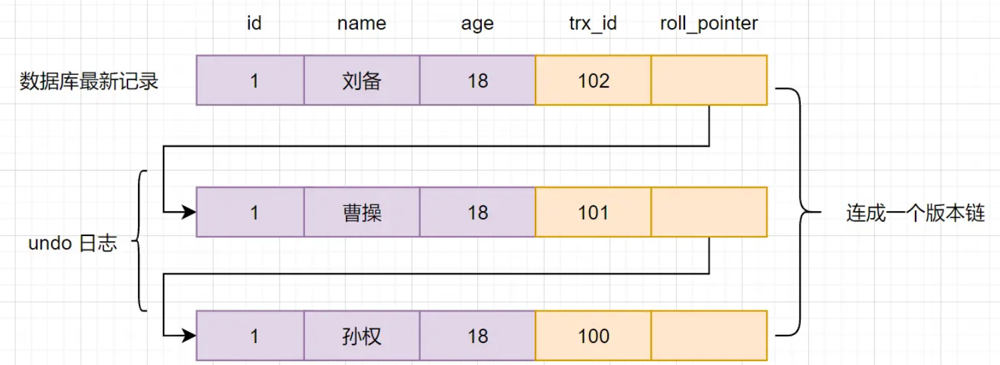
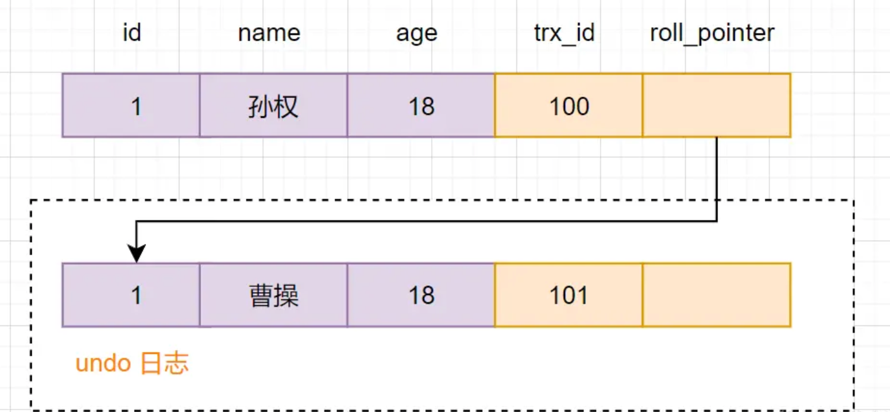
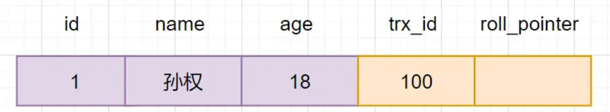
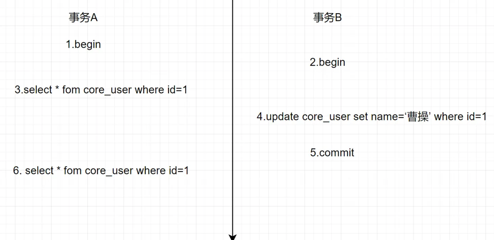

=============================
MVCC
=============================

MVCC，即Multi-Version  Concurrency Control （多版本并发控制）。
它是一种并发控制的方法，一般在数据库管理系统中，
实现对数据库的并发访问，在编程语言中实现事务内存::

  通俗的讲，数据库中同时存在多个版本的数据，
  并不是整个数据库的多个版本，而是某一条记录的多个版本同时存在，
  在某个事务对其进行操作的时候，需要查看这一条记录的隐藏列事务版本id，
  比对事务id并根据事物隔离级别去判断读取哪个版本的数据。

隔离级别见: :doc:`/docs/数据库/mysql/事务`

数据库隔离级别读已提交、可重复读 都是基于MVCC实现的，
相对于加锁简单粗暴的方式，它用更好的方式去处理读写冲突，能有效提高数据库并发性能。

事务版本号
=============================

事务每次开启前，都会从数据库获得一个自增长的事务ID，
可以从事务ID判断事务的执行先后顺序。这就是事务版本号。

隐式字段
=============================

对于InnoDB存储引擎，每一行记录都有两个隐藏列trx_id、roll_pointer，
如果表中没有主键和非NULL唯一键时，则还会有第三个隐藏的主键列row_id。

.. csv-table::
  :header: 列名, 是否必须, 描述

  .. 列名            是否必须      描述

  row_id            ,否        ,单调递增的行ID，不是必需的，占用6个字节
  trx_id            ,是        ,记录操作该数据事务的事务ID
  roll_pointer      ,是        ,这个隐藏列就相当于一个指针，指向回滚段的undo日志

undo log
=============================

undo log，回滚日志，用于记录数据被修改前的信息。
在表记录修改之前，会先把数据拷贝到undo log里，
如果事务回滚，即可以通过undo log来还原数据。

可以这样认为，当delete一条记录时，
undo log 中会记录一条对应的insert记录，
当update一条记录时，它记录一条对应相反的update记录。

undo log有什么用途呢？
  事务回滚时，保证原子性和一致性。
  用于MVCC快照读。

版本链
=============================

多个事务并行操作某一行数据时，不同事务对该行数据的修改会产生多个版本，
然后通过回滚指针（roll_pointer），连成一个链表，这个链表就称为版本链。
如下：

其实，通过版本链，我们就可以看出事务版本号、表格隐藏的列和undo log它们之间的关系。
我们再来小分析一下。

假设现在有一张core_user表，表里面有一条数据,id为1，名字为孙权

现在开启一个事务A: 对core_user表执行update core_user set name ="曹操" where id=1,会进行如下流程操作

- 首先获得一个事务ID=100
- 把core_user表修改前的数据,拷贝到undo log
- 修改core_user表中，id=1的数据，名字改为曹操
- 把修改后的数据事务Id=101改成当前事务版本号，并把roll_pointer指向undo log数据地址。

快照读和当前读
=============================

快照读
  读取的是记录数据的可见版本（有旧的版本）。
  不加锁,普通的select语句都是快照读,
  如::

    select * from core_user where id > 2;
当前读
  读取的是记录数据的最新版本，
  显式加锁的都是当前读::

    select * from core_user where id > 2 for update;
    select * from account where id>2 lock in share mode;

Read View
=============================

Read View是什么呢？
它就是事务执行SQL语句时，产生的读视图。
实际上在innodb中，每个SQL语句执行前都会得到一个Read View。

Read View有什么用呢？
它主要是用来做可见性判断的，即判断当前事务可见哪个版本的数据

Read View是如何保证可见性判断的呢？我们先看看Read view 的几个重要属性

m_ids
  当前系统中那些活跃(未提交)的读写事务ID, 它数据结构为一个List。
min_limit_id
  表示在生成ReadView时，当前系统中活跃的读写事务中最小的事务id，即m_ids中的最小值。
max_limit_id
  表示生成ReadView时，系统中应该分配给下一个事务的id值。
creator_trx_id
  创建当前read view的事务ID

Read view 匹配条件规则如下：

1. 如果数据事务ID ``trx_id < min_limit_id``，表明生成该版本的事务在生成Read View前，
   已经提交(因为事务ID是递增的)，所以该版本可以被当前事务访问。
2. 如果 ``trx_id >= max_limit_id``，表明生成该版本的事务在生成ReadView后才生成，所以该版本不可以被当前事务访问。
3. 如果 ``min_limit_id =<trx_id< max_limit_id``, 需腰分3种情况讨论

   - 如果m_ids包含trx_id,则代表Read View生成时刻，这个事务还未提交，
     但是如果数据的trx_id等于creator_trx_id的话，表明数据是自己生成的，因此是可见的。
   - 如果m_ids包含trx_id，并且trx_id不等于creator_trx_id，则 Read View生成时，
     事务未提交，并且不是自己生产的，所以当前事务也是看不见的；
   - 如果m_ids不包含trx_id，则说明你这个事务在Read View生成之前就已经提交了，修改的结果，当前事务是能看见的。

MVCC实现原理分析
=============================

查询一条记录，基于MVCC，是怎样的流程
------------------------------------------------------------

- 获取事务自己的版本号，即事务ID
- 获取Read View
- 查询得到的数据，然后Read View中的事务版本号进行比较。
- 如果不符合Read View的可见性规则， 即就需要Undo log中历史快照;
- 最后返回符合规则的数据

InnoDB 实现MVCC，是通过 Read View + Undo Log 实现的，
Undo Log 保存了历史快照，Read View可见性规则帮助判断当前版本的数据是否可见。

读已提交（RC）隔离级别，存在不可重复读问题的分析历程
------------------------------------------------------------

创建core_user表，插入一条初始化数据,如下

隔离级别设置为读已提交（RC），事务A和事务B同时对core_user表进行查询和修改操作::

  事务A: select * fom core_user where id=1
  事务B: update core_user set name =”曹操”

执行流程如下：

最后事务A查询到的结果是，name=曹操的记录，我们基于MVCC，
来分析一下执行流程：

- A开启事务，首先得到一个事务ID为100
- B开启事务，得到事务ID为101
- 事务A生成一个Read View，read view对应的值如下

  .. csv-table::
    :header: 变量, 值

    m_ids	          ,100，101
    max_limit_id	  ,102
    min_limit_id	  ,100
    creator_trx_id	,100

  然后回到版本链：开始从版本链中挑选可见的记录

  .. figure:: ../../../resources/images/2024-02-19-16-58-38.png
    :width: 480px

  由图可以看出，最新版本的列name的内容是孙权，
  该版本的trx_id值为100。开始执行read view可见性规则校验::

    min_limit_id(100)=<trx_id（100）<102;
    creator_trx_id = trx_id =100;

  由此可得，trx_id=100的这个记录，当前事务是可见的。所以查到是name为孙权的记录。

- 事务B进行修改操作，把名字改为曹操。
  把原数据拷贝到undo log,然后对数据进行修改，
  标记事务ID和上一个数据版本在undo log的地址。

  .. figure:: ../../../resources/images/2024-02-19-16-59-51.png
    :width: 480px
- 提交事务
- 事务A再次执行查询操作，新生成一个Read View，Read View对应的值如下

  .. csv-table::
    :header: 变量, 值

    m_ids	          ,100
    max_limit_id	  ,102
    min_limit_id	  ,100
    creator_trx_id	,100

  然后再次回到版本链：从版本链中挑选可见的记录：

  .. figure:: ../../../resources/images/2024-02-19-17-04-34.png
    :width: 480px

  从图可得，最新版本的列name的内容是曹操，该版本的trx_id值为101。开始执行Read View可见性规则校验::

    min_limit_id(100)=<trx_id（101）<max_limit_id（102);

  但是,trx_id=101，不属于m_ids集合

  因此，trx_id=101这个记录，对于当前事务是可见的。所以SQL查询到的是name为曹操的记录。
  综上所述，在读已提交（RC）隔离级别下，同一个事务里，两个相同的查询，读取同一条记录（id=1），
  却返回了不同的数据（第一次查出来是孙权，第二次查出来是曹操那条记录），因此RC隔离级别，存在不可重复读并发问题。

参考: `<https://juejin.cn/post/7016165148020703246>`_

