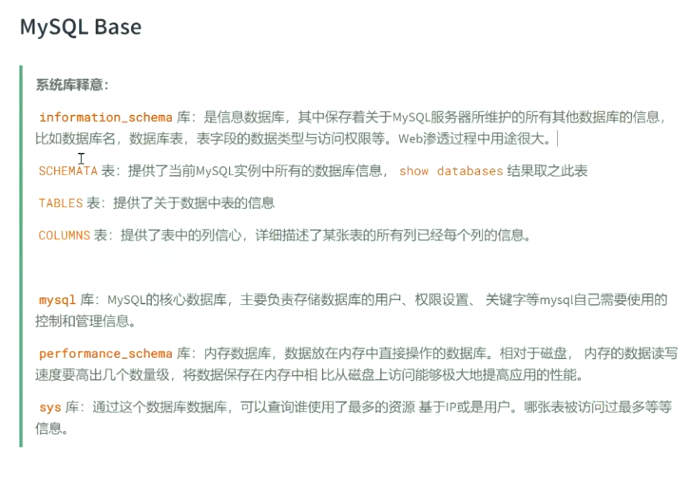
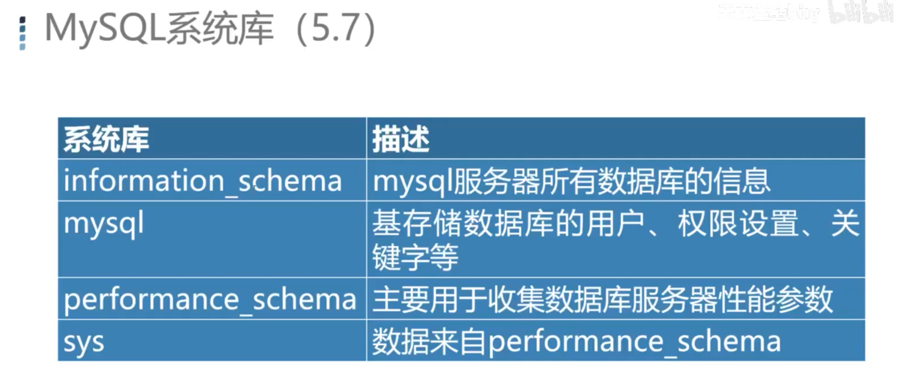
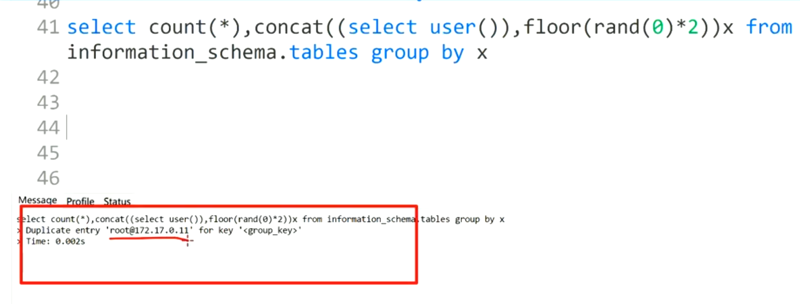

========================
mysql
========================

.. toctree::
  :maxdepth: 1

  索引
  查询选项
  explain优化
  MVCC
  mysql备份方案
  数据库引擎
  主从同步
  锁
  其他问题
  索引数据结构
  事务
  分库分表
  8.0新特性
  概念基础/index
  表内外连接
  on、where、Having的区别

	mysql base

预定义变量::

		@@datadir                数据路径
		@@basedir                mysql安装路径
		@@version_compile_os     mysql安装的系统

备份
=======================

备份某一个表::

		mysqldump -uroot -p $database $table >/tmp/t.sql

全部备份::

		mysqldump -uroot -p -ARE --triggers --master-data=2 --single-transaction >/tmp/full.sql

其他详细信息见: :doc:`/docs/数据库/mysql/mysql备份方案`

注释
=======================

单行::

	# select
  -- select

多行::

	/*
  select
  */

关于字符集修改
===========================

直接修改数据表的字符集不一定行,
得删除表重新建表的时候弄字符集

直接修改字符集（不一定有用）::

  select
    concat(
        'alter table ',
          TABLE_NAME,
          ' convert to character set utf8mb4 collate utf8mb4_general_ci;'
      )
  from
    information_schema.'TABLES'
  where
    TABLE_SCHEMA = '$database';

这个结果为更改语句，直接复制执行即可

诱导报错
=======================

诱导报错::

		select count(*) ,concat((select user()),floor(rand(0)*2))x from information_schema.TABLES group by x;

在mysql5.7中会有以下报错, 8的版本中没有复现出来

		诱导报错

sql预处理
=======================

设置预处理语句::

		EXECUTE stmt_name [USING @var_name [, @var_name] ...];

册除(释放)定义::

		{DEALLOCATE | DROP} PREPARE stmt_name;

例子::

		# 设置预处理语句
		prepare select_content from 'select table_name, engine from information_schema.TABLES where version = ? and table_schema= ? ';

		# 设置参数
		set @ver=10; set @base='information_schema';

		# 执行查询
		execute select_content using @ver, @base;

