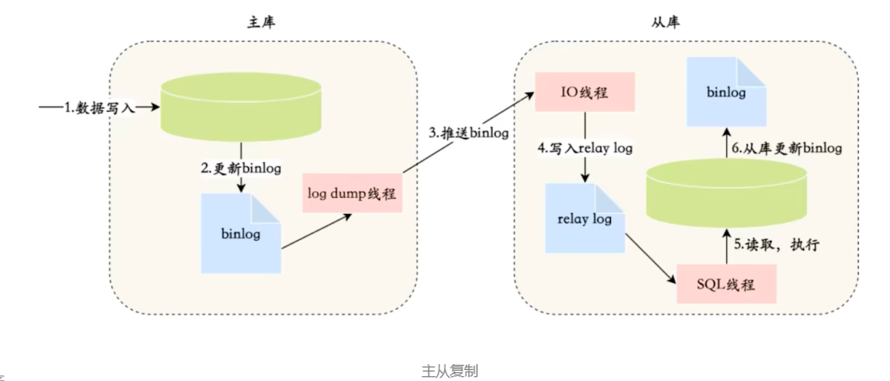

===========================
主从同步
===========================

.. post:: 2023-02-20 22:06:49
  :tags: mysql
  :category: 数据库
  :author: YanQue
  :location: CD
  :language: zh-cn

用处:
比如使用 **主从架构** (binlog) 实现 **读写分离**
业务代码层面, 读写分离只关注路由到读的库, 还是写的库.

出了物理上的从库,
还可以使用其他组件
比如 ClickHouse 伪装作为从库(还是用的binlog的形式实现, 单机读性能强),
还有 Canal 与 MQ 结合

主从复制原理
===========================

流程

- master数据写入，更新binlog
- master创建一个dump线程向slave推送binlog
- slave连接到master的时候，会创建一个IO线程接收binlog，并记录到 relay log(中继日志) 中
- slave再开启一个sq|线程读取 relay log 事件并在slave执行，完成同步
- slave记录自己的binglog

主从同步延迟处理
===========================

主从同步延迟的原因
  当数据库主库有较大更新并发操作时，可能会导致主从同步延迟，
  因为从库里面读取 binlog 的线程仅有一个，
  当某个 SQL 在从库上执行的时间稍长或者由于某个SQL 要进行锁表就会导致主从同步延迟，
  主库的SQL大量积压，未被同步到从库里。这就导致了主从不一致，也就是主从延迟。

主从同步延迟的解决办法
---------------------------

解决主从复制延迟有几种常见的方法：

1. 写操作后的读操作指定发给数据库主库

例如，注册账号完成后，登录时读取账号的读操作也发给数据库主库。
这种方式和业务强绑定，对业务的侵入和影响较大，如果哪个新来的程序员不知道这样写代码，就会导致一个bug。

2. 读从库失败后再读一次主库

这就是通常所说的“二次读取”，二次读取和业务无绑定，只需要对底层数据库访问的 API 进行封装即可，
实现代价较小，不足之处在于如果有很多二次读取，将大大增加主库的读操作压力。
例如，黑客暴力破解账号，会导致大量的二次读取操作，主库可能顶不住读操作的压力从而崩溃。

3. 关键业务读写操作全部指向主库，非关键业务采用读写分离

例如，对于一个用户管理系统来说，注册+登录的业务读写操作全部访问主库，
用户的介绍、爱好、等级等业务，可以采用读写分离，
因为即使用户改了自己的自我介绍，在查询时却看到了自我介绍还是旧的，业务影响与不能登录相比就小很多，业务上一般可以接受。

