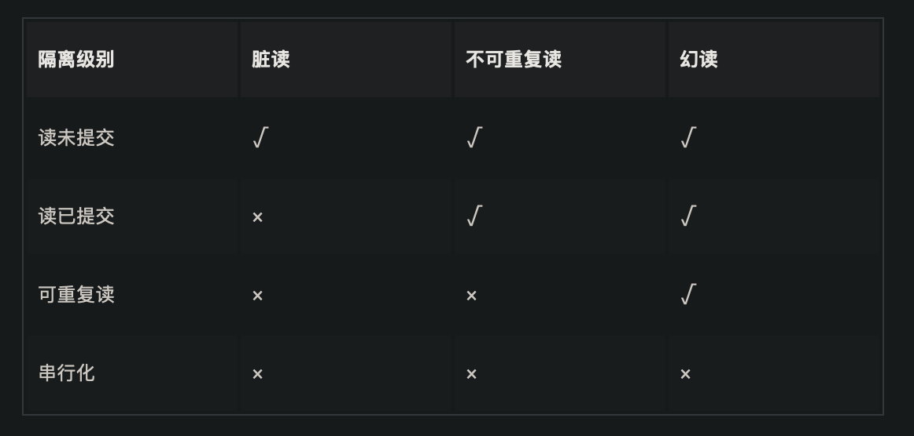

==========================
事务
==========================

Mysql事务四大特性ACID
=============================

- A (Atomicity): 原子性;
  事务作为一个整体被执行，包含在其中的对数据库的操作要么全部被执行，要么都不执行;
- C (Consistency): 一致性;
  指在事务开始之前和事务结束以后，数据不会被破坏，假如 A 账户给B 账户转 10块钱，不管成功与否，A和B的总金额是不变的;
- I (Isolation): 隔离性;
  多个事务并发访问时，事务之间是相互隔离的，即一个事务不影响其它事务运行效果;
- D (Durability): 持久性
  表示事务完成以后，该事务对数据库所作的操作更改，将持久地保存在数据库之中.

实现原理
  - 事务的隔离性是通过数据库锁以及MVCC机制实现的;
  - 事务的一致性由undo log来保证：
    undo log是逻辑日志，记录了事务的insert、update、delete操作，
    回滚的时候做相反的delete、update、insert操作来恢复数据。
  - 事务的原子性和持久性由redo log来保证：
    redo log被称作重做日志，是物理日志，事务提交的时候，
    必须先将事务的所有日志写入redo log持久化，到事务的提交操作才算完成。

事务隔离级别
=============================

读未提交
  读未提交，采取的是读不加锁原理。允许脏读

  - 事务读不加锁，不阻塞其他事务的读和写
  - 事务写阻塞其他事务写，但不阻塞其他事务读；

  读未提交隔离级别，只限制了两个数据不能同时修改，
  但是修改数据的时候，即使事务未提交，
  都是可以被别的事务读取到的，这级别的事务隔离有脏读、重复读、幻读的问题；
读已提交
  读已提交隔离级别，当前事务只能读取到其他事务提交的数据，
  所以这种事务的隔离级别解决了脏读问题，但还是会存在重复读、幻读问题；

  读取已提交和可重复读级别利用了ReadView和MVCC，
  也就是每个事务只能读取它能看到的版本（ReadView）。
  只能读取到已经提交的数据.

  - READ COMMITTED：每次读取数据前都生成一个ReadView
可重复读(默认)
  可重复读隔离级别，限制了读取数据的时候，不可以进行修改，
  所以解决了重复读的问题，但是读取范围数据的时候，是可以插入数据，所以还会存在幻读问题；

  可重复读. 读取已提交和可重复读级别利用了ReadView和MVCC，
  也就是每个事务只能读取它能看到的版本（ReadView）

  - REPEATABLE READ ：在事务里第一次读取数据时生成一个ReadView
串行化
  事务最高的隔离级别，在该级别下，所有事务都是进行串行化顺序执行的。
  可以避免脏读、不可重复读与幻读所有并发问题。但是这种事务隔离级别下，事务执行很耗性能。

  串行化的实现采用的是读写都加锁的原理。

  串行化的情况下，对于同一行事务，写会加写锁，读会加读锁。
  当出现读写锁冲突的时候，后访问的事务必须等前一个事务执行完成，才能继续执行。

数据库是如何保证事务的隔离性的呢？
  数据库是通过加锁，来实现事务的隔离性的。

  加锁确实好使，可以保证隔离性。
  比如串行化隔离级别就是加锁实现的。
  但是频繁的加锁，导致读数据时，没办法修改，修改数据时，没办法读取，大大降低了数据库性能。

  那么，如何解决加锁后的性能问题的？
  答案就是,MVCC多版本并发控制！
  它实现读取数据不用加锁，可以让读取数据同时修改。修改数据时同时可读取。

  参见: :doc:`/docs/数据库/mysql/MVCC`

参考: `<https://juejin.cn/post/7016165148020703246>`_

并发带来事物问题
==========================

丢失更新
  A事务提交或撤销时, 把B事务给丢了
脏读
  如果一个事务读取到了另一个未提交事务修改过的数据，我们就称发生了脏读现象。
不可重复读
  同一个事务内，前后多次读取，读取到的数据内容不一致(其他事务的修改已经提交)
幻读
  如果一个事务先根据某些搜索条件查询出一些记录，
  在该事务未提交时，
  另一个事务写入了一些符合那些搜索条件的记录（如insert、delete、update），就意味着发生了幻读。

事务优化
==========================

优化原则
  在保证业务逻辑的前提下, 尽量缩短事务长度

  大事务拆分为小事务

  DDL拆分(无锁变更)

  长事务合并为大事务

  长事务分解(不必要的请求擦除)

  应用保持一致性

