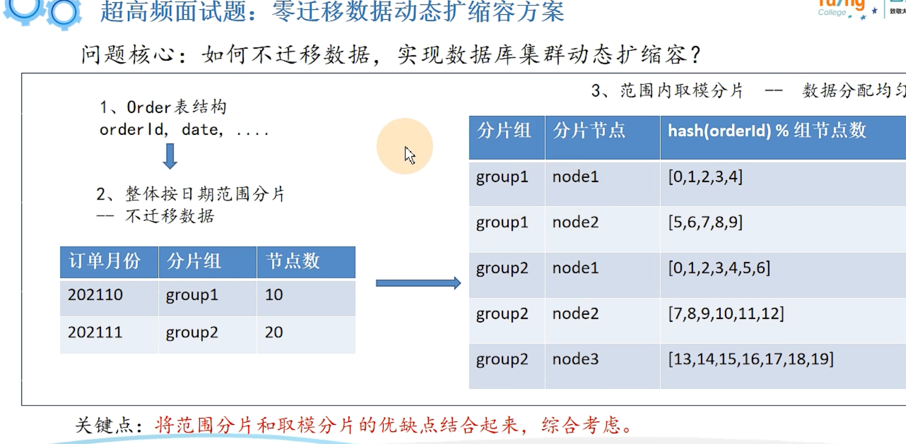
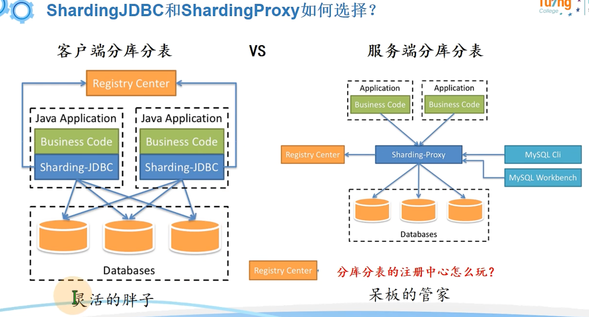
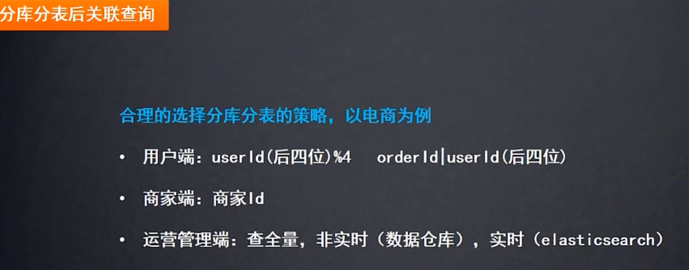
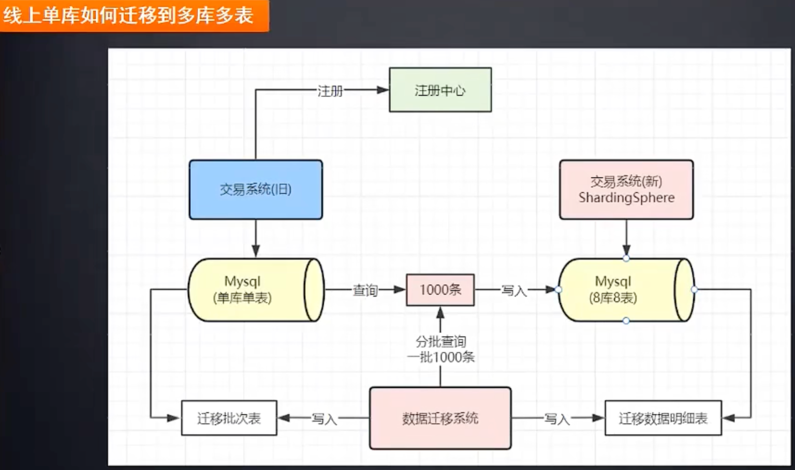

=============================
分库分表
=============================

.. post:: 2023-02-20 22:06:49
  :tags: mysql
  :category: 数据库
  :author: YanQue
  :location: CD
  :language: zh-cn

具体情况具体分析,
合理选择策略.

.. note::

  还有 NewSQL 的 单机 到 分布式集群, 不属于分库分表,
  而是直接就实现了分布式

  .. figure:: ../../../resources/images/2024-02-01-00-19-31.png
    :width: 480px

分库分表算是一个轻量级的优化解决方案

- 分库: 将数据分离多个库, 解放数据库IO性能
- 分表: 将数据分离多个表, 突破单表数据压力

.. note::

  这里提一句, 还有其他优化方案, 比如使用 **主从架构** (binlog) 实现 **读写分离**

  业务代码层面, 读写分离只关注路由到读的库, 还是写的库.

分库分表方案
=============================

数据分片

常见策略
  - 取模分片。优点：数据存放均匀。缺点：扩容需要大量数据迁移。
  - 按范围分片。优点：扩容不需要迁移数据。缺点：数据存放不均匀，容易产生数据倾斜(比如按月份分, 某月的数据过多, 另一月内数据又过少)。
  - 配置路由, 比如将路由配置信息写到路由表; 缺点是得多查询一次, 以及数据量大时候又回陷入分表循环;
  - 根据业务场景，灵活定制分片策略。--面试重点

垂直拆分
-----------------------------

垂直分片：

  - 从业务维度切分扩展数据库连接数
  - 提升数据库IO性能

  把单库中的不同表分到不同的库,
  再深入点, 把单表的列拆分给多个表

水平拆分
-----------------------------

水平分片：

  - 从数据维度切分扩展单表可控数据量
  - 提升数据库查询性能

  .. figure:: ../../../resources/images/2024-02-01-00-31-44.png
    :width: 480px

  水平分片从理论上突破了单机数据量处理的瓶颈，并且扩展相对自由，是分库分表的标准解决方案。

如

比如按日期拆分(范围分表), 那在WEB应用的角度怎么查? 可以按照时间, 2021年的查2021年的表...

Hash分表
  其实就是上面的取模策略.

  查id, id计算hash后对多少(比如拆为4张表)取余, 然后决定去哪个表查.

  但是有个缺点, 后续如果再拆4个表, 加起来一共八个, 之前的逻辑的混乱了.
  所以还要作数据迁移

  无热点问题, 但是扩容迁移麻烦.
范围分表
  时间分表就是,

  比如 1000-2000 w数据在第2张表.

  存在热点问题. 比如同时并发在某一个表.

分库分表后如何实现不停机扩容
=============================

实际上，不停机扩容，实操起来是个非常麻烦而且很有风险的操作，
当然，面试回答起来就简单很多。

第一阶段：在线双写，查询走老库
  a. 建立好新的库表结构，数据写入老库的同时，也写入拆分的新库
  b. 数据迁移，使用数据迁移程序，将旧库中的历史数据迁移到新库
  c. 使用定时任务，新旧库的数据对比，把差异补齐
第二阶段：在线双写，查询走新库
  a. 完成了历史数据的同步和校验
  b. 把对数据的读切换到新库
第三阶段：旧库下线
  a. 旧库不再写入新的数据
  b. 经过一段时间，确定旧库没有请求之后，就可以下线老库

分库分表问题
=============================

从分库的角度来讲
-----------------------------

事务的问题
  使用关系型数据库，君很大一点在于它保证事务完整性。

  而分库之后单机事务就用不上了，必须使用分布式事务来解决。
跨库 JOIN 问题
  在一个库中的时候我们还可以利用JOIN 来连表查询，而跨库了之后就无法使用JOIN 了

  此时的解决方案就是在业务代码中进行关联，也就是先把一个表的数据查出来，
  然后通过得到的结果再去查另一张表，然后利用代码来关联得到最终的结果。

  这种方式实现起来稍微比较复杂，不过也是可以接受的。

  还有可以适当的冗余一些字段。比如以前的表就存储一个关联 ID，但是业务时常要求返回对应的 Name 或者其他字段。
  这时候就可以把这些字段冗余到当前表中，来去除需要关联的操作。

  还有一种方式就是数据异构，通过binlog同步等方式，把需要跨库join的数据同步到ES的大宽表里去，通过ES直接查询，效率很高。

从分表的角度来看
-----------------------------

跨节点的 count,order by.group by 以及聚合函数问题
  只能由业务代码来实现或者用中间件将各表中的数据汇总、排序、分页然后返回。
数据迁移，容量规划，扩容等问题
  数据的迁移，容量如何规划，未来是否可能再次需要扩容，等等，都是需要考虑的问题。
ID 问题
  数据库表被切分后，不能再依赖数据库自身的主键自增生成机制，所以需要一些手段来保证全局主键唯一。
  即 案例-主键冲突_

  - 还是自增，只不过自增步长设置一下。比如现在有三张表，步长设置为3，
    三张表ID 初始值分别是1、2、3。
    这样第一张表的ID增长是1、4、7。第二张表是2、5、8。第三张表是3、6、9，这样就不会重复了。
  - UUID，这种最简单，但是不连续的主键插入会导致严重的页分裂，性能比较差。
  - 分布式ID，比较出名的就是 Twitter 开源的 sonwflake 雪花算法

案例-主键冲突
-----------------------------

数据库一般使用整型自增主键,
那么当进行分库分表时,
新的表也是需要主键索引的, 这个时候就会有主键冲突,
如何解决?

有个自定义主键,  **雪花** 算法,
它让主键只是保持一个增加的趋势,
具体怎么实现的, 后面再研究.

案例-多数据源, 分布式事务问题
-----------------------------

分库分表开源框架
=============================

ShardingSphere分库分表
-----------------------------

京东开源

地址: `Apache ShardingSphere <https://shardingsphere.apache.org/index_zh.html>`_

支持:

- ShardingJDBC: 客户端分库分表
- ShardingProxy: 服务端分库分表

实际使用方面来看, 实现是通过配置把多个表、库整合为一个逻辑表、库

支持策略

- Inline策略 - 根据单一分片键进行精确分片;
  如
  SQL::

    Insert into course values (?,?,?,?)
    Select * from course where cid = ?
    Select * from course where cid in ?

  注: 此处cid是由雪花算法生成的主键id

  分片键: cid尽量不要用id，MyBatis会对id字段默认生成雪花主键

  分片算法::

    m$->{cid%2+1}.course_$-> I ((cid+1) %4).intdiv(2) +1}

  真实节点::

    m$->{1.. 2}.course_$->{1.. 2}

- Standard策略 - 根据单一分片键进行精确或者范围分片;

  如SQL::

    Select * from course where cid between ? and ?

  分片键: cid

  分片算法::

    Precise algorithm + Range algorithm

  真实节点::

    m$->{1.. 2}.course_$->{1.. 2}
- Complex策略 - 根据多个分片键进行精确或者范围分片;
- Hint策略 - 使用与SQL无关的方式进行分片;
  如查询的cid是奇数

其他:

- 支持读写分离下的策略配置

案例举例
=============================

案例-不同用户端优化
-----------------------------

说明: 主要是运营管理端, 如果需要实时可以用es, es中可以只存相关关键查询字段和主键
然后再拿主键去数据库拿.

案例-线上单库不停机迁移
-----------------------------

先考虑停机迁移, 可以直接整库迁移, 或者每次迁移1k数据等

但是如果是线上迁移, 期间可能会有业务数据更新.

方案一: 监听binlog
  binlog记录了对数据库的修改,
  阿里有个开源的 **canal** 组件 , 可以做到监听binlog

  然后把binlog的变动解析出来写到新库表.
  但是得考虑, 如果监听binlog写到新库表要比迁移的快, 就会造成数据混乱.
  解决方案就是用版本啊, 重试机制啥的

迁移后也不能马上全部拿去用,
而是 **灰度发布**, 先给部分服务器用.
灰度的周期一般比较短, 因为期间可能有分流的问题,
比如更新的新表, 但是有查询旧表...

