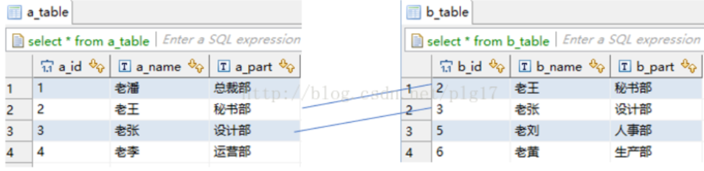
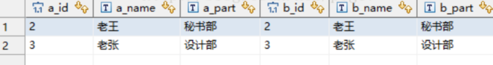
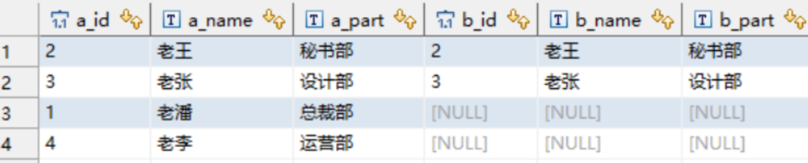
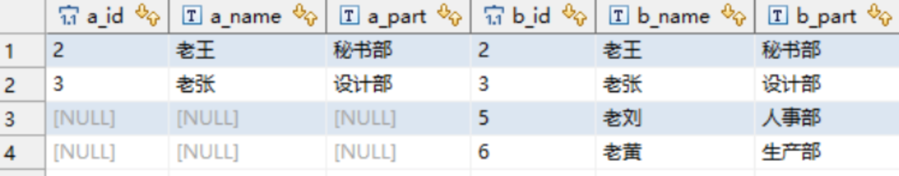

===========================
表内外连接
===========================

假设有两个表a, b::

  CREATE TABLE `a_table` (
    `a_id` int(11) DEFAULT NULL,
    `a_name` varchar(10) DEFAULT NULL,
    `a_part` varchar(10) DEFAULT NULL
  ) ENGINE=InnoDB DEFAULT CHARSET=utf8

  CREATE TABLE `b_table` (
    `b_id` int(11) DEFAULT NULL,
    `b_name` varchar(10) DEFAULT NULL,
    `b_part` varchar(10) DEFAULT NULL
  ) ENGINE=InnoDB DEFAULT CHARSET=utf8

  表数据

内连接
---------------------------

内连接, 语法::

  inner join on

用例::

  select * from a_table a inner join b_table b on a.a_id = b.b_id;

  结果

说明: 结果只会包含满足 a.a_id = b.b_id.
相当于两个表的交集.

左连接（左外连接）
---------------------------

语法::

  left join on / left outer join on

用例::

  select * from a_table a left join b_table b on a.a_id = b.b_id;

  结果

- left join 是left outer join的简写，它的全称是左外连接，是外连接中的一种
- 左连接会显示主表（左表）的全部记录，右表只会显示符合连接条件的数据，不符合的为null

右连接（右外连接）
---------------------------

关键字::

  right join on / right outer join on

语句::

  select * from a_table a right outer join b_table b on a.a_id = b.b_id;

  执行结果

- right join是right outer join的简写，它的全称是右外连接，是外连接中的一种。
- 与左(外)连接相反，右(外)连接，显示右表（主表）所有记录，左表只会显示符合连接条件的数据，不符合的为null

全外连接(mysql不支持)
---------------------------

关键字::

  full [outer] join

相当于返回两个表的并集, 没有的为空

MySQL暂不支持这种语句，不过可以使用union将两个结果集“堆一起”，
利用左连接，右连接分两次将数据取出，然后用union将数据合并去重。

:参考::
  - `MySQL多表查询与左连接、右连接、内连接、全连接 <https://zhuanlan.zhihu.com/p/455111363>`_
  - `【MySQL】连接查询 以及 on、where、Having的区别 <https://www.cnblogs.com/birdy-silhouette/p/14011817.html>`_

UNION
===========================

这个不属于连接, 不过容易混, 所以放在这

合并多个结果集为一个

MySQL UNION 操作符用于连接两个以上的 SELECT 语句的结果组合到一个结果集合，并去除重复的行。
UNION 操作符必须由两个或多个 SELECT 语句组成，每个 SELECT 语句的列数和对应位置的数据类型必须相同::

  SELECT column1, column2, ...
  FROM table1
  WHERE condition1
  UNION
  SELECT column1, column2, ...
  FROM table2
  WHERE condition2
  [ORDER BY column1, column2, ...];

参数说明:

- column1, column2, ... 是你要选择的列的名称，如果使用 * 表示选择所有列。
- table1, table2, ... 是你要从中查询数据的表的名称。
- condition1, condition2, ... 是每个 SELECT 语句的过滤条件，是可选的。
- ORDER BY 子句是一个可选的子句，用于指定合并后的结果集的排序顺序。

将选择客户表和供应商表中所有城市的唯一值，并按城市名称升序排序::

  SELECT city FROM customers
  UNION
  SELECT city FROM suppliers
  ORDER BY city;

还有个 **UNION ALL**, 也是合并结果集, 但是不会去重.

总结
  - UNION 语句：用于将不同表中相同列中查询的数据展示出来；（不包括重复数据）
  - UNION ALL 语句：用于将不同表中相同列中查询的数据展示出来；（包括重复数据）

  使用形式如下::
    SELECT 列名称 FROM 表名称 UNION SELECT 列名称 FROM 表名称 ORDER BY 列名称；
    SELECT 列名称 FROM 表名称 UNION ALL SELECT 列名称 FROM 表名称 ORDER BY 列名称；

