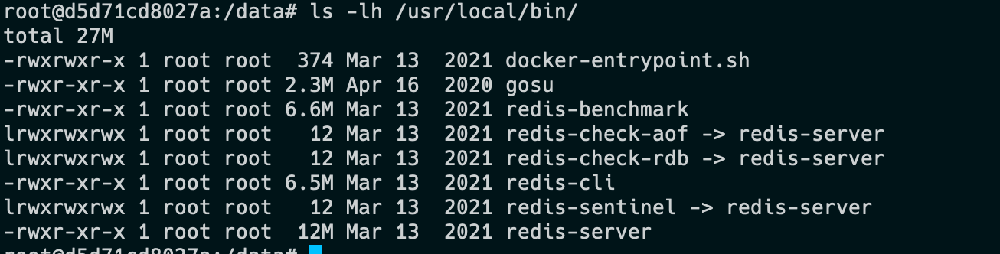

===============================
使用
===============================

.. post:: 2023-02-20 22:06:49
  :tags: redis
  :category: 数据库
  :author: YanQue
  :location: CD
  :language: zh-cn

相关命令
===============================

redis-benchmark
  redis性能测试
redis-check-aof
  校验aof文件完整性
redis-check-rdb
  检查rdb
redis-cli
  命令行交互式打开使用
redis-sentinel
  哨兵, 与服务是一个
redis-server
  服务. 启动redis可以使用::

    redis-server [conf-file]

  docker安装的redis结构

redis-cli交互指令
-------------------------------

redis-cli

-h
  主机
-p
  端口
-a
  密码
--raw
  当输出结果有中文的时候, 默认输出是16进制,
  加此选项, 解码为中文显示

也可以直接跟在redis-cli后面直接执行::

  redis-cli --raw get $key

关闭redis::

  redis shutdown

不建议直接kill, 会丢失内存数据

交互式操作
===============================

dbsize
  查看当前存储的key数量
keys
  查看所有key::

    keys *
flushdb
  清空当前会话的数据
auth
  账户验证登陆
type
  查看指定key数据类型
object encoding
  查看key对应数据底层结构.

  如::

    object encoding $key

String操作
===============================

set
  设置key-value

  语法::

    set key value [EX seconds|PX milliseconds|EXAT timestamp|PXAT milliseconds-timestamp|KEEPTTL] [NX|XX] [GET]

  参数选项说明

  key
    设置的键名
  value
    键对应的值
  EX seconds
    可选参数，过期时间, 单位秒
  PX milliseconds
    可选参数，过期时间, 单位毫秒, 与EX二选一即可
  EXAT timestamp
    可选参数，时间戳
  PXAT milliseconds-timestamp
    可选参数，毫秒级时间戳
  KEEPTTL
    可选参数，保持键的现有过期时间不变。
  NX
    可选参数，如果要设置的key不存在才设置, 仅使用此选项, 与 **setnx** 效果一致
  XX
    可选参数，仅在键已存在时设置键的值（即执行 "SET IF EXISTS" 操作）。
  GET
    可选参数，在设置键的值的同时，获取键的旧值
setnx
  与set类似, 不过只有在键key不存在时才设置.

  命令来自于 ``SET if Not eXists`` 的缩写

  命令的返回值:

  - 1：设置成功；
  - 0：key 没有设置成功。
del
  删除指定的key
exists
  判断指定的key是否存在
hincrby
  创建指定key的hash表
hexists
  判断key对应的hash表中是否存在某个值
expire
  指定某个key的过期时间, 单位: 秒
incr
  设置某个key自增, 就是每次设置一次后就加一

.. note::

  对于 "查看指定key数据类型", 表示key对应的值的数据类型

Hash操作
===============================

HMSET
  hash, 批量存储
HMGET
  hash, 批量获取

List操作
===============================

一览

- LPUSH
- RPUSH
- LPOP
- RPOP
- LRANGE
- BLPOP
- BRPOP

将一个或多个值value插入到key列表的表头（最左边）::

  LPUSH key value [value ...]

将一个或多个值value插入到key列表的表尾（最右边）::

  RPUSH key value [value ...]

移除并返回key列表的头元素::

  LPOP key

移除并返回key列表的尾元素::

  RPOP key

返回列表key中指定区间内的元素，区间以偏移量start和stop指定::

  LRANGE key start stop

从key列表表头弹出一个元素，若列表中没有元素，阻塞等待 timeout秒；如果timeout=0， 直阻塞等待::

  BLPOP key [key ...] timeout

从key列表表尾弹出一个元素，若列表中没有元素，阻塞等待 timeout秒；如果timeout=0，一直阻塞等待::

  BRPOP key [key ...] timeout

常用分布式数据结构

  栈::

    Stack = LPUSH + LPOP

  队列::

    Queue = LPUSH + RPOP

  阻塞队列::

    Blocking MQ = LPUSH + BRPOP

Set操作
===============================

一览

- SADD
- SREM
- SCARD
- SISMEMBER
- SRANDMEMBER
- SPOP

往集合key中存入元素，元素存在则忽略， 若key不存在则新建::

  SADD key member [member ...]

从集合key中删除元素::

  SREM key member [member ...]

获取集合key中所有元素::

  SMEMBERS key

获取集合key的元素个数::

  SCARD key

判断member元素是否存在于集合key中::

  SISMEMBER key member

从集合key中选出count个元素(随机选取)，元素不从key中删除::

  SRANDMEMBER key [count]

从集合key中选出count个元素，元素从key中删除::

  SPOP key [count]

Set运算操作
-------------------------------

一览

- SINTER
- SINTERSTORE
- SUNION
- SUNIONSTORE
- SDIFF
- SDIFFSTORE

交集运算::

  SINTER key [key ...]

将交集结果存入新集合destination中::

  SINTERSTORE destination key [key ..]

并集运算::

  SUNION key [key .]

将并集结果存入新集合destination中::

  SUNIONSTORE destination key [key ...]

差集运算::

  SDIFF key [key ...]

将差集结果存入新集合destination中::

  SDIFFSTORE destination key [key ...]

ZSet常用操作
===============================

一览

- ZADD
- ZREM
- ZSCORE
- ZINCRBY
- ZCARD
- ZRANGE
- ZREVRANGE

与Set的区别就是, 元素插入的时候要提供一个 `分值`

往有序集合key中加入带分值元素::

  ZADD key score member [[score member]...]

从有序集合key中删除元素::

  ZREM key member [member ...]

返回有序集合key中元素member的分值::

  ZSCORE key member

为有序集合key中元素member的分值加上increment::

  ZINCRBY key increment member

返回有序集合key中元素个数::

  ZCARD key

正序获取有序集合key从start下标到stop下标的元素::

  ZRANGE key start stop [WITHSCORES]

倒序获取有序集合key从start下标到stop下标的元素::

  ZREVRANGE key start stop [WITHSCORES]

Zset集合操作
-------------------------------

一览

- ZUNIONSTORE
- ZINTERSTORE

并集计算::

  ZUNIONSTORE destkey numkeys key [key ...]

交集计算::

  ZINTERSTORE destkey numkeys key [key ...]

