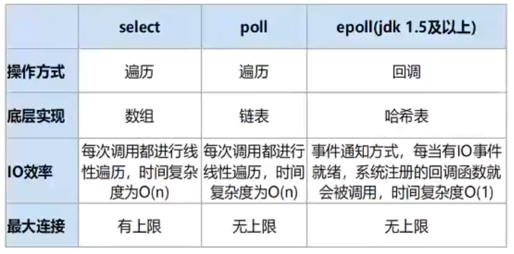
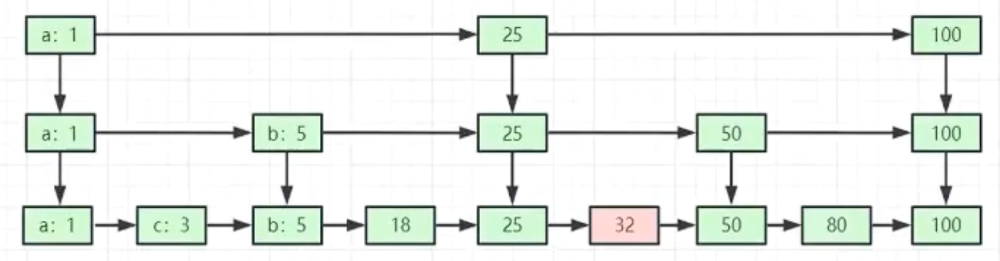

=============================
底层实现
=============================

基于epoll, 多路复用

I/O多路复用底层主要用的Linux 内核函数 （select, poll, epoll）来实现，
windows不支持epoll实现，windows底层是基于winsock2的

select函数实现的（不开源）

Linux下可参考 :doc:`/docs/操作系统/linux/概念性/IO模型`

.. select poll epoll（idk1.5及以上）

.. 操作方式遍历遍历回调

.. 底层实现

.. I0效率

.. 最大连接

.. 数组链表哈希表

.. 每次调用都进行线每次调用都进行事件通知方式，每当有10事件性遍历，时间复杂线性遍历，时间就绪，系统注册的回调函数就度为O（n） 复杂度为O（n） 会被调用，时间复杂度0（1） 有上限无上限无上限

底层数据结构
=============================

整体看是大的全局hash表(k-v)

但是对于value来说, 有不同情况.
value常见支持类型:

- String
- List (比如消息队列)
- Set (比如关注列表)
- Hash (复杂最想存储)
- Zset（有序集合）SortSet (比如排行榜)

String
  简单动态字符串

  - 能转整数的, 用int
  - 小于等于44字节的, 用 “embstr”
  - 大于44字节, 用 “raw”

  如果要查看底层数据存储::

    object encoding $key
Hash
  hash表, 压缩列表
List
  压缩列表(ziplist), 双向链表
Set
  hash表, 整数数组
ZSet
  压缩列表, 跳表(skiplist)

  可能会在存储时候, 切换数据结构

跳表(skiplist)优化
=============================

对于每两个元素, 取第一个向上提取一层(建立冗余索引),
类似于B+树

提高查找性能

