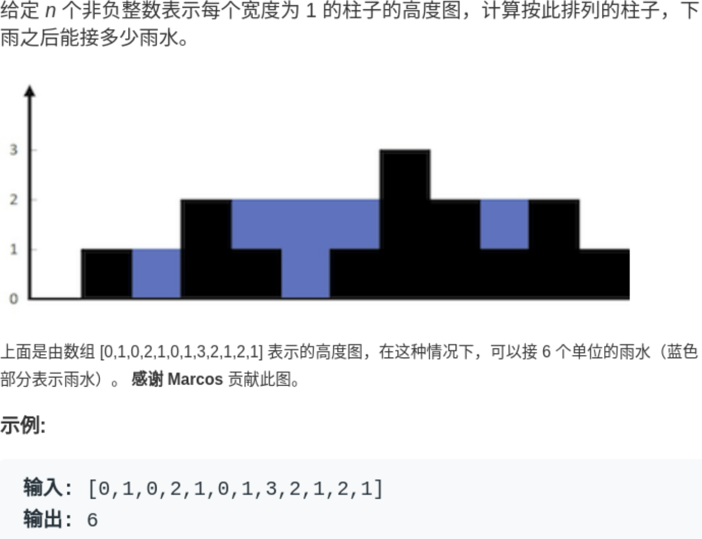

==========================
数据结构
==========================

.. 树

.. toctree::

  树
  Hash
  回溯算法
  贪心算法/index

算法-动态规划
==========================

主要是要想到一个状态转移方程, 根据这个方程来写代码,
以 算法示例-01背包问题_ 为例

.. note::

  也叫填表法, 记忆化搜索

算法-贪心
==========================

以 01 背包为例, 先按照贪心的方向排序,
比如考虑三种排序策略

- 重量最轻
- 价值最高
- 性价比最高(价值/重量最高)

然后按照这个顺序从最好的开始, 但是会导致一个问题, 结果不一定是最优解.

可参见: :doc:`/docs/数据结构/贪心算法`

滚动数组
==========================

主要将目标集中在当前计算需要的数据上, 丢弃不必要的数据

滚动数组-斐波那契数列
--------------------------

先以 **斐波那契数列** 为例, 第一和第二个数为1, 后续每一个数前两个数之和::

  1、1、2、3、5、8、13、21、34

**基础的解法** ::

  d = [1, 1]
  for i in range(2, n):
    d[i] = d[i-1] + d[i-2]

这个时候的空间复杂度为数组d, O(n)

**两个变量解法**

仔细观察, 计算每一步实际上只需要前两次的值就行,
那么实际上可以只需要两个变量即可::

  a, b = [1, 1]
  i = 2
  while i < n:
    a = a+b
    b = a+b
    i += 2

  # 最后需要判断一个奇偶决定返回a还是b
  return b if n % 2 == 0 else a

这个时候空间复杂度就变成了O(2), 就是O(1)

**大小为3数组解法**

或者利用一个大小为3的数组::

  d = [0, 1, 1]
  for i in range(2, n):
    d[0], d[1] = d[1], d[2]
    d[2] = d[0] + d[1]

  return d[2]

算法示例-01背包问题
==========================

有一个物品重量数据 width 和 其中每一个物品对应的价值数组 value,
比如 width[i] 的价值是 value[i],
求当背包容量为 big-package 时, 能装下物品的最大价值

首先找到状态转移方程,

定义:

- i, 物品下标i, 表示这个物品
- j, 当前背包容量
- d[i][j], 表示当选择第i个物品时候, 且容量为j时候的最大价值

当遍历到第i个物品时候, 有两种情况:

- 选择第i个物品, 那么 d[i][j] = d[i-1][j-width[i]] + value[i]
- 不选择第i个物品, 那么 d[i][j] = d[i-1][j]

选择这两个情况中价值最大的那个::

  d[i][j] = max(d[i-1][j], d[i-1][j-width[i]] + value[i])

要注意边界条件和容量值, 比如容量值要大于0才可以选择当前物品::

  j-width[i] > 0

边界条件, 当容量j为0的时候, 对于任意i::

  d[i][0] = 0

如果没有物品, 虽然也可以定义::

  d[0][j] = 0

但是仔细考虑是没有必要的, 一方面是在i的维度会多一层值,
另一方面可以直接从第一个物品(下标0)来作为边界值, 就不用考虑下标减1的情况::

  d[0][j] = value[0] if j >= width[0] else 0
  # 或者三目, 伪代码懂意思就行
  d[0][j] = j >= width[0] ? value[0] : 0

当然用没有物品作为边界值也可以, 不过要注意, 这样后面使用下标注意减1,
因为0表示没有物品, 1表示第一个物品, 对应索引为0(也就是要记得减一)

伪代码解(使用第一个物品作为边界)::

  n = len(width)

  # n 行, 背包数 + 1 列, 初始值为 0
  d = [[0] * (big_package_size+1) for _ in range(n)]

  # 当选择第一个物品时, 边界值
  for j in range(big_package_size+1):
    d[0][j] = value[0] if j >= width[0] else 0

  # 构造动态转移方程
  for i in range(n):
    for j in range(big_package_size+1):
      if j-width[i] >= 0:
        d[i][j] = max(
          d[i-1][j],
          d[i-1][j-width[i]] + value[i]
        )
      else:
        d[i][j] = d[i-1][j]

  # 为什么直接是最后一个值, 因为都是从上一个值推导出来的 max ...
  return d[n-1][big_package_size]

图解, 以物品重量 w=[1,3,4], 价值 v=[15,20,30], 背包最大容量4为例::

            列,容量j    0       1       2       3       4
  行,物品i

    0                   0       15      15      15      15

    1                   0       15      15      20      35

    2                   0       15      15      20      35

.. note::

  不需要先排序, 因为看物品i, 是一个个子问题, 与排序是否无关

  两个for循环嵌套顺序不影响结果, 因为
  如果外层用物品, d[i][j] 是根据 d[i-1][j] 与 d[i-1][j-width[i]] 确定的(需要用的物品下标i小于等于当前层面, 之前层的所有j都是有值的),
  如果外层用容量, d[i][j] 也是根据 d[i-1][j] 与 d[i-1][j-width[i]] 确定的(需要用的容量j小于等于当前层, 之前层的所有i都是有值的),
  都在上一层

  提示: d[i-1][j - width[i]] 是物品 width[0:i] (下标0到i-1) 的最优解

  直接在编辑器手写的, 没运行过, 懂意思就行

优化空间-滚动数据
--------------------------

滚动数组是什么可看上面 滚动数组_

.. 甚至再精简一点, 使用一维数组:\:
.. 这个是错的, 不能从小到大, 会覆盖上一层
..   for i in range(n):  # 遍历物品
..     for j in range(big_package_size+1): # 遍历背包容量
..       if j >= weight[i]:
..         d[j] = max(d[j], d[j - weight[i]] + value[i])

.. (注意, 如果是下面一节的完全背包, 物品是可以添加多次的，必须从小到大去遍历)

分析, 当遍历物品i时候, 需要用的数据只有物品i-1的, 即只会使用上一层,
区别就是根据不同的情况, 选择上一层的不同容量的数据,
那么根据滚动数组的概念, 辅助数组只要两层即可(当前层与上一层), 这个时候内循环不管从大到小
还是从小到大遍历皆可.

再仔细想我们的规划方程::

  d[i][j] = max(d[i-1][j], d[i-1][j-width[i]] + value[i])

可以转换为一维::

  d[j] = max(d[j], d[j-w[i]] + v[i])

现在讲讲内循环为什么应该从大到小.
先看外循环, 每次计算物品i时, 用到的物品下标只与i-1有关,
再看内循环的j, 用到的值有::

  j
  j-width[i]

两种策略, 还是以上面的物品重量 w=[1,3,4], 价值 v=[15,20,30], 背包最大容量4为例::

            列,容量j    0       1       2       3       4
  行,物品i

    0                   0       15      15      15      15

    1                   0       15      15      20      35

    2                   0       15      15      20      35

我们尝试将其转换为一维数组, 当行物品i==1时::

  d[1][0] = 0
  d[1][1] = max(d[0][1], d[0][1-3] + 20) = max(15) = 15
  d[1][2] = max(d[0][2], d[0][2-3] + 20) = max(15) = 15
  d[1][3] = max(d[0][3], d[0][3-3] + 20) = max(15, 20) = 20
  d[1][4] = max(d[0][4], d[0][4-3] + 20) = max(15, 15+20) = 35

再次可以总结出, 计算i层时候, 只与上一层i-1有关(这里例子是1-1=0),
那列j与什么有关呢, 观察目前的i==1变化趋势::

  1-3
  2-3
  3-3
  4-3

其实归根结底就是::

  j - w[i]

且j不断增大到最大容量, 然后就更新当前容量时候的值,
那么可以说 当前更新的 容量列(j) 与 上一层的::

  j - w[i]

有关, 且::

  j - w[i]

总是小于等于j的.

所以如果要用一维数据d[j], 当内循环从小到大遍历的时候::

  d[j] = max(d[j], d[j-w[i]] + v[i])

先记录一下当前的d数组d[0]::

  d = [0,       15,      15,      15,      15]

归纳一下当i==1的时候更新的内容::

  d[0] = 0
  d[1] = max(d[1], d[1-3] + 20) = max(15) = 15
  d[2] = max(d[2], d[2-3] + 20) = max(15) = 15
  d[3] = max(d[3], d[3-3] + 20) = max(15, d[0] + 20) = 20
  d[4] = max(d[4], d[4-3] + 20) = max(15, d[1] + 20) = 20

观察一下从小到大遍历有没有什么问题?

当i==1, 计算d[3] 的时候, 用到了d[0], 但是d[0] 其实已经被更新了, 是新的::

  d[0] = 0

同理当i==1, 计算d[4] 的时候, 用到了d[1], 但是d[1] 其实已经被更新了, 是新的::

  d[1] = 15

那么怎么解决这个问题呢?

答案就是 **从大到小遍历**, 因为当更新 d[j] 是, 需要用到的 ``j-w[i]`` 往往是小于
当前j的, 所以我们只要先更新最大的, 这个时候 ``j-w[i]`` 还没被更新, 还是上次的.

简而言之, 计算 ``d[i][j]`` 时, 依赖 ``d[i-1][j-width[i]]`` , 需要保证上一层的数据使用的时候还是原来的,
即 **确保 ``d[i-1][j-width[i]]`` 存储的是上一行的值，即确保 ``d[j-width[i]]`` 还没有被更新，所以遍历方向是从大到小。**

.. 因为每一层的最优解只与上一层物品的最优解有关,
.. 所以在本层内顺序前到后或者后到前都是可以的:\:

编码::

  for i in range(n):  # 遍历物品
    for j in range(big_package_size, -1, -1): # 遍历背包容量
      if j >= weight[i]:
        d[j] = max(d[j], d[j - weight[i]] + value[i])
      else: # 说明前面的都不满足 j - weight[i] >= 0 , 值就是当前值, 直接跳出此处循环
        break

算法示例-完全背包
==========================

有一个物品重量数据 width 和
其中每一个物品对应的价值数组 value,
.. 以及每一个物品的花费数组 cost(就是你要拿这个物品要用多少钱买),
且 **每一个物品i是无限的**,
比如 width[i] 的单价值是 value[i],
.. 购买单件需要花费 cost[i]
求当背包容量为 big-package 时, 能装下物品的最大价值

与 算法示例-01背包问题_ 相比, 完全背包物品有无限个

与其相似, 得出规律::

  选择 0 件物品i 的最大价值，即: d[i-1][j]
  选择 1 件物品i 的最大价值，即: d[i-1][j-width[i]] + value[i]
  选择 2 件物品i 的最大价值，即: d[i-1][j-width[i]*2] + value[i]*2
  ...

记得考虑条件, 不能超过背包容量::

  j-width[i] * k >= 0

还是先遍历物品
方程::

  d[i][j] = max(d[i-1][j], d[i-1][j-width[i]*k] + value[i]*k)

  # =》 当k为0

  d[i-1][j-width[i]*k] + value[i]*k = d[i-1][j]

  # 所以可以直接写成

  d[i][j] = max({d[i-1][j-width[i]*k] + value[i]*k})

当考虑k时编码::

  for i in range(n):
    for j in range(big_package_size+1):
      # 初始
      d[i][j] = d[i-1][j]   # 即k==0
      k = 1
      # while j-width[i]*k >= 0:
      while j >= width[i]*k:
        d[i][j] = max(
          d[i][j],
          d[i-1][j-width[i]*k] + value[i]*k
        )

可以看出时间复杂度是比较高的,
这个时候是否可以将k的因素给去掉呢? 可以.

先看原始的方程::

  d[i][j] = max({d[i-1][j-width[i]*k] + value[i]*k})

将k展开::

  d[i][j] = max({d[i-1][j-width[i]*k] + value[i]*k})
    = max(d[i-1][j-width[i]*0] + value[i]*0,
        d[i-1][j-width[i]*1] + value[i]*1,
        d[i-1][j-width[i]*2] + value[i]*2
        ...
        d[i-1][j-width[i]*k] + value[i]*k
      )

可以简单的得到当容量统一减小width[i]时::

  d[i][j-width[i]]
    = max(d[i-1][j-width[i]*1] + value[i]*0,
        d[i-1][j-width[i]*2] + value[i]*1,
        d[i-1][j-width[i]*3] + value[i]*2
        ...
        d[i-1][j-width[i]*(k+1)] + value[i]*k
      )

对于max来说, 在其上加减一个数是不影响结果的, 所以对上一个式子统一加上value[i]::

  d[i][j-width[i]] + value[i]
    = max(d[i-1][j-width[i]*1] + value[i]*1,
        d[i-1][j-width[i]*2] + value[i]*2,
        d[i-1][j-width[i]*3] + value[i]*3
        ...
        d[i-1][j-width[i]*(k+1)] + value[i]*(k+1)
      )

就得到了::

  d[i][j] = max(d[i-1][j-width[i]*k] + value[i]*k)              # 0 <= k < max_k

  # 将0分离出来
  d[i][j] = max(d[i-1][j], d[i-1][j-width[i]*k] + value[i]*k)   # 1 <= k < max_k

  # 带入上面对max的操作 d[i][j-width[i]] + value[i]
  d[i][j] = max(d[i-1][j], d[i][j-width[i]] + value[i])         # 1 <= k < max_k

可以简单的理解为, 当计算物品i时, 从相邻的物品(可能是自己)算起,

此时消掉k编码::

  for i in range(n):
    for j in range(big_package_size+1):
      if j >= width[i]:
        d[i][j] = max(
            d[i-1][j],
            d[i][j-width[i]] + value[i]
          )
        else:
          d[i][j] = d[i-1][j]

使用 滚动数组_ ,
转换为一维数组
方程::

  d[j] = max(d[j], d[j-width[i]] + value[i])

注意此时与01背包不同, 01背包使用的是上一层的,
所以内循环是从大到小遍历,
但是此时是完全背包, 使用的是当前层的数据, 需要先更新,
所以完全背包内循环是从小到大遍历::

  for i in range(n):
    for j in range(big_package_size+1):
      if j >= width[i]*k:
        d[j] = max(
            d[j],
            d[j-width[i]] + value[i]
          )

此处内循环是从小到大遍历,
简而言之, 计算 ``d[i][j]`` 时, 依赖 ``d[i][j-width[i]]`` , 需要保证数据使用的时候还是当前层已经更新的.
即 **确保 ``d[i][j-width[i]]`` 存储的是当前行的值，确保 ``d[j-width[i]]`` 已经更新，所以遍历方向是从小到大。**

.. 有k编码

  .. for i in range(n):
  ..   for j in range(1, big_package_size+1):
  ..     # 初始
  ..     d[j] = [j-1]   # 即k==0
  ..     k = 1
  ..     while j >= width[i]*k:
  ..       d[j] = max(
  ..         d[j],
  ..         d[j-width[i]*k] + value[i]*k
  ..       )

参考:

- `【动态规划/背包问题】从数学角度推导「完全背包」与「01 背包」之间的遍历顺序关系 <https://mp.weixin.qq.com/s?__biz=MzU4NDE3MTEyMA==&mid=2247486107&idx=1&sn=e5fa523008fc5588737b7ed801caf4c3&chksm=fd9ca184caeb28926959c0987208a3932ed9c965267ed366b5b82a6fc16d42f1ff40c29db5f1&token=536156957&lang=zh_CN#rd>`_
- `背包问题总结( 1 ) 01 背包，完全背包，多重背包，分组背包 <https://zhuanlan.zhihu.com/p/166439661>`_

算法示例-爬楼梯
==========================

有一个台阶 1~n, 每次可以走 1~n 步(n不大于剩余楼梯数), 有多少种走法

解:
  考虑在第n阶的时候, 用 d[n] 表示一共有多少选择, 有这些选择

  - 从 n-1 开始, 走 1 步, 那么只需要考虑 d[n-1] 有多少种 (走一步的本身与前面的每一个 d[n-1] 构成一种选择, 所以没有额外需要加的)

    .. note::

      对很多人来说, 最卡的一点就是, 没想通:
      **d[n-1] 中的每一种方案, 都与最后的一步, 一起继续构成这一种方案**,
      下同

  - 从 n-2 开始, 走 2 步, d[n-2]
  - 从 n-3 开始, 走 3 步, d[n-3]
  - 省略...
  - 从 1 开始, 走 n-1 步, d[1], 显而易见 d[1] = 1

可以推断出::

  d[n] = d[n-1] + d[n-2] + d[n-3] + ... + d[1]

编码::

  d = [0] * (n+1)
  d[1] = 1

  for i in range(2, n+1):
    for j in range(1, i):   # j 范围是, [1, i-1], 因为 j 为 i 的时候加的是 d[0], 值为0, 可以简化掉
      d[i] += d[i-j]

    # 内循环也可以从头部加起来
    # for j in range(1, i):
    #   d[i] += d[j]

  return d[n]

优化, 由上面的递推公式可以推断出::

   d[n-1] = d[n-2] + d[n-3] + ... + d[1]

所以, 原来的递推可以变化为::

  d[n] = d[n-1] + d[n-2] + d[n-3] + ... + d[1]
    = d[n-1] +  (d[n-2] + d[n-3] + ... + d[1])
    = d[n-1] +  d[n-1]
    = 2 * d[n-1]

即::

  d[n] = 2 * d[n-1]

也就说说, 第n个结果是上一个结果的 2 倍, 那就好办了,
一共有 n 个台阶, 一共需要被累乘(n-1)次, 直接::

  return 2 ** (n-1)

也可以笨一点递归乘::

  d = [0] * (n+1)
  d[1] = 1

  for i in range(2, n+1):
    d[i] = 2 * d[i-1]

  return d[n]

其他-接雨水
==========================

具体案例需要距离分析,
比如接雨水问题, 参考: `经典面试题：接雨水问题详解 <https://zhuanlan.zhihu.com/p/107792266>`_

就是用一个数组表示一个条形图，问你这个条形图最多能接多少水::

  int trap(int[] height);

最重要的几点:

- 对于每一个位置i,
  能接到的雨水数::

    min(l_max, r_max) - height[i]
- 每一个位置i, 左右的最高值都可以先算出, 这是备忘录的基础

暴力::

  int trap(vector<int>& height) {
      int n = height.size();
      int ans = 0;
      for (int i = 1; i < n - 1; i++) {
          int l_max = 0, r_max = 0;
          // 找右边最高的柱子
          for (int j = i; j < n; j++)
              r_max = max(r_max, height[j]);
          // 找左边最高的柱子
          for (int j = i; j >= 0; j--)
              l_max = max(l_max, height[j]);
          // 如果自己就是最高的话，
          // l_max == r_max == height[i]
          ans += min(l_max, r_max) - height[i];
      }
      return ans;
  }

备忘录解法::

  int trap(vector<int>& height) {
      if (height.empty()) return 0;
      int n = height.size();
      int ans = 0;
      // 数组充当备忘录
      vector<int> l_max(n), r_max(n);
      // 初始化 base case
      l_max[0] = height[0];
      r_max[n - 1] = height[n - 1];
      // 从左向右计算 l_max
      for (int i = 1; i < n; i++)
          l_max[i] = max(height[i], l_max[i - 1]);
      // 从右向左计算 r_max
      for (int i = n - 2; i >= 0; i--)
          r_max[i] = max(height[i], r_max[i + 1]);
      // 计算答案
      for (int i = 1; i < n - 1; i++)
          ans += min(l_max[i], r_max[i]) - height[i];
      return ans;
  }

双指针解法::

  int trap(vector<int>& height) {
      if (height.empty()) return 0;
      int n = height.size();
      int left = 0, right = n - 1;
      int ans = 0;

      int l_max = height[0];
      int r_max = height[n - 1];

      while (left <= right) {
          l_max = max(l_max, height[left]);
          r_max = max(r_max, height[right]);

          // ans += min(l_max, r_max) - height[i]
          if (l_max < r_max) {
              ans += l_max - height[left];
              left++;
          } else {
              ans += r_max - height[right];
              right--;
          }
      }
      return ans;
  }

仔细发现, 双指针相对于备忘录其实有点不同,
备忘录计算的是每次紧邻位置i左右的最高点, 即 l_max[i] 和 r_max[i] 代表的是 height[0..i] 和 height[i..end] 的最高柱子高度;
双指针仅仅是当前指针位置一侧最高点, 即 l_max 和 r_max 代表的是 height[0..left] 和 height[right..end] 的最高柱子高度.

那后者为什么可以代表前者?

还是看计算公式::

  min(l_max, r_max) - height[i]

我们需要的只是 l_max, r_max 中的最小值,
先看备忘录, 与正常的思维一致::

  min(l_max, r_max) = max(max(height[0..i]), max(height[i..end]))

再看双指针::

  min(l_max, r_max) = max(max(height[0..left]), max(height[right..end]))

区别就是少考虑了 height[left..right], 那么这个区间会造成影响吗?

解析说明
  先考虑::

    max(height[0..left]) < max(height[right..end])

    # 即 l_max < r_max

  的情况, 如果 height[left..right] 区间的值都比 max(height[right..end]) (即r_max) 小了,
  那么实际两者就是等价的::

    max(max(height[0..left]), max(height[right..end])) = max(max(height[0..i]), max(height[i..end]))

  如果height[left..right] 区间的值存在比 max(height[right..end]) (即r_max) 大的,
  即使找到那个值(记为 r_plus )了, 就是::

    max(l_max, r_max)
    =>
    max(l_max, r_plus)

    # 上面说了这是  l_max < r_max 的情况, 所以 两者的结果都是一样的

  因为 l_max < r_max, 对于比 r_max 更大的 r_plus, l_max < r_plus 肯定也是成立的

  两者也是等价的

反之当 l_max > r_max 同样也成立, 所以完全可以用双指针.

