======================================================
Dijkstra(迪杰斯特拉)算法
======================================================

.. post:: 2024-03-07 22:13:39
  :tags: 贪心算法
  :category: 数据结构
  :author: YanQue
  :location: CD
  :language: zh-cn

Dijkstra 算法是一个基于「贪心」、「广度优先搜索」、「动态规划」求一个图中一个点到其他所有点的最短路径的算法，时间复杂度 O(n^2)

**典型最短路径算法**，用于计算一个节点到其他节点的最短路径。
它的主要特点是以起始点为中心向外层层扩展(广度优先遍历思想)，直到扩展到终点为止。

基本步骤:

- Dijkstra 算法从指定的节点（源节点）出发，寻找它与图中所有其它节点之间的最短路径。
- Dijkstra 算法会记录当前已知的最短路径，并在寻找到更短的路径时更新。
- 一旦找到源节点与其他节点之间的最短路径，那个节点会被标记为“已访问”并添加到路径中。
- 重复寻找过程，直到图中所有节点都已经添加到路径中。
  这样，就可以得到从源节点出发访问所有其他节点的最短路径方案。

.. note::

  Dijkstra 只能用在权重为正的图中，因为计算过程中需要将边的权重相加来寻找最短路径。

Dijkstra 算法示例
======================================================

.. 1. 通过Dijkstra计算图G中的最短路径时，需要指定一个起点D(即从顶点D开始计算)。
.. 2. 此外，引进两个数组S和U。
..    S的作用是记录已求出最短路径的顶点(以及相应的最短路径长度)，
..    而U则是记录还未求出最短路径的顶点(以及该顶点到起点D的距离)。
.. 3. 初始时，数组S中只有起点D；
..    数组U中是除起点D之外的顶点，并且数组U中记录各顶点到起点D的距离。
..    如果顶点与起点D不相邻，距离为无穷大。
.. 4. 然后，从数组U中找出路径最短的顶点K，并将其加入到数组S中；
..    同时，从数组U中移除顶点K。
..    接着，更新数组U中的各顶点到起点D的距离。
.. 5. 重复第4步操作，直到遍历完所有顶点。

.. 图解

.. figure:\: ../../../resources/images/2024-03-06-15-48-03.png
  :width: 480px

.. 初始状态:
..   S是已计算出最短路径的顶点集合，U是未计算除最短路径的顶点的集合！

.. 第1步:
..   将顶点D加入到S中。

..   此时，S={D(0)}, U={A(∞),B(∞),C(3),E(4),F(∞),G(∞)}。 注:C(3)表示C到起点D的距离是3。
.. 第2步:
..   将顶点C加入到S中。

..   上一步操作之后，U中顶点C到起点D的距离最短；因此，将C加入到S中，同时更新U中顶点的距离。以顶点F为例，之前F到D的距离为∞；但是将C加入到S之后，F到D的距离为9=(F,C)+(C,D)。

..   此时，S={D(0),C(3)}, U={A(∞),B(13),E(4),F(9),G(∞)}。
.. 第3步:
..   将顶点E加入到S中。

..   上一步操作之后，U中顶点E到起点D的距离最短；因此，将E加入到S中，同时更新U中顶点的距离。还是以顶点F为例，之前F到D的距离为9；但是将E加入到S之后，F到D的距离为6=(F,E)+(E,D)。

..   此时，S={D(0),C(3),E(4)}, U={A(∞),B(13),F(6),G(12)}。

.. 第4步:
..   将顶点F加入到S中。

..   此时，S={D(0),C(3),E(4),F(6)}, U={A(22),B(13),G(12)}。

.. 第5步:
..   将顶点G加入到S中。

..   此时，S={D(0),C(3),E(4),F(6),G(12)}, U={A(22),B(13)}。

.. 第6步:
..   将顶点B加入到S中。

..   此时，S={D(0),C(3),E(4),F(6),G(12),B(13)}, U={A(22)}。

.. 第7步:
..   将顶点A加入到S中。

..   此时，S={D(0),C(3),E(4),F(6),G(12),B(13),A(22)}。

.. 此时，起点D到各个顶点的最短距离就计算出来了: A(22) B(13) C(3) D(0) E(4) F(6) G(12)。

寻找 0 到其它每一个节点的最短路径.

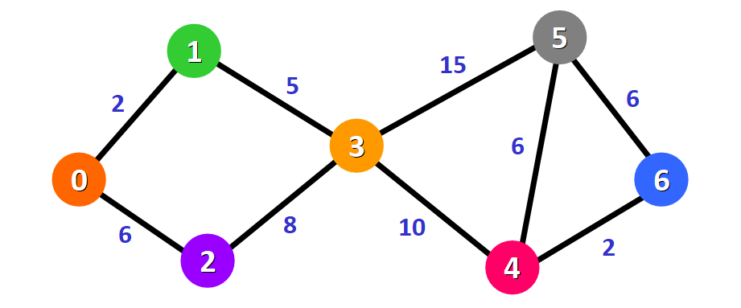

.. note::

  假定两个节点之间的权重表示它们之间的距离。

我们将会得到节点 0 到节点 1、节点 0 到节点 2、节点 0 到 节点 3……（以此类推）的最短路径。

初始的距离列表如下：

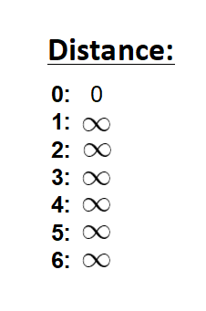

还有一个列表用来记录哪些节点未被访问（即尚未被包含在路径中）

.. note::

  当所有节点都被添加到路径中时，算法的计算过程就完成了。

我们选择了从节点 0 出发，可以直接将它标记为“已访问”，
同样的，在未访问节点列表中把它划掉，并在图中给它加上红色的边框：

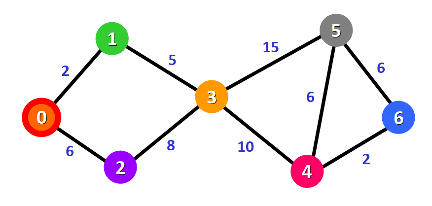

现在需要检查节点 0 到相邻节点的距离，两个相邻节点分别是节点 1 和节点 2（注意看红色的边）：

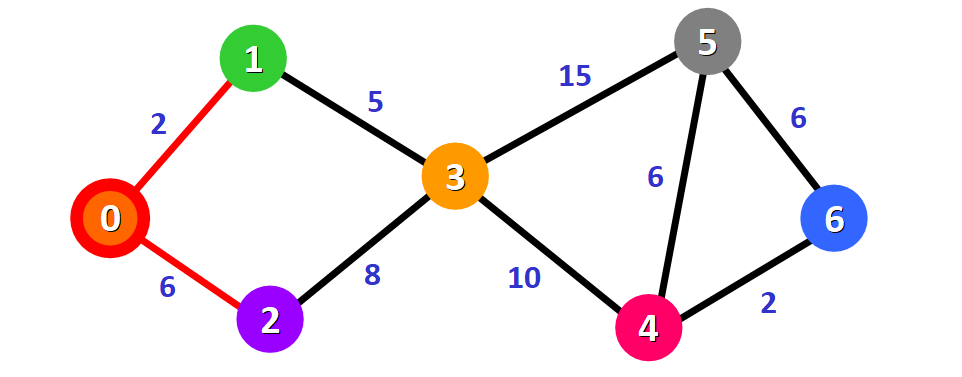

.. note::

  这并不是说立即把这两个相邻节点加入到最短路径中。
  在把一个节点加入到最短路径之前，需要确认是否已经寻找到了访问它的最短路径。
  现在只是在对可选方案做初步检查。

更新节点 0 到节点 1、节点 0 到节点 2 的距离为它们之间的边的权重，分别为 2 和 6

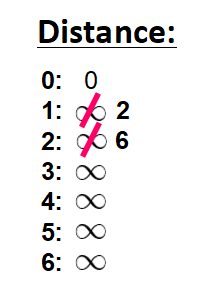

更新了到相邻节点的距离之后：

- 根据已知的距离列表选择距离源节点最近的节点。
- 将它标记为“已访问”。
- 将它添加到路径中。

查看距离列表，发现节点 1 到源节点的距离是最短的（距离为 2），所以把它加入到路径中。

在图中，以红色边来表示：

.. figure:: ../../../resources/images/2024-03-06-16-55-03.png
  :width: 480px

在距离列表中用红色方块标记这个节点，表明它是“已访问”的、已经寻找到了访问这个节点的最短路径：

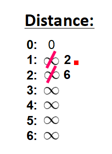

在未访问节点列表中将它划掉：

现在分析新的相邻节点，寻找访问它们的最短路径。
只需要分析已经在最短路径（标记为红色边）中的节点的相邻节点。

节点 2 和节点 3 都是最短路径包含的节点的相邻节点，
因为它们分别与节点 0 和节点 1 直接相连，如下图所示。下一步将要分析这两个节点。

.. figure:: ../../../resources/images/2024-03-06-16-56-52.png
  :width: 480px

之前已经计算过源节点到节点 2 的距离，并记录在了列表中，
所以不用更新。这次只需要更新源节点到新的相邻节点（节点 3）的距离：

.. figure:: ../../../resources/images/2024-03-06-16-57-17.png
  :width: 480px

这个距离是 7，来看看为什么。

为了计算源节点到另一个节点（这里指节点 3）的距离，需要把访问该节点的最短路径的所有边权重相加：

对于节点 3： 将构成路径 `0 -> 1 -> 3` 的所有边权重相加，
得到总距离为 7（0 -> 1 距离为 2，1 -> 3 距离为 5）。

.. figure:: ../../../resources/images/2024-03-06-16-57-56.png
  :width: 480px

现在得到了到相邻节点的距离，需要选择一个节点添加到路径中。
我们必须 **选择一个已知到源节点距离最短的未访问节点**。
即选择 Distance 中未确定最小值.

从距离列表中可以看出，距离为 6 的节点 2 就是我们的选择：

.. figure:: ../../../resources/images/2024-03-06-16-58-19.png
  :width: 480px

在图中为它加上红色边框，并将路径上的边标记为红色：

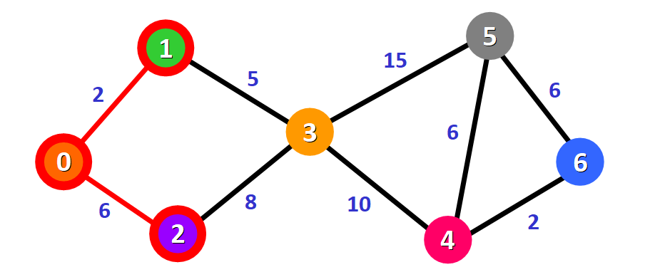

在距离列表中用红色方块把它标记为“已访问”，在“未访问”节点列表中把它划掉：

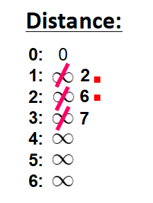

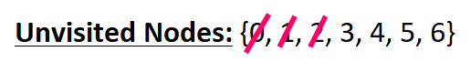

重复前面的步骤，寻找源节点到新的相邻节点节点 3 的最短路径。

可以看到，有两种可选的路径： `0 -> 1 -> 3` 或 `0 -> 2 -> 3`。一起看看我们是如何确定最短路径的。

.. figure:: ../../../resources/images/2024-03-06-17-09-36.png
  :width: 480px

节点 3 在之前已经有了一个距离记录（距离为 7，参阅下表），
这个距离是之前步骤中由路径 `0 -> 1 -> 3` 的两个边权重（分别为 5 和 2）相加得到的。

不过现在有了一个新的可选路径： `0 -> 2 -> 3`，它途经权重分别为 6 和 8 的两条边 `0 -> 2` 和 `2 -> 3`，总距离为 14。

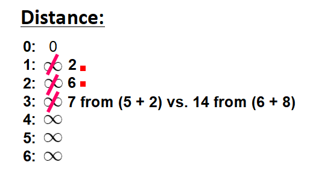

显然，第一个路径的距离更短（7 vs. 14），
所以选择第一个路径 `0 -> 1 -> 3`。只有在新的路径距离更短的情况下，才会更新距离列表。

因此，使用第一种方案 `0 -> 1 -> 3`，将节点添加到路径中。

.. figure:: ../../../resources/images/2024-03-06-17-11-33.png
  :width: 480px

把这个节点标记为“已访问”，在“未访问”节点列表中把它划掉：

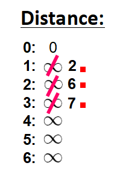

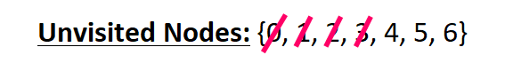

重复前面的过程。

检查尚未访问的相邻节点：节点 4 和节点 5，因为它们是节点 3 的相邻节点。

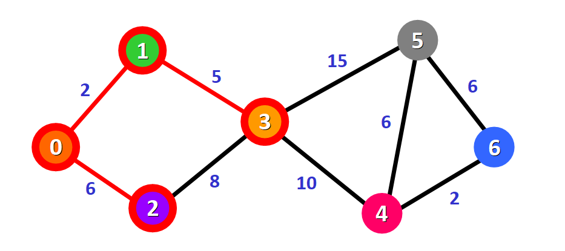

更新它们到源节点的距离，尝试寻找更短的路径：

- 对于节点 4： 路径是 `0 -> 1 -> 3 -> 4`，距离为 17。
- 对于节点 5： 路径是 `0 -> 1 -> 3 -> 5`，距离为 22。

.. note::

  我们只能从最短路径（红色边）上进行扩展，
  而不能途经未被包含在最短路径中的边（例如，不能构造经过边 2 -> 3 的路径）。

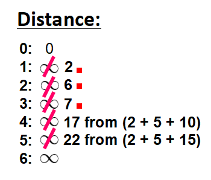

现在需要选择将哪个未访问节点标记为“已访问”，这里选择节点 4，因为在距离列表中它的距离最短。在图中做标记：

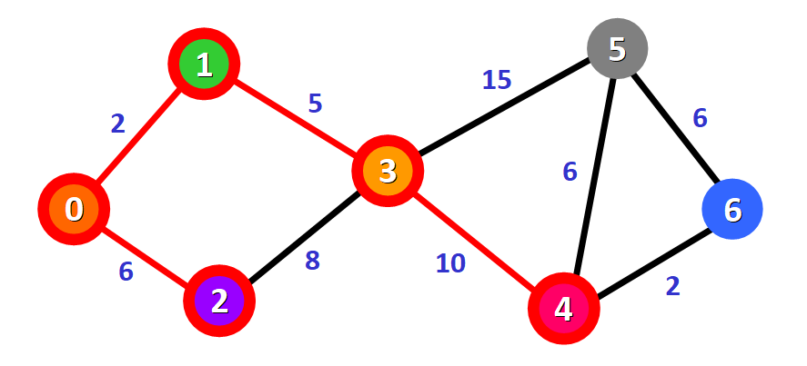

在距离列表中用红色方块将它标记为“已访问”：

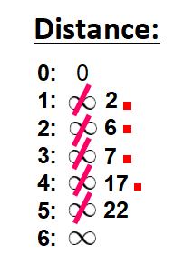

在“未访问”节点列表中把它划掉：

再次重复前面的过程。检查相邻节点：节点 5 和节点 6。分析每一种从已访问节点到它们之间的可能路径方案。

.. figure:: ../../../resources/images/2024-03-06-17-15-07.png
  :width: 480px

对于节点 5：

- 第一种选择是路径 `0 -> 1 -> 3 -> 5`，到源节点的距离为 22（2 + 5 + 15），前面的步骤已经记录了这个距离。
- 第二种选择是路径 `0 -> 1 -> 3 -> 4 -> 5`，到源节点的距离为 23（2 + 5 + 10 + 6）。

显然，第一个路径距离更短，为节点 5 选择第一种方案。

对于节点 6：

- 可选的路径是 `0 -> 1 -> 3 -> 4 -> 6`，到源节点的距离为 19（2 + 5 + 10 + 2）。

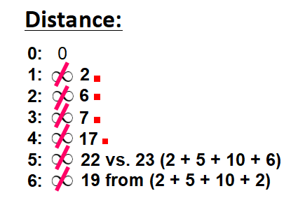

把距离最短（当前已知）的节点 6 标记为“已访问”。

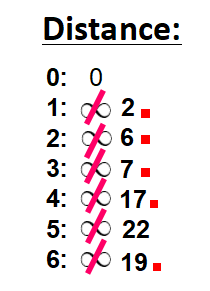

在“未访问”节点列表中把它划掉：

现在得到了如下路径（标记为红色）：

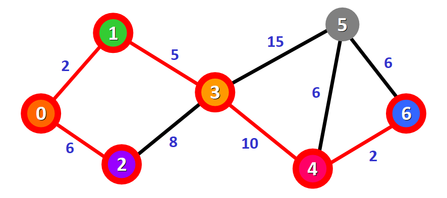

现在只剩下一个节点 5 还没被访问了，看看我们要如何把它添加到路径中。

从已经添加到路径中的节点出发，有三种不同的路径可以访问节点 5：

- 第一种选择： `0 -> 1 -> 3 -> 5`，总距离为 22（2 + 5 + 15）。
- 第二种选择： `0 -> 1 -> 3 -> 4 -> 5`，总距离为 23（2 + 5 + 10 + 6）。
- 第三种选择： `0 -> 1 -> 3 -> 4 -> 6 -> 5`，总距离为 25（2 + 5 + 10 + 2 + 6）。

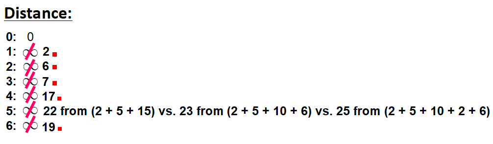

选择总距离为 22 的最短路径： `0 -> 1 -> 3 -> 5`。

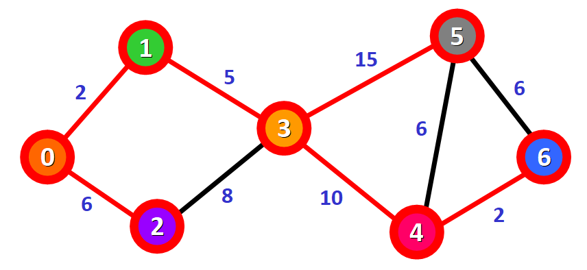

把这个节点标记为“已访问”，并在“未访问”节点列表中把它划掉：

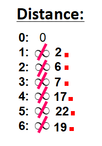

瞧！ 我们得到了从节点 0 到图中每个节点的最短路径。

.. figure:: ../../../resources/images/2024-03-06-17-19-34.png
  :width: 480px

图中，标记为红色的边表示最短路径：连接节点 0 和目标节点的红色边即为从源节点出发访问目标节点的最短路径。

例如，想要从节点 0 出发访问节点 6，连接它们的红色边就是最短路径，跟着走就行了。

上述例子Python实现::

  from math import inf
  from typing import List

  class Solution:

      def find(self, n: int, edges: List[List[int]]) -> list:
          # 将 edges 转换为 图
          g = [[inf] * n for _ in range(n)]
          for x, y, d in edges:
              g[x][y] = d
              g[y][x] = d

          # inf 当前已寻找好距离,
          # False 是否作为必须点被寻找
          # 索引直接表示点 0 - n-1
          dis = [(inf, False)] * n

          # 到自己的距离为0
          dis[0] = (0, False)

          while any(not x[1] for x in dis):
              x = -1
              cur_d = inf
              for i, (d, al_find) in enumerate(dis):
                  # 找出当前 未访问 中最小的
                  if not al_find and d < cur_d:
                      x = i
                      cur_d = d
              # if x == -1: break
              # 最后一个点的时候, 肯定已经有其他点先遍历过了(双向点), 所以可以直接退出
              if x == n-1:
                  break

              # 标记为 当必经过当前点时 已找过
              dis[x] = (dis[x][0], True)
              for y, d in enumerate(g[x]):
                  if d == inf or dis[y][1]: continue   # 不可达 或者 已经找过, 跳过
                  new_d = d + dis[x][0]
                  if new_d < dis[y][0]:
                      dis[y] = (new_d, False)

          return [x[0] for x in dis]

  if __name__ == '__main__':
      dd = Solution().find(
          7,
          [
              [0, 1, 2],
              [0, 2, 6],
              [1, 3, 5],
              [2, 3, 8],
              [3, 5, 15],
              [3, 4, 10],
              [4, 5, 6],
              [4, 6, 2],
              [5, 6, 6],
          ]
      )

      print(dd)

:参考::
  - `图文详解 Dijkstra 最短路径算法 <https://www.freecodecamp.org/chinese/news/dijkstras-shortest-path-algorithm-visual-introduction/>`_
  - `<https://www.cnblogs.com/goldsunshine/p/12978305.html>`_ , 这个还没仔细看, 浅浏览了感觉图比较全, 本地见: :download:`../../../resources/pdf/一篇文章讲透Dijkstra最短路径算法 - 金色旭光 - 博客园.pdf`

  .. - `Dijkstra算法详解 通俗易懂 <https://zhuanlan.zhihu.com/p/338414118>`_
  .. - `最短路径算法-迪杰斯特拉(Dijkstra)算法 <https://zhuanlan.zhihu.com/p/346558578>`_ , 这篇的例子有点问题

