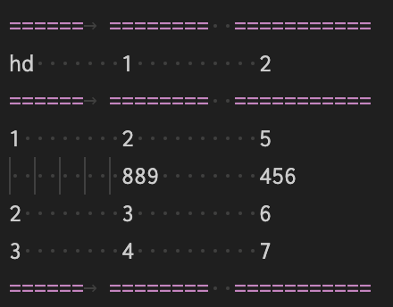
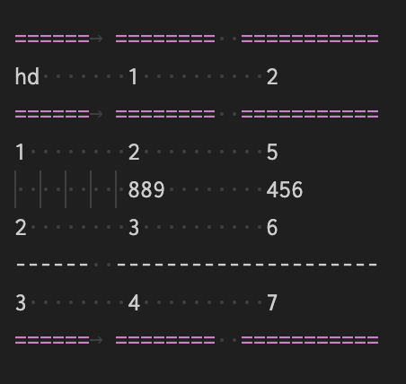

==============================
表格
==============================

.. post:: 2023-03-01 00:19:35
  :tags: rst标记语言, 语法模块
  :category: 文档
  :author: YanQue
  :location: CD
  :language: zh-cn

支持的指令

- table_
- csv-table_
- list-table_
- 符号表格_

table
==============================

简单表格, 例::

  .. table:: 一个测试表格
    :name: csv表格

    ======	========	========
    head    1         2
    ======	========	========
    1       2         3
    2       3         4
    3       4         5
    ======	========	========

.. note::

  简单表格可以不需要 ``..table``, 直接使用符号画出来可以自动识别

csv-table
==============================

csv数据表格, 支持自定义分隔符, 例::

  .. csv-table:: 一个测试表格
    :name: 不知道有啥用
    :header: head, 1, 2

    1, 2, 3
    2, 3, 4
    3, 4, 5

list-table
==============================

列表格式表格::

  .. list-table:: 一个测试表格
    :name: test_list表格
    :header-rows: 1

    * - head
      - 1
      - 2
    * - 1
      - 2
      - 3
    * - 2
      - 3
      - 4
    * - 3
      - 4
      - 5

符号表格
==============================

我这样称, 没注意官方怎么定义. 源码::

  +-------+-------+-------+
  | head1 | head2 | head3 |
  +=======+=======+=======+
  | 1     | 2     | 3     |
  +-------+-------+-------+
  | 4     | 5     | 6     |
  +-------+-------+-------+
  | 7     | 8     | 9     |
  +-------+-------+-------+

效果基本都是一样的:

+-------+-------+-------+
| head1 | head2 | head3 |
+=======+=======+=======+
| 1     | 2     | 3     |
+-------+-------+-------+
| 2     | 3     | 4     |
+-------+-------+-------+
| 3     | 4     | 5     |
+-------+-------+-------+

.. note::

  这种符号表格, 只能用空格而不是tab, 否则会导致识别不正常(截止于Sphinx5.3, 后续没试过)

  另外符号表格画起来好麻烦

表格折行打印
==============================

有时候文字太长, 需要折行视为同一行

简单表格只能实现第二列后的折行
-------------------------------

合并也支持

效果:

======	========  ===========
hd       1          2
======	========  ===========
1        2          5
         889        456
2        3          6
3        4          7
======	========  ===========

源码

也支持表格合并

合并表格体第二行:

======	========  ===========
hd       1          2
======	========  ===========
1        2          5
         889        456
2        3          6
------  ---------------------
3        4          7
======	========  ===========

源码:

此处参考: `表格学习 <https://rst-tutorial.readthedocs.io/zh/latest/advance/01_use_table.html>`_

符号表格可以实现所有列的折行
-------------------------------

+-------+-------+-------+
| head1 | head2 | head3 |
+=======+=======+=======+
| 1     | 2     | 3     |
| 4     | 24    +-------+
|       |       | 34    |
+-------+-------+-------+
| 2     | 3     | 4     |
+-------+-------+-------+
| 3     | 4     | 5     |
+-------+-------+-------+

