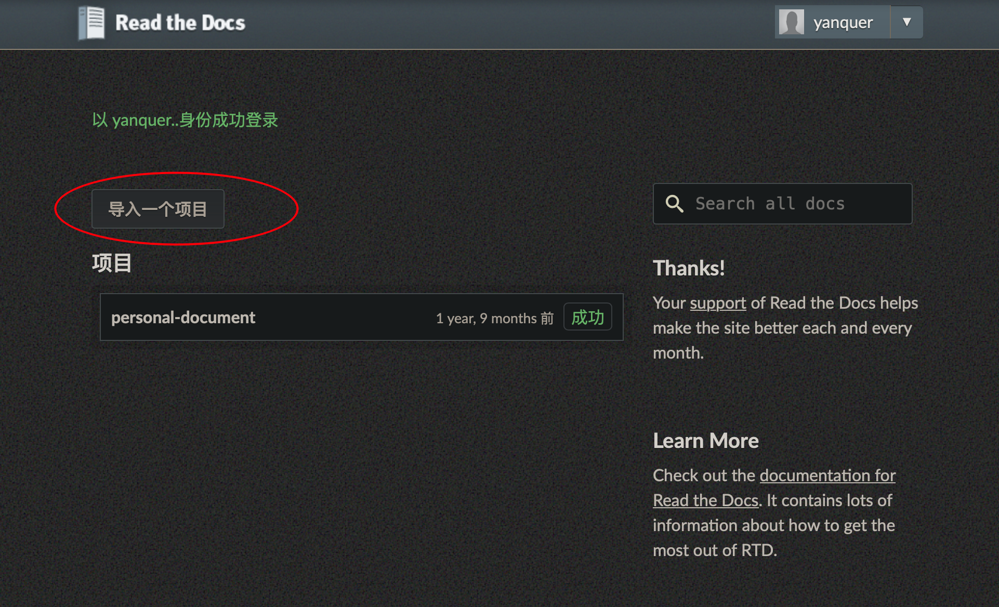
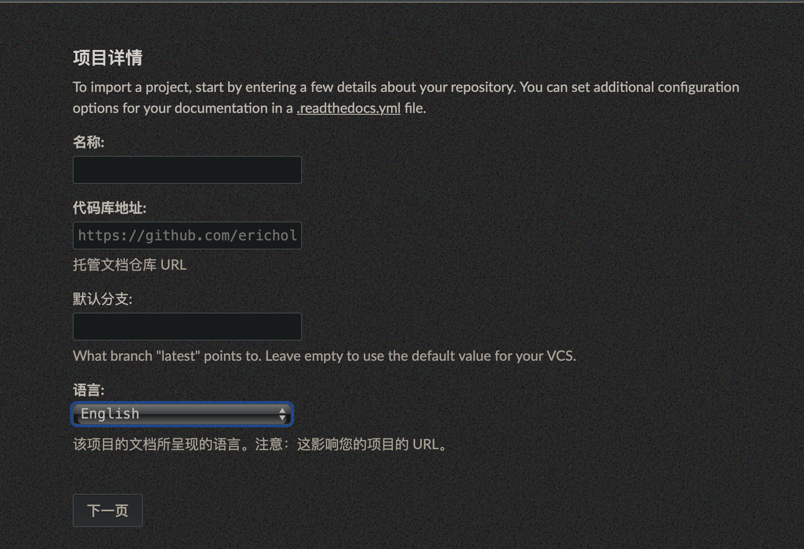

===========================================
使用ReadtheDocs托管文档
===========================================

.. post:: 2024-03-09 18:21:01
  :tags: rst标记语言, 问题
  :category: 文档
  :author: YanQue
  :location: CD
  :language: zh-cn

:关键词::
  - 文档
  - rst文档
  - Sphinx
  - 文档托管

ReadtheDocs 是一个基于 Sphinx 的免费文档托管项目.
是一个比较大的文档托管平台.

需要先有一个支持Sphinx文档项目,
然后托管到github, 且需要开源.

去 `<https://readthedocs.org/dashboard/>` 注册账号并登录,
然后在仪表盘导入github项目即可.

如果是使用github关联登录, 可以直接看到自己的所有github仓库,
选择文档仓库即可

或者选择手动导入, 填写相关信息:

