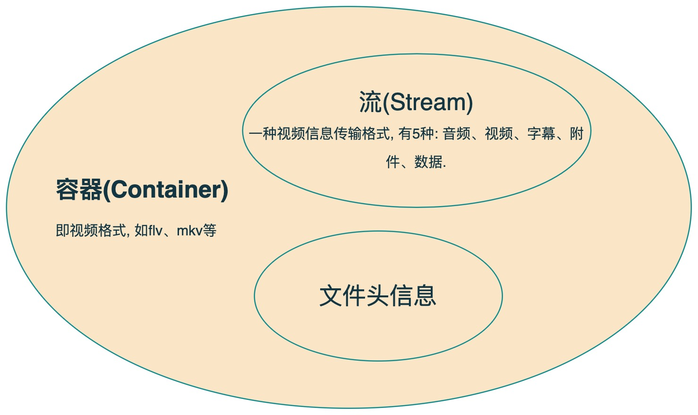

=========================
ffmpeg介绍
=========================

.. post:: 2023-02-20 22:06:49
  :tags:
  :category: 杂乱无章
  :author: YanQue
  :location: CD
  :language: zh-cn

Python下有个三方库, 可见: :doc:`/docs/后端/python/python三方库/ffmpeg`

前言
=========================

FFmpeg是一套可以用来记录、转换数字音频、视频，并能将其转化为流的开源计算机程序。可以轻易地实现多种视频格式之间的相互转换。

名称来自于MPEG视频编码标准, FF代表 “fast forawrd”.

.. topic:: 包含以下部分

  - libavformat：用于各种音视频封装格式的生成和解析，包括获取解码所需信息以生成解码上下文结构和读取音视频帧等功能，包含demuxers和muxer库。
  - libavcodec：用于各种类型声音/图像编解码。
  - libavutil：包含一些公共的工具函数。
  - libswscale：用于视频场景比例缩放、色彩映射转换。
  - libpostproc：用于后期效果处理。
  - ffmpeg：是一个命令行工具，用来对视频文件转换格式，也支持对电视卡实时编码。
  - ffsever：是一个HTTP多媒体实时广播流服务器，支持时光平移。
  - ffplay：是一个简单的播放器，使用ffmpeg 库解析和解码，通过SDL显示。
  - ffprobe：收集多媒体文件或流的信息，并以人和机器可读的方式输出。

基本概念
=========================

容器(Container)与流(Stream)
-----------------------------

  容器包含流与文件头

容器/文件(Conainer/File)
++++++++++++++++++++++++

即视频格式, 特定格式的多媒体文件，比如mp4、flv、mkv等

媒体流(Stream)
+++++++++++++++++++++++++

一种视频信息传输格式, 有5种: 音频、视频、字幕、附件、数据.

表示时间轴上的一段连续数据，如一段声音数据、一段视频数据或一段字幕数据，可以是压缩的，也可以是非压缩的，压缩的数据需要关联特定的编解码器。

数据帧/数据包(Frame/Packet)
---------------------------

帧代表一幅静止的图像，分为I帧，P帧，B帧。

通常，一个媒体流是由大量的数据帧组成的，对于压缩数据，帧对应着编解码器的最小处理单元，分属于不同媒体流的数据帧交错存储于容器之中。

一般情况下：

Frame对应压缩前的数据，Packet对应压缩后的数据。

编解码器(Codec)
-------------------------

以帧为单位实现压缩数据和原始数据之间的相互转换, 对视频进行压缩或者解压缩，CODEC = COde（编码） +DECode（解码）。

复用/解复用(mux/demux)
-------------------------

把不同的流按照某种容器的规则放入容器，这种行为叫做复用（mux）。

把不同的流从某种容器中解析出来，这种行为叫做解复用(demux)。

帧率
-------------------------

帧率也叫帧频率，帧率是视频文件中每一秒的帧数，肉眼想看到连续移动图像至少需要15帧。

码率
-------------------------

比特率(也叫码率，数据率)是一个确定整体视频/音频质量的参数，秒为单位处理的字节数，码率和视频质量成正比，在视频文件中中比特率用bps来表达。

:参考::
  `<https://zhuanlan.zhihu.com/p/117523405>`_
  `<https://cloud.tencent.com/developer/article/1773248>`_

