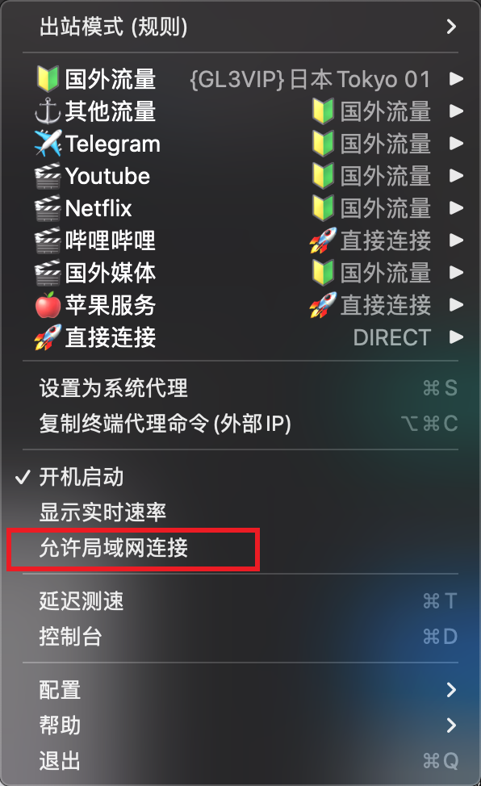

=================================
mac下clash x共享代理
=================================

在已安装clash x 且能够开启代理的机器上, 菜单栏点开clash x, 设置允许局域网连接

	允许局域网连接

在另一个需要连接的设备设置http代理,

- ip为安装clash x机器的ip
- 端口为 7890 (mac默认是这个, win貌似可以自己设置)

