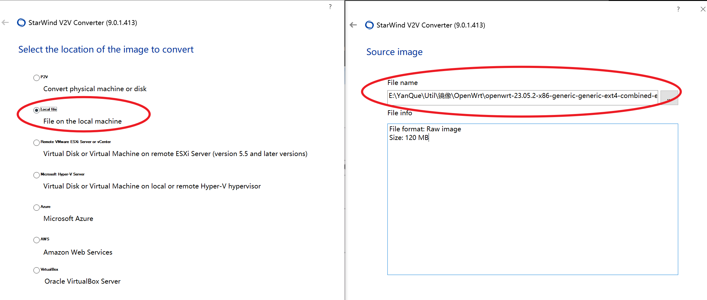
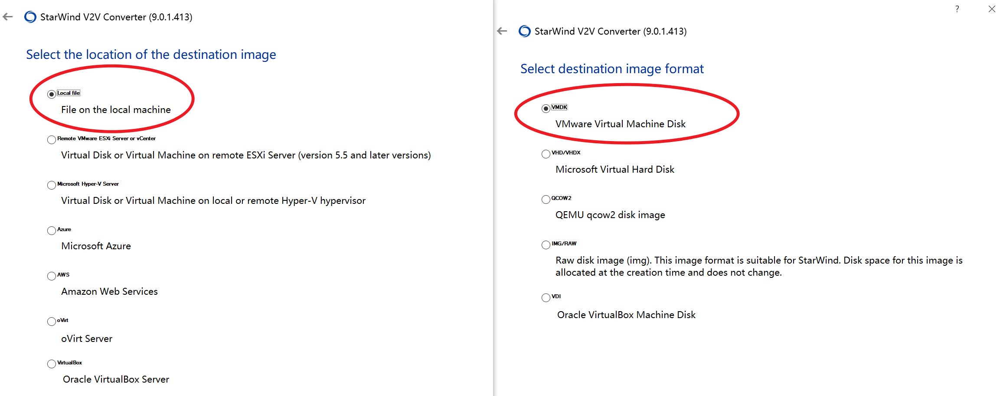
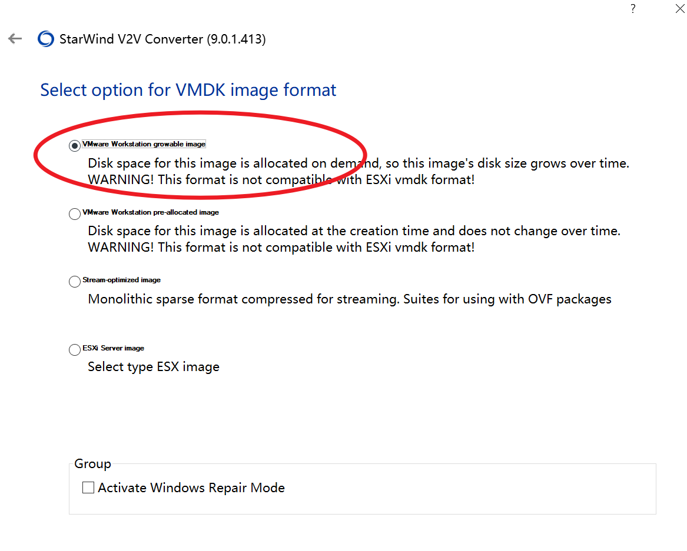
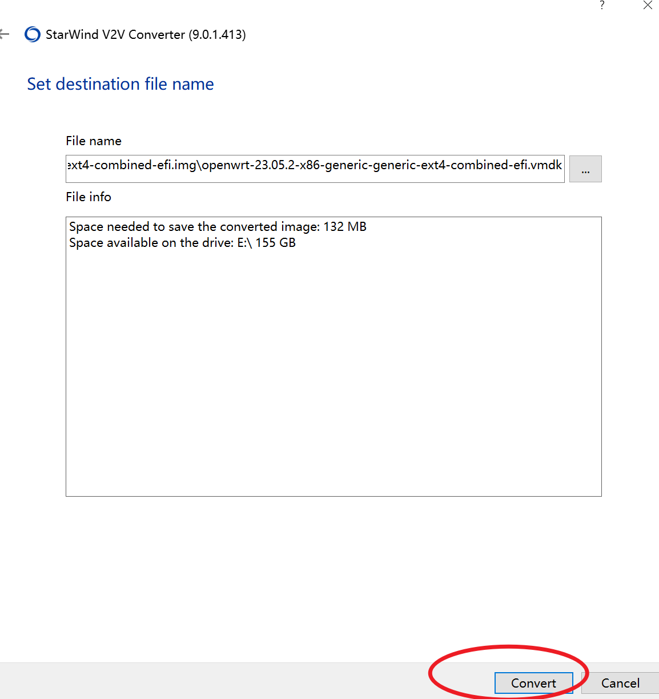
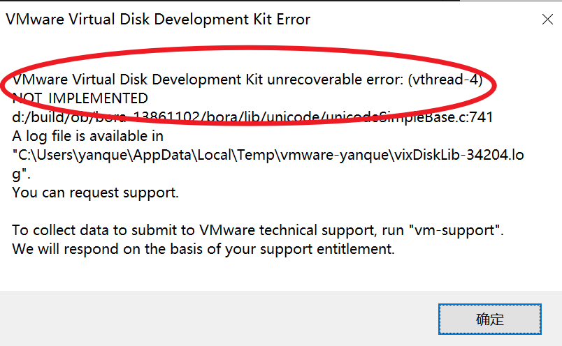

====================================
StarWindConverter
====================================

.. post:: 2024-03-09 18:21:01
  :tags: 
  :category: 常用工具使用
  :author: YanQue
  :location: CD
  :language: zh-cn

将 img 镜像转换为 Wmvare 可用的虚拟机文件

官网下载地址: `<https://www.starwindsoftware.com/starwind-v2v-converter#download>`_

需要填写信息, 然后会给你发邮件, 下载地址在邮件里面, 我的是::

  https://www.starwindsoftware.com/tmplink/starwindconverter.exe

不知道是不是每人都一样

安装好之后使用,

选择需要转换的镜像

选择转换的目标

这里好像任意都可, 我选的第一个

然后 转换

如果有这个报错, 说明路径有中文, 换个路径就行

