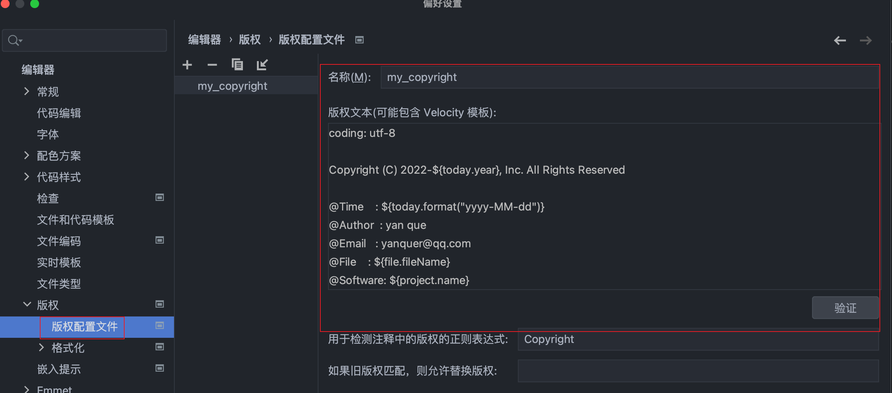
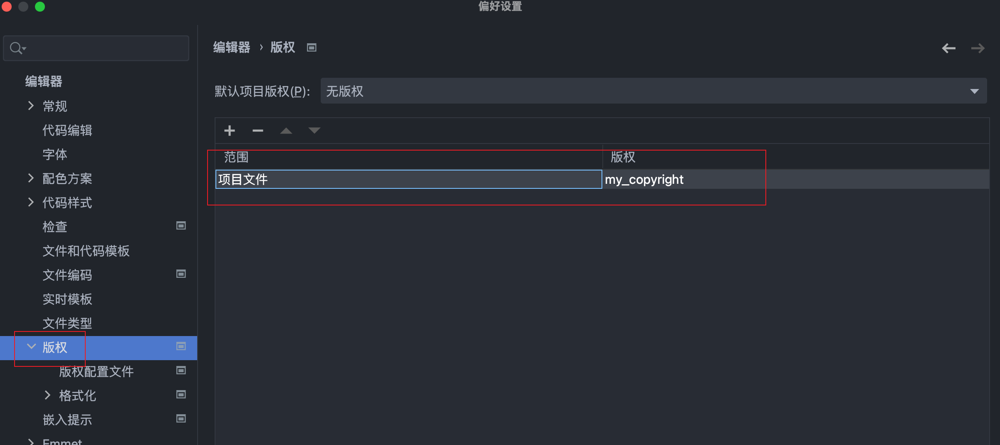
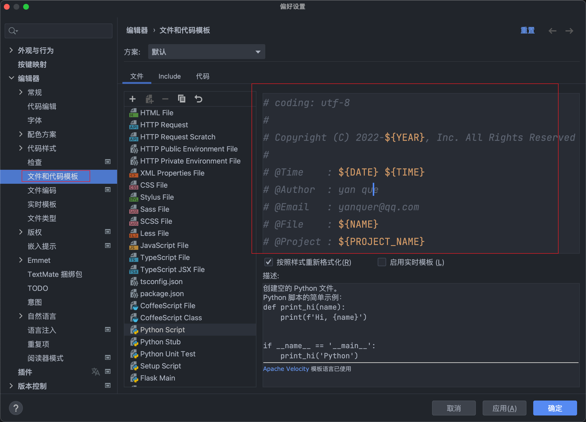

===========================
Pycharm添加版权文件
===========================

设置概览
===========================

``File > Settings > Editor > Copyright > Copyright Profiles``

然后添加版权文件, 随便自己命名就行

	版权配置文件

新建好后在版权李设置好生效范围即可

	设置生效范围

最后应用, mac下新建好文件后 ``command + n`` 直接添加版权即可

.. note::

	windows 貌似是 ``alt + insert`` , 然后选择copyright

一些相关配置变量
===========================

.. table:: Pycharm配置文件可用变量
	:name: Pycharm config

	========================	===========================	===========================
	Name						Type						Comment
	========================	===========================	===========================
	$today						DateInfo					当前日期时间对象
	$file.fileName				String						当前文件的名称
	$file.pathName				String						当前文件的完整路径
	$file.className				String						当前文件的类名
	$file.qualifiedClassName	String						当前文件的权限定名
	$file.lastModified			DateInfo					上一次修改的日期时间对象
	$project.name				String						当前项目名
	$module.name				String						当前 Module 名
	$username					String						当前用户名（系统用户名）
	========================	===========================	===========================

其中, DateInfo 对象有如下属性和方法：

.. table:: DateInfo 对象的属性和方法
	:name: DateInfo

	======================	======================	==================================================================
	Name					Type					Comment
	======================	======================	==================================================================
	year					int						当前年份
	month					int						当前月份
	day					int						当前日期（1-31）
	hour					int						当前小时（0-11）
	hour24					int						当前小时（0-23）
	minute					int						当前分钟（0-59）
	second					int						当前秒数（0-59）
	format(String format)	String					时间日期格式化方法, 参考:java.text.SimpleDateFormat format
	======================	======================	==================================================================

.. note::

	Pycharm网上很少有这种说明, 这些还是参考的 Idea 的相关说明配置.
	自定义变量的方式也没有找到, 后面找到了再补充.

	另外, 也可以 :ref:`直接添加模板`.

自己使用的配置
===========================

.. code::
	:name: 自己使用版权配置

	coding: utf-8

	Copyright (C) 2022-${today.year}, Inc. All Rights Reserved

	@Time    : ${today.format("yyyy-MM-dd")}
	@Author  : yan que
	@Email   : yanquer@qq.com
	@File    : ${file.fileName}
	@Project : ${project.name}

.. _直接添加模板:

直接添加模版的方式
===========================

	直接添加模板

参考配置

.. code::
	:name: example

	# coding: utf-8
	#
	# Copyright (C) 2022-${YEAR}, Inc. All Rights Reserved
	#
	# @Time    : ${DATE} ${TIME}
	# @Author  : yan que
	# @Email   : yanquer@qq.com
	# @File    : ${NAME}
	# @Project : ${PROJECT_NAME}

.. note::

	使用模版 与 使用版权配置文件, 任选其一即可, 都用可能会点问题(冲突会自动合并)

