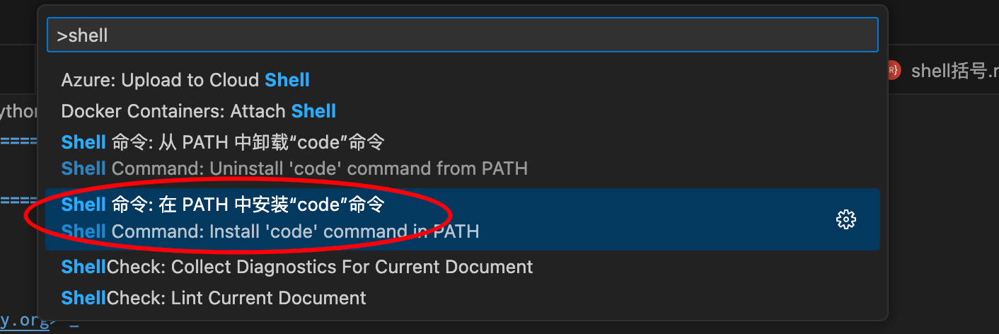

================================
Vscode
================================

.. post:: 2024-03-09 18:21:01
  :tags: vscode
  :category: 常用工具使用
  :author: YanQue
  :location: CD
  :language: zh-cn

.. toctree::
  :maxdepth: 1

  vscode
  vscode设置等宽字体
  vscode不同文件配置不同缩进
  记录vscode与rst协作
  记录一次vscode配置rst的坑
  Vscode预定义变量

实现探究:

.. toctree::
  :maxdepth: 1

  vscode-本地历史记录
  vscode后台更新探究

MacOS下设置到环境变量
================================

  `Shell Command` => `安装到Path`

