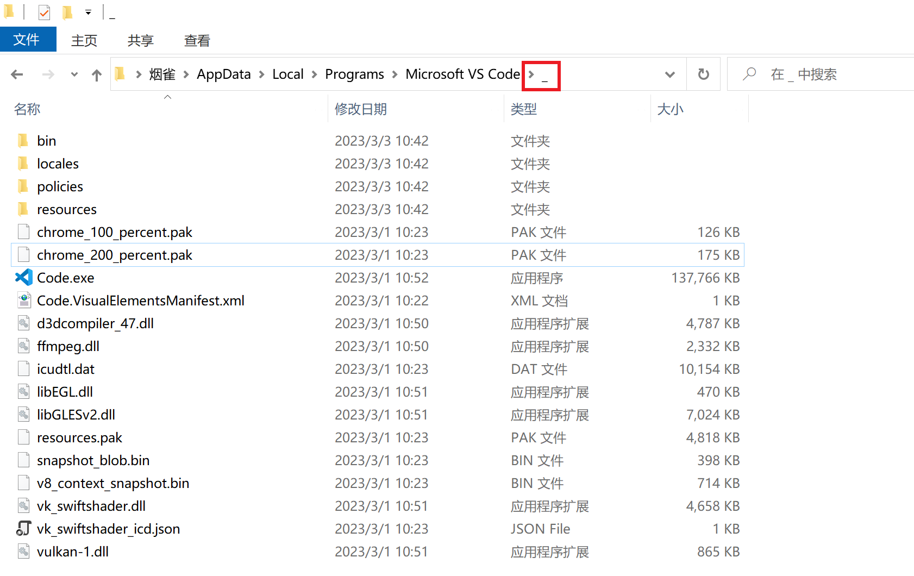

===========================
vscode后台更新探究
===========================

.. post:: 2024-03-09 18:21:01
  :tags: vscode
  :category: 常用工具使用
  :author: YanQue
  :location: CD
  :language: zh-cn

因为想像vscode一样实现应用的后台无感更新, 所以clone下来vscode源码研究了这一部分.

对于不同的系统版本, 实现的方式不同, 这里只讨论 windows 与 macos. linux看代码貌似没支持.

前置
===========================

:源码::
    `microsoft/vscode <https://github.com/microsoft/vscode/wiki/How-to-Contribute>`_

vscode 事件, 组件等概念, 如果要介绍会导致篇幅太多, 故略过.

如果需要自己构建, 国内目前只看到这一篇说明清楚了: `打包VSCode源码为安装程序 <https://blog.csdn.net/qq_38248561/article/details/129011139>`_ , 其实源码仓库readme也有指引, 不过不是很明显.

笔者使用macos, 最开始直接run的时候没成功, 后面就没管这个直接看代码, 再后面才找到要怎么构建.

更新模块的主要源码都在 ``src/vs/platform/update`` ::

    yanque@yanquedembp vscode-code % tree src/vs/platform/update
    src/vs/platform/update
    ├── common
    │   ├── update.config.contribution.ts
    │   ├── update.ts
    │   └── updateIpc.ts
    └── electron-main
        ├── abstractUpdateService.ts
        ├── updateService.darwin.ts
        ├── updateService.linux.ts
        ├── updateService.snap.ts
        └── updateService.win32.ts

    2 directories, 8 files

对外提供的接口主要都放 ``common`` 目录下. ``electron-main`` 目录下是具体的实现.

在 ``electron-main`` 下,

- ``abstractUpdateService.ts`` 定义了抽象模版, 后面三个都是继承此类.
- ``updateService.darwin.ts`` 是针对 macos 的实现
- ``updateService.linux.ts`` 是针对 linux 的实现
- ``updateService.win32.ts`` 是针对 windows 的实现

``abstractUpdateService`` 下 ``initialize()`` 定义了一个基础的判断更新逻辑, 检查用户配置的 ``update.mode``

- 为 ``manual`` 表示手动更新, 退出执行
- 为 ``start``  表示仅启动时候检查一次更新, 退出执行
- 其他值则定时检查更新. 设置的是每30s检查一次

源码::

    if (updateMode === 'manual') {
        this.logService.info('update#ctor - manual checks only; automatic updates are disabled by user preference');
        return;
    }

    if (updateMode === 'start') {
        this.logService.info('update#ctor - startup checks only; automatic updates are disabled by user preference');

        // Check for updates only once after 30 seconds
        setTimeout(() => this.checkForUpdates(false), 30 * 1000);
    } else {
        // Start checking for updates after 30 seconds
        this.scheduleCheckForUpdates(30 * 1000).then(undefined, err => this.logService.error(err));
    }

经过几层调用后到了抽象类的 ``doCheckForUpdates()`` , 此抽象方法由上面提到的 ``updateService.darwin.ts`` 等具体实现.

windows无感更新
===========================

实现方式依赖 `inno setup <https://github.com/jrsoftware/issrc>`_ , 官网文档: `inno_setup_jrsoftware`_

只说结果, 如果支持快速更新, 则调用 ``build_process`` 的 ``spawn`` 执行类似于以下指令::

    VSCodeUserSetup-x64-1.76.0.exe /verysilent /update=VSCodeUserSetup-x64-1.76.0.flag /nocloseapplications /mergetasks=runcode,!desktopicon,!quicklaunchicon

其中

- ``VSCodeUserSetup-x64-1.76.0.exe`` : 是下载好的安装包
- ``/verysilent`` : 表示 强制静默安装，不管是否报错，都不会有任何提示
- ``/update`` : vscode 自定义的参数. 见 update_
- ``/nocloseapplications`` : 不关闭应用程序
- 其他: 字面意思, 任务都定义在仓库 ``build/win32/code.iss`` 下的 ``[Tasks]`` 部分(进此文件搜就看到了)

.. note::

    真正支持后台更新的是 ``verysilent`` 与 ``/update``

    ``/update`` 可以说是ts代码 与 iss 内定义脚本的一个交互. (还用了互斥锁, 不过具体实现我没看懂)

    详情见: `后台更新`_

源码::

    const child = spawn(this.availableUpdate.packagePath, ['/verysilent', `/update="${this.availableUpdate.updateFilePath}"`, '/nocloseapplications', '/mergetasks=runcode,!desktopicon,!quicklaunchicon'], {
        detached: true,
        stdio: ['ignore', 'ignore', 'ignore'],
        windowsVerbatimArguments: true
    });

    child.once('exit', () => {
        this.availableUpdate = undefined;
        this.setState(State.Idle(getUpdateType()));
    });

.. _update:

这里的参数一般都是通用的, 除了 ``/update`` . 这一部分涉及到 innosetup 的 iss 配置文件定义, 可参考 官网文档: `inno_setup_jrsoftware`_

``/update`` 是vscode 使用 innosetup 自定义的一个参数, 源码如下::

    // VS Code will create a flag file before the update starts (/update=C:\foo\bar)
    // - if the file exists at this point, the user quit Code before the update finished, so don't start Code after update
    // - otherwise, the user has accepted to apply the update and Code should start
    function LockFileExists(): Boolean;
    begin
    Result := FileExists(ExpandConstant('{param:update}'))
    end;

    function ShouldRunAfterUpdate(): Boolean;
    begin
    if IsBackgroundUpdate() then
        Result := not LockFileExists()
    else
        Result := True;
    end;

启动部分代码如下::

    [Run]
    Filename: "{app}\{#ExeBasename}.exe"; Description: "{cm:LaunchProgram,{#NameLong}}"; Tasks: runcode; Flags: nowait postinstall; Check: ShouldRunAfterUpdate
    Filename: "{app}\{#ExeBasename}.exe"; Description: "{cm:LaunchProgram,{#NameLong}}"; Flags: nowait postinstall; Check: WizardNotSilent

结合上一部分, 能看出, 当 ``ShouldRunAfterUpdate`` 为 true (也就是安装程序后台启动静默安装且存在flag文件) 时,
将会在用户退出出程序后, 自动打开.

Task定义::

    [Tasks]
    // 省略...
    Name: "runcode"; Description: "{cm:RunAfter,{#NameShort}}"; GroupDescription: "{cm:Other}"; Check: WizardSilent

可以看到, tasks 定义了 ``runcode`` 等任务, 看起来是执行什么, 不过没找到具体实现, 官网也没找到相关说明.

后台更新
---------------------------

补充, 后面再看了一下, 发现这部分之前认识有限, 真正支持后台更新的是 ``verysilent`` 与 ``/update`` .

而对于vscode来说, 真正有用的还是  ``/update`` .

不使用此参数时, 在vscode在允许的时候, 执行::

    VSCodeUserSetup-x64-1.76.0.exe /verysilent /nocloseapplications /mergetasks=runcode,!desktopicon,!quicklaunchicon

会弹出交互界面提示已经安装, 然后让你先退出.

在定义了 ``/update=VSCodeUserSetup-x64-1.76.0.flag`` 后,
安装路径将不会安装在原来的 ``{app}`` 目录下, 而是暂时先安装到 ``{app}\_`` 下, 最后会触发 ``inno_updater.exe``.

``inno_updater.exe`` 是微软自己做的一个更新工具, 源码地址: `microsoft/inno-updater`_

而在 iss 配置的源码如下, 仅看关键代码

配置当存在flag文件时(即 使用了 ``/update`` ) ::

    // file 部分
    [Files]
    Source: "*"; Excludes: "\CodeSignSummary*.md,\tools,\tools\*,\appx,\appx\*,\resources\app\product.json"; DestDir: "{code:GetDestDir}"; Flags: ignoreversion recursesubdirs createallsubdirs
    Source: "tools\*"; DestDir: "{app}\tools"; Flags: ignoreversion
    Source: "{#ProductJsonPath}"; DestDir: "{code:GetDestDir}\resources\app"; Flags: ignoreversion

    // code 部分
    function GetDestDir(Value: string): string;
    begin
    if IsBackgroundUpdate() then
        Result := ExpandConstant('{app}\_')
    else
        Result := ExpandConstant('{app}');
    end;

**效果**

    后台安装到 ``_`` 目录下

执行 ``inno_updater.exe`` ::

    procedure CurStepChanged(CurStep: TSetupStep);
    var
    UpdateResultCode: Integer;
    begin
    if IsBackgroundUpdate() and (CurStep = ssPostInstall) then
    begin
        CreateMutex('{#AppMutex}-ready');

        while (CheckForMutexes('{#AppMutex}')) do
        begin
        Log('Application is still running, waiting');
        Sleep(1000);
        end;

        // 此处执行
        Exec(ExpandConstant('{app}\tools\inno_updater.exe'), ExpandConstant('"{app}\{#ExeBasename}.exe" ' + BoolToStr(LockFileExists())), '', SW_SHOW, ewWaitUntilTerminated, UpdateResultCode);
    end;
    end;

inno_updater 源码
---------------------------

可以去 `microsoft/inno-updater`_ clone下源码看 ,

在 ``src/main.rs`` ::

    fn _main(log: &slog::Logger, args: &Vec<String>) -> Result<(), Box<dyn error::Error>> {

        //省略非关键代码

        let code_path = PathBuf::from(&args[1]);

        //省略非关键代码

        update(log, &code_path, "_", silent == "true")
    }

在 update 函数就指定了更新路径为 ``"_"``

最后是通过删除文件, 并重命名的方式处理::

    fn move_update(
        log: &slog::Logger,
        uninstdat_path: &Path,
        update_folder_name: &str,
    ) -> Result<(), Box<dyn error::Error>> {

        // 省略非关键部分

        // safely delete all current files
        delete_existing_version(log, root_path, update_folder_name)?;

        // move update to current
        for entry in fs::read_dir(&update_path)? {
            let entry = entry?;
            let entry_name = entry.file_name();
            let entry_name = entry_name.to_str().ok_or(io::Error::new(
                io::ErrorKind::Other,
                "Could not get entry name",
            ))?;

            let mut target = PathBuf::from(root_path);
            target.push(entry_name);

            let msg = format!("Renaming: {:?}", entry_name);
            util::retry(
                &msg,
                |attempt| {
                    info!(log, "Rename: {:?} (attempt {})", entry_name, attempt);
                    fs::rename(entry.path(), &target)?;
                    Ok(())
                },
                None,
            )?;
        }

        // 省略非关键部分

    }

将除 ``_ tools unins* appx`` 的目录/文件完全删除, 再从 ``_`` 下重命名过去.

貌似还有版本检查的在vscode源码里面, 没细看.

.. _microsoft/inno-updater: https://github.com/Microsoft/inno-updater
.. _inno_setup_jrsoftware: https://jrsoftware.org/isinfo.php

多个进程协作-互斥量
---------------------------

更新补充以下互斥量相关.

更新过程与生命周期有两个互斥量参与::

    {#AppMutex}
    {#AppMutex}-ready

其中, 第一个 ``{#AppMutex}`` 主要用于生命周期结束时候的释放(就是vscode进程结束时候的释放),
然后提示更新程序可以启动 inno_updater 进行更新.

创建 ``{#AppMutex}`` 及释放部分源码::

	private async installMutex(): Promise<void> {
		const win32MutexName = this.productService.win32MutexName;
		if (isWindows && win32MutexName) {
			try {
				const WindowsMutex = await import('windows-mutex');
				const mutex = new WindowsMutex.Mutex(win32MutexName);
				once(this.lifecycleMainService.onWillShutdown)(() => mutex.release());
			} catch (error) {
				this.logService.error(error);
			}
		}
	}

创建 ``{#AppMutex}-ready`` 源码(这个暂时没看到有释放的操作)::

  procedure CurStepChanged(CurStep: TSetupStep);
  var
    UpdateResultCode: Integer;
  begin
    if IsBackgroundUpdate() and (CurStep = ssPostInstall) then
    begin
      CreateMutex('{#AppMutex}-ready');

      while (CheckForMutexes('{#AppMutex}')) do
      begin
        Log('Application is still running, waiting');
        Sleep(1000);
      end;

      Exec(ExpandConstant('{app}\tools\inno_updater.exe'), ExpandConstant('"{app}\{#ExeBasename}.exe" ' + BoolToStr(LockFileExists())), '', SW_SHOW, ewWaitUntilTerminated, UpdateResultCode);
    end;
  end;

``CreateMutex('{#AppMutex}-ready')`` 创建的互斥信号量 用于告知vscode已经临时安装结束 ::

  const readyMutexName = `${this.productService.win32MutexName}-ready`;
	const mutex = await import('windows-mutex');

  // poll for mutex-ready
  pollUntil(() => mutex.isActive(readyMutexName))
    .then(() => this.setState(State.Ready(update)));

``pollUntil(() => mutex.isActive(readyMutexName))`` 表示轮询检查 ``{#AppMutex}-ready`` 是否已经存在, 存在就表示已经临时安装到 ``_`` 完成.

macos无感更新
===========================

使用了 ``electron`` 下的 ``autoUpdater`` 模块. 官网说明: `autoUpdater <https://www.electronjs.org/zh/docs/latest/api/auto-updater>`_

应用其中部分:

.. topic:: autoUpdater 对象具有以下方法

    .. function:: autoUpdater.setFeedURL(选项)​

        - 选项 对象
            - url string
            - headers Record<string, string> (可选) macOS - HTTP 请求头。
            - serverType string(可选) macOS - 可以是json 或者 default,查看 Squirrel.Mac 的README文件获取更多详细信息。

        设置检查更新的 url，并且初始化自动更新。

    .. function:: autoUpdater.getFeedURL()​

        返回 string - 获取当前更新的 Feed 链接.

    .. function:: autoUpdater.checkForUpdates()​

        询问服务器是否有更新。 在使用此 API 之前，您必须调用setFeedURL 。

        注意: 若更新可用将自动下载 调用 autoUpdater.checkForUpdates() 方法两次将下载更新两次

    .. function:: autoUpdater.quitAndInstall()​

        重启应用并在下载后安装更新。 它只应在发出 update-downloaded 后方可被调用。

        在此机制下，调用 autoUpdater.quitAndInstall() 将首先关闭所有应用程序窗口，并且在所有窗口都关闭之后自动调用 app.quit()

        注意: 严格来讲，执行一次自动更新不一定要调用此方法。因为下载更新文件成功之后，下次应用启动的时候会强制更新。

.. note::

    一些当时搜到但是没时间看的文:

    - `研究Electron自动更新 <https://zhuanlan.zhihu.com/p/348648807>`_
    - `Electron AutoUpdater自动更新问题 <https://www.jianshu.com/p/1142cbf27327>`_

linux
===========================

不支持, 检查更新后是跳转到浏览器下载的

猜测与想法
===========================

后台更新的功能,

- windows 专门自定义了工具
- mac 使用 electron 的自动更新模块
- linux 手动下载

至于为什么不全平台支持呢, 猜测可能有以下原因:

- linux权限控制问题

  所以没有像使用压缩包解压复制的方式.

  另外使用linux的群体, 大多都是同行吧, 让他/她们自己玩呗

- electron 虽然支持了windows与mac, 但是估计有另外的需求, 或者是后面才支持的(不想去看提交历史, 后面有空补充)

  (electron 的自动更新, 具体怎么实现的我没有去看源码, 不做太多讨论)

- 是不是可以全平台支持? 使用下载压缩包的形式, 解压的临时目录然后移动.

  windows已经有exe的支持了, 下载压缩包还需要另外写工具, 得不偿失.

  也可能就是不想支持吧

- 最后, windows就是微软自家产品, 自家产品当然要用自己的

