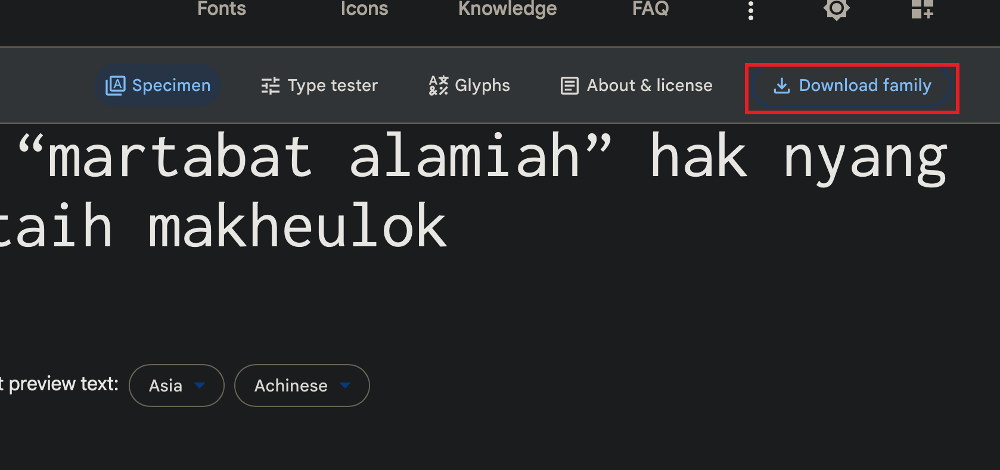
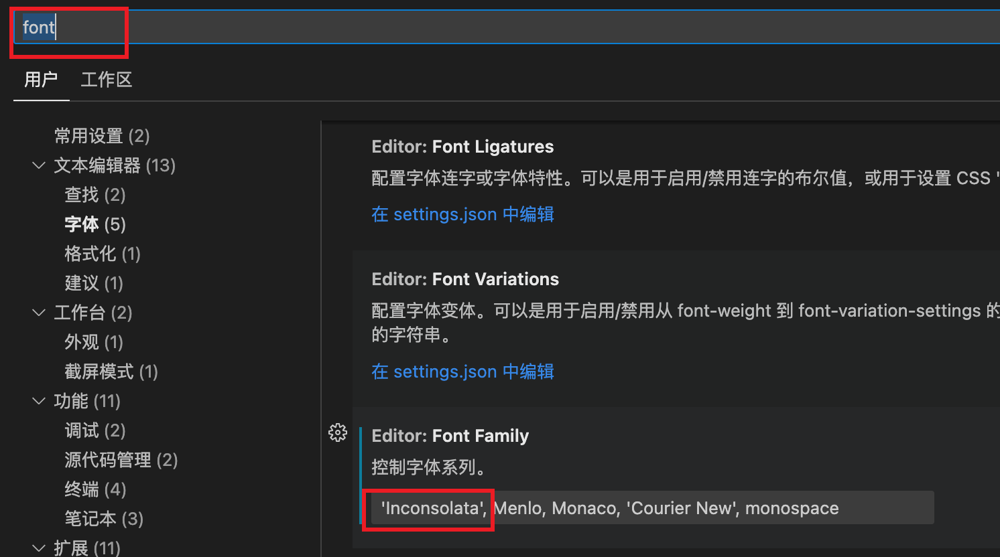

===================
vscode设置等宽字体
===================

目前只找到两种字体:

- Inconsolata_
- Ubuntu Mono: Ubuntu_Mono_

Inconsolata
===================

比较优雅的等宽字体，支持高分辨率，是开源的 `Google Fonts <https://fonts.google.com>`_ 字体.

Inconsolata 字体下载地址(需要科学上网): `Inconsolata#standard-styles <https://fonts.google.com/specimen/Inconsolata#standard-styles>`_

点击右上角的下载即可:

下载好后打开文件夹, 双击 ttf 即可安装.

vscode中将 Editor: Font Family设置为Inconsolata:

  最前面加上字体名称即可.

或者在 setting.json 加入(内容根据现有字体) ::

  "editor.fontFamily": "'Inconsolata', Menlo, Monaco, 'Courier New', monospace"

看起来是按照顺序来找字体的, 某个字符这个字体没有就看下个.

自己下载的: :download:`../../../../resources/tar/Inconsolata.tar.gz`

.. _Ubuntu_Mono:

Ubuntu Mono
===================

`UbuntuMono的github <https://github.com/powerline/fonts/tree/master/UbuntuMono>`_ 页面 下载这四个ttf文件::

  Ubuntu Mono derivative Powerline Bold Italic.ttf
  Ubuntu Mono derivative Powerline Bold.ttf
  Ubuntu Mono derivative Powerline Italic.ttf
  Ubuntu Mono derivative Powerline.ttf

vscode内设置一下即可::

  'Ubuntu Mono derivative Powerline'

