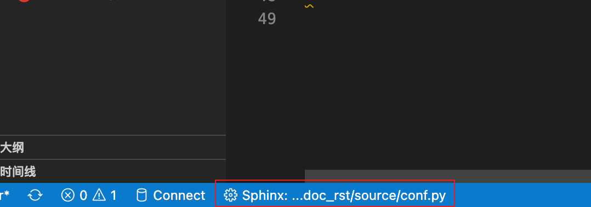

=============================
记录一次vscode于rst协作的坑
=============================

系统
=============================

- macos 13
- vscode 1.73.1
- python 3.9.10

背景
=============================
今日看到野火的rst文档介绍, 发现使用了一样的vscode插件 `reStructuredText` .

但是我这边居然没有预览html的效果(无html样式, 只有空白的文字与普通样式).

处理
=============================

一开始以为有插件冲突, 去自己的已安装插件看了一下, 卸载了一些没用的插件, 无果.

于是网上冲浪, 无果 .

也去项目 release 看了, 说明了个寂寞.

最后看了一眼别人使用的版本, `v155.0.0` , 去下载了这个版本的用, 居然就好了...

于是, 又试了较新的几个版本, 最开始是不行的, 后面可能是安装了推荐的插件, 最后使用最新版 `v189.2.0` 又可以了

暂时确定, 相关的有一个 `esbonio` 的 pip 包一定要有(vscode插件不用, 因为新版已内置),
去看了官网文档, 确实要 (`reStructuredText` v171之后的版本已经内置了这个插件, 所以可能启动的时候会有一些bug...)

(简而言之就是某些配置存在问题, 通过降级后使用的时候触发了某些正确配置, 升级后就正常了)

结语
=============================

官网文档又不说, 项目的 release 介绍也没提, 坑...

最终解决
=============================

人都傻了, 知道什么原因了, 最新版默认使用的是 `docutils` 所以会有这个问题, 需要手动切换配置一下,

  点击 vscode 左下角设置即可(打开rst文件才有)

另外, 有一个 ``No module named rstcheck.__main__;
'rstcheck' is a package and cannot be directly executed`` 报错,

需要在 `setting.json` 里添加配置 ``"restructuredtext.linter.rstcheck.executablePath": "rstcheck"`` ,
详情见 `官网issuse <https://github.com/vscode-restructuredtext/vscode-restructuredtext/issues/400>`_

.. note::

  相关的有一个 `esbonio` 的 pip 包, `reStructuredText` v171之后的版本默认使用 pip安装的了(没有的需要装)
