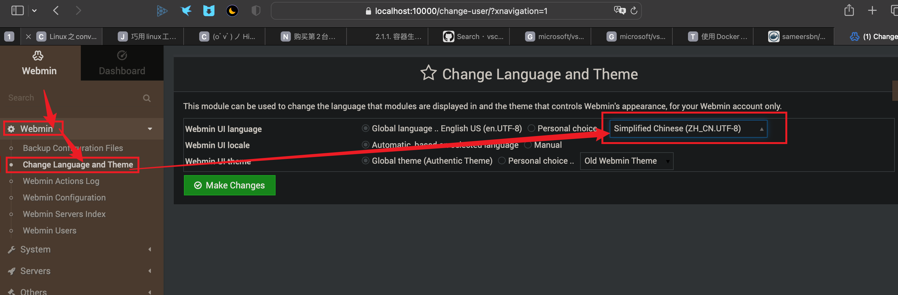
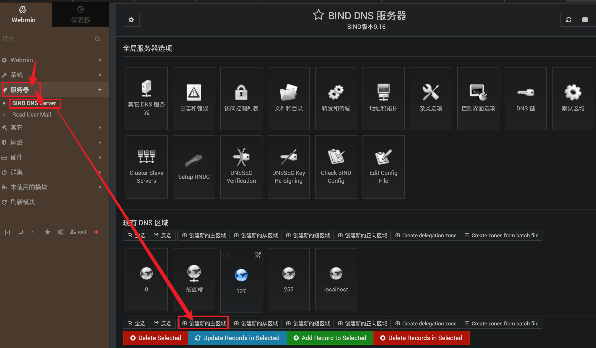
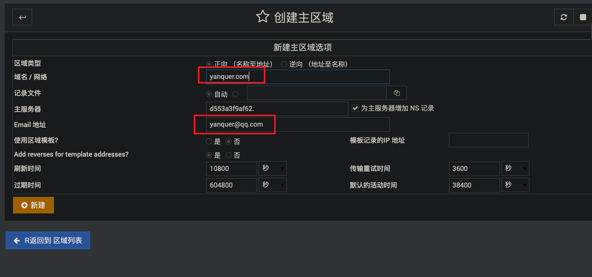
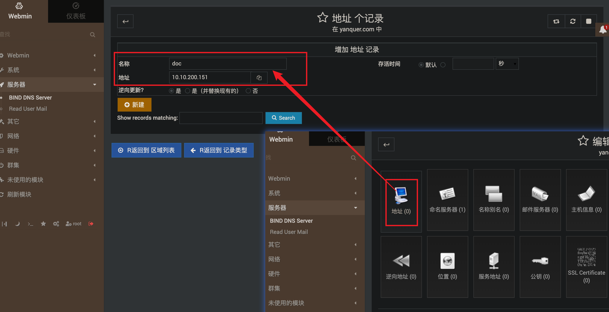
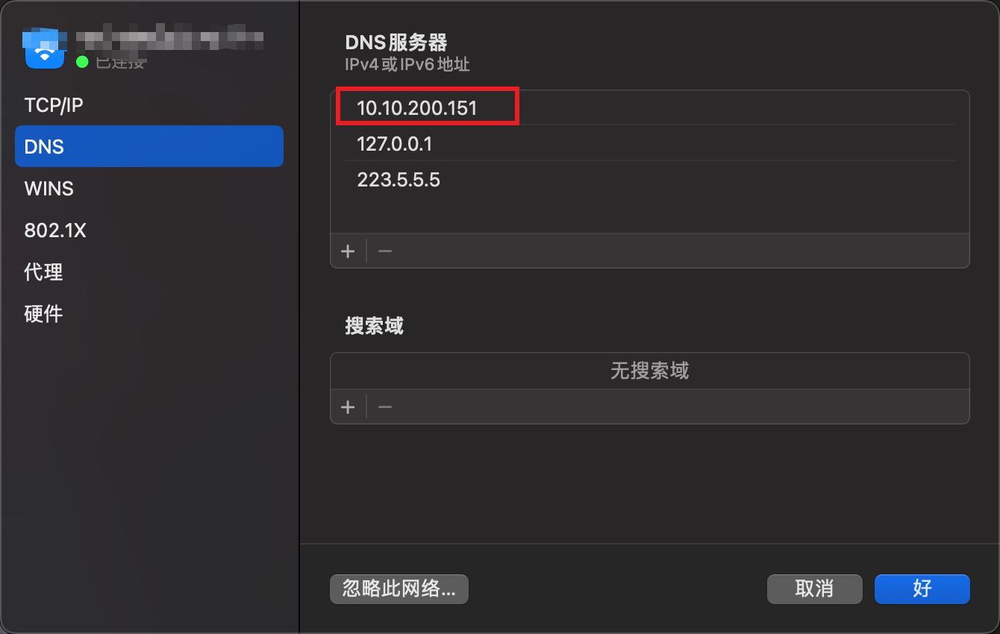
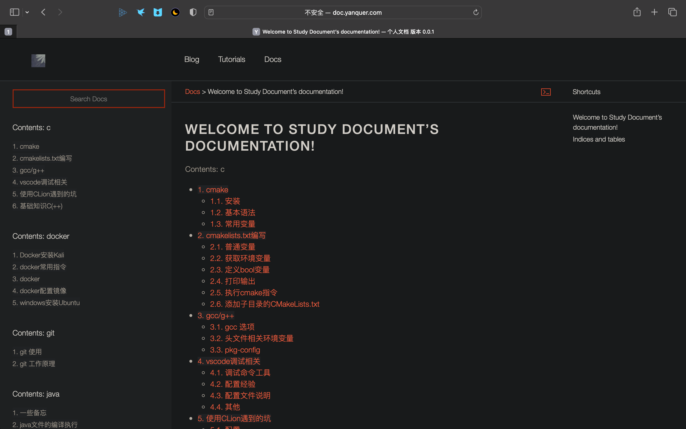

=====================================
docker使用bind部署dns服务-管理面板
=====================================

.. post:: 2024-03-09 18:21:01
  :tags: config_dns
  :category: 计算机网络
  :author: YanQue
  :location: CD
  :language: zh-cn

使用的镜像: `sameersbn/bind <https://hub.docker.com/r/sameersbn/bind>`_

使用bind镜像创建::

  # 创建一个持久化存放文件的目录
  mkdir -p sameersbn/bind
  # 使用容器创建应用
  # --restart=always
  docker run --name bind -d \
  --publish 53:53/tcp --publish 53:53/udp --publish 10000:10000/tcp \
  --volume /Users/yanque/project/docker/sameersbn/bind:/data \
  sameersbn/bind:9.16.1-20200524

若需要外网访问, 注意开放53的tcp与udp端口

在本机浏览器打开: ``https://localhost:10000``, 默认账户密码root/password登录, 然后更改语言为中文.

  更新语言为中文

  创建新的主区域

  填写域名, 邮箱, 然后点击新建

  选择地址, 然后填写前缀名称与ip (本机ip)

  更新本机dns (本机ip)

.. tip::

  如果是在本机使用, 可以直接写 127.0.0.1

访问公网::

  # vim sameersbn/bind/bind/etc/resolv.conf
  nameserver 114.114.114.114
  nameserver 8.8.8.8

  # vim sameersbn/bind/bind/etc/named.conf.options
  # 添加一行，内容如下：
  allow-query { any; };

重启一下服务，执行以下命令，这样才能使用配置生效::

  docker restart bind

测试, 访问 自己设置的地址 ``http://doc.yanquer.com`` :

  访问

其他
===============================

具有管理面板的docker-bind: `使用Docker搭建自己的DNS服务器 <https://cloud.tencent.com/developer/article/2027134>`_

