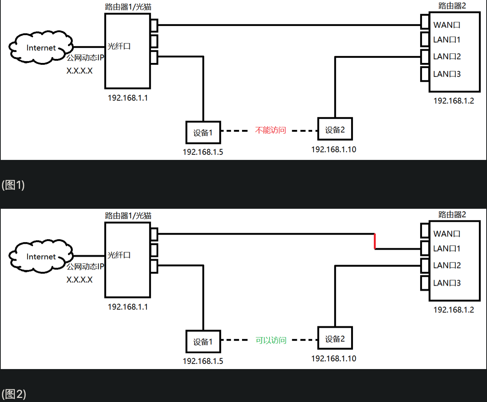

===============================================
LAN与WAN
===============================================

- WAN端口用于连接至Internet
- LAN端口用于连接至局域网设备

- LAN端口连接你自己的设备，笔记本/台式机/打印机等；
  无线路由器配置的wifi则相当于LAN端口，连接自己的无线设备，手机/ipad/笔记本等；
- 当WAN端口连上外网，LAN端口上的各个设备和路由器一起组成了一个小型局域网，这个局域网内的设备可以互相发现，访问。

普通路由器的LAN端口只有4个，当不够用的时候怎么办呢？变相扩充LAN端口的办法：

- 交换机，连LAN口，交换机的作用可以简单理解为帮你把4个LAN端口扩展到N个；
- 路由器，连LAN口，第二个路由器就是当前局域网的子局域网；
  就跟家里的局域网一样，电脑不是直接连上英特网，而是作为子网连上去的，这样多个设备可以共用一个公网IP。

**路由器还可以当交换机用**
  当不使用路由器的WAN端口，只使用LAN端口时，就可以看成是个交换机了，
  当然此时LAN端口IP要设置成局域网段内的IP，并且最好配置关闭DHCP；

  假设

  - 原路由器IP为192.168.1.1
  - 掩码为255.255.255.0
  - 可用网段为192.168.1.2~192.168.1.254，

  那么你作交换机用途的路由器 LAN端口IP 应设置为 192.168.1.2~192.168.1.254 范围内的IP；

  如果你想要局域网中再接入局域网，则应设置WAN端口IP自动获取，
  LAN端口IP应与原路由器的IP在不同网段，如192.168.2.1）

问题-同局域网的两个路由器下的电脑想要ping通
===============================================

.. note::

  路由器的网段不能相同

- 方法1: b路由器 的lan口 连 a路由器的lan口（记得关闭一个路由的dhcp服务）
- 方法2: a路由器配置路由规则，使b网段的机器都走b路由（需要a路由有这个功能）

其他:

参考: `<https://www.zhihu.com/question/20738115>`_
