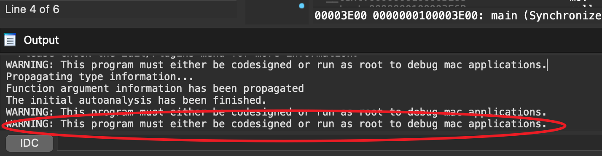

==============================
IDA-问题总结
==============================

Mac下调试需要权限
==============================

Mac下一般使用默认的本地调试器, 由于权限问题无法启动

官方建议的解决方案是使用 **远程调试**

就是启动::

  /Applications/IDA\ Pro\ 7.5/idabin/dbgsrv/mac_server64

后在IDA Pro中选择 **Remote Mac OS X debugger**

参考: `<https://hex-rays.com/wp-content/static/tutorials/mac_debugger_primer2/mac_debugger_primer2.html>`_

但是这个要求IDA Pro, 个人免费版不支持remote debug...
